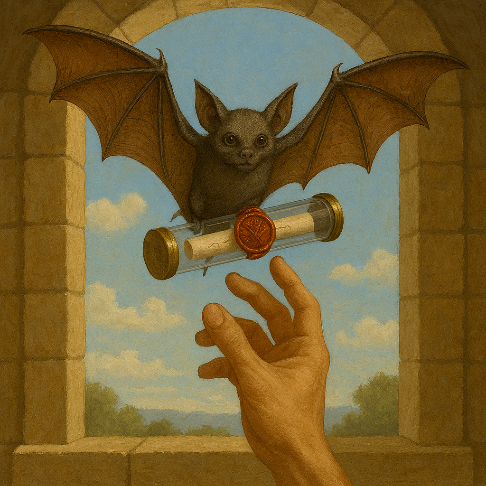

[Adventures](../Adventures.md) / Chapter 1 The Summons <!-- wikidown:breadcrumb -->

# Chapter 1 — The Summons

Campaign opener: the reunion, the transformed city, and Jak's revelation of the void. Sources: `assets/campaign-start.docx`, `assets/Jaks thromeroom.docx`, `assets/The Throne Room.docx`.

## Structure

1. **Background montage** — a year of peace; Jak's rise from monk to Administrator; each PC's gap-year story (player homework: what did you do, and how do you feel about your friend holding global power?).
2. **The summons** — a dis-trans bat delivers a glass tube sealed with the new administration seal (anchor + compass rose + temple symbols). Note inside: *"Put this in your ear."* Jak's voice: *"Unknown forces move against the peace we fought to create… Time grows short."*
3. **Arrival in Grønnfjord** — sunset over the harbor; the Temple of Nord towering where warehouses stood; Spásistren escort through familiar-strange streets. Undercurrents: ready weapons, urgent whispers, hasty ship preparations.
4. **The throne room** — the set-piece scene below.

## The throne room scene

Vast sound-swallowing chamber; floating light orbs that guide the worthy; the 20-ft black stone throne with reliefs that hurt to look at; Jak smaller than his seat, knuckles white, implant pulsing erratically; his trembling dis-trans bat — his best reconnaissance unit — clinging to the throne. (Jak's portrait on the throne: [his page](../NPCs/Jak-Bjornsson.md).)

**Jak's revelation, beat by beat:**

- He can see the whole restored world — every city, ship, and church — except one place, close to home.
- His scouts return *changed*; the bat found the source of the southern creatures and met… nothing. **"Complete void. As if that place doesn't exist in our reality at all."**
- No scrying, no ancient magic, no powers predating the network can touch it. Clerics keep creature corpses in brine; no sage can name them.
- The pitch: their first adventure was preparation. *"Will you be my eyes and ears in the one place that exists outside reality itself?"*

## Mission objectives given

Determine what causes the monsters to emerge, who or what is responsible, how to prevent incursions — and anything else about the absence in reality.

## DM notes

- Jak should read as *frightened* under the authority — the fear is real and the friendship is real; the sealed orders ([Jak's page](../NPCs/Jak-Bjornsson.md)) are also real. All three at once.
- Seed Grønnfjord's divided mood on the walk in; Chapter 2 pays it off.
