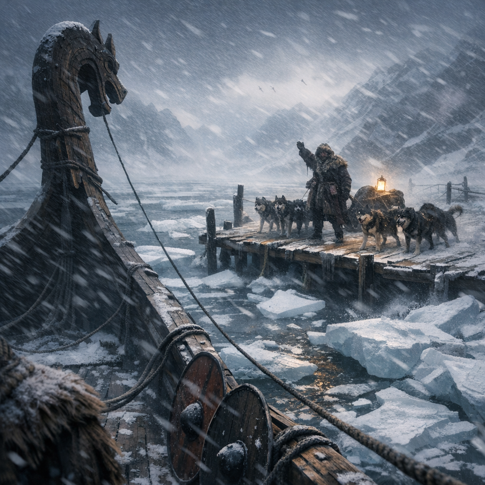
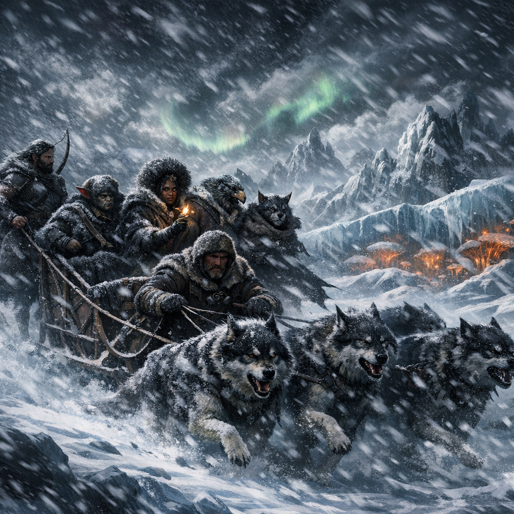
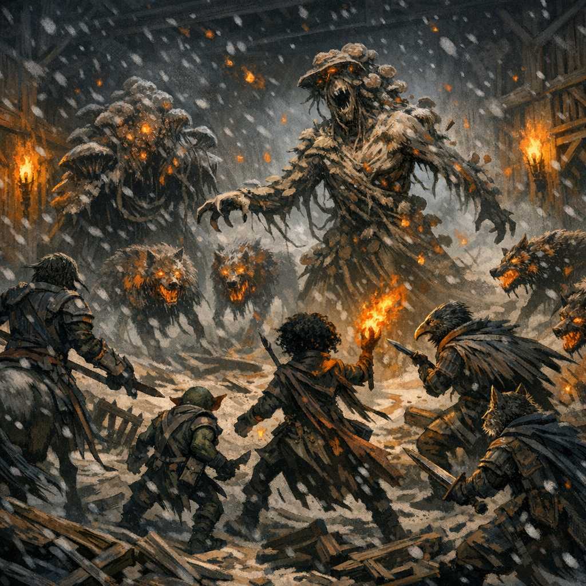
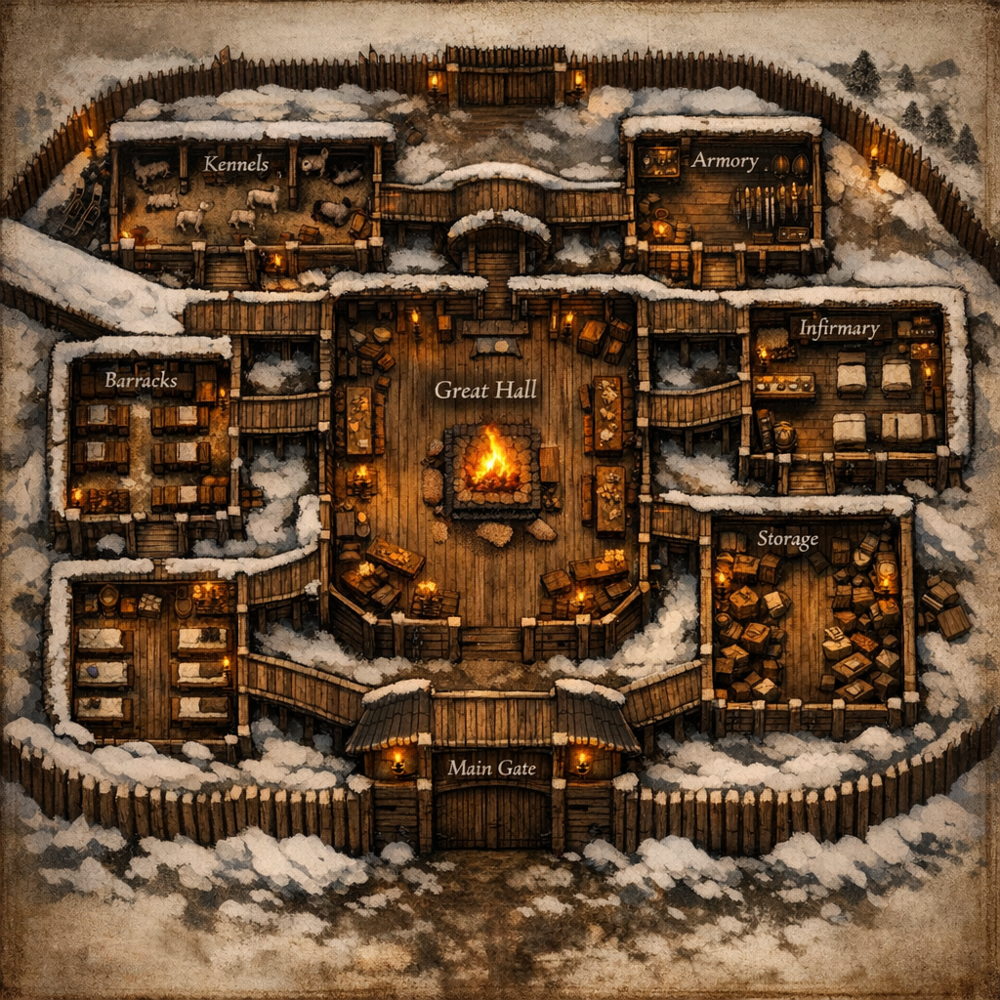

[Adventures](../Adventures.md) / Frostwatch Horror <!-- wikidown:breadcrumb -->

# Frostwatch Horror

Survival-horror module for five 10th-level characters: isolation, paranoia, and a creeping fungal terror. Source: `assets/Frostwatch_Horror.docx`. Location: [Frostwatch Hold](../Locations/Frostwatch-Hold.md).

## Act I — The Frostwind Crossing

Longship to a lonely dock; a fur-wrapped figure ([Korrin](../NPCs/Korrin.md)) waves them ashore; Grønnfjord-issue cold gear proves inadequate. Dogsled convoy through the blizzard — skill challenges and frostbite saves per [Cold & Survival](../Game-Mechanics/Cold-and-Survival.md). Hazards: whiteouts, hidden crevasses, sled-dog panic.

## Act II — Night at Frostwatch Hold

Smoke, fear, and an argument by the hearth: Korrin (*"Kill the dogs and we die out here"*) vs. [Copper](../NPCs/Copper-the-Surgeon.md) (*"The rot hides in blood. Fire cleanses"*). [McReady](../NPCs/McReady.md) defuses it, welcomes the party ("Jak says you're the best"), sets departure for first light. **Alert PCs may spot McReady reporting to Jak by dis-trans bat** — the seed of his council role later.

Run the **paranoia engine**: d6 symptom table (orange-flecked coughs, discoloration, whispering hallucinations, growths, fatigue, sudden aggression), Insight DC 16 to read motives, and secret objectives for any infected PC.

## Act III — Siege of the Shapeshifter

Muffled kennel yelps → human screams → the far wall **explodes**. Two **Fungal Horrors** (CR 10: AC 16, HP 180, infectious bite DC 16 CON, 15-ft spore burst, absorbed-voice mimicry, legendary spore puff) and four **infected wolves** (CR 5, pack tactics, death-burst spores). Fungal growth spreads as they fight — terrain turns slick and hostile. Art for both: [Fungal Threats](../Bestiary/Fungal-Threats.md).

**Victory conditions:** survive until dawn, or destroy the horrors while preserving the sled teams. (In play: the party survived; the sled dogs did not — see [Korrin](../NPCs/Korrin.md).)

**Battle map** (the hold's interior, from the module):

## Mechanics kit (module cheat sheet)

- Fear checks: WIS DC 15 on witnessing mutation → frightened 1 minute.
- Infection: DC 16 CON on exposure → latent 1d4 h → symptoms → hidden objectives ([full rules](../Game-Mechanics/Russet-Mold-and-Infection.md)).
- Infection stages: Latent → Symptomatic → Full Corruption.
