# Return to Frostwatch

Journey-and-council module: the hoversled descent through dying mountains, the occupied hold, and the Council of Frostwatch. Tone: cosmic horror, political tension, impossible choices — *"The party has seen the void. Now the void is following them home."*

**Source: `assets/Return_to_Frostwatch_v3.md`** ⭐ (current — adds the *Rajaat* naming scene, the Seal-the-Ship containment path, and the triage framing; supersedes `Return_to_Frostwatch_Final.md` and the docx).

## Act I — The Hoversled Descent (~4 hours in-world)

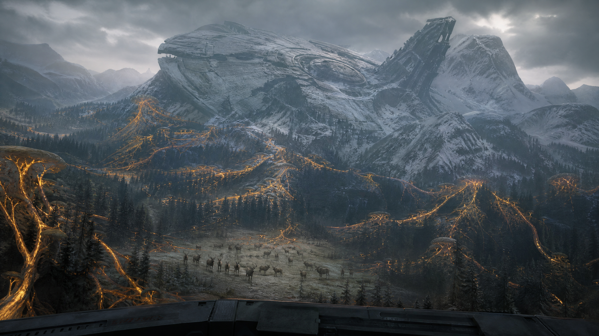

Run 2–3 encounters from the d6 table, building to the set piece. The mountains are *wrong*: fungal veins on the ridgelines, bioluminescent snow, animals that watch instead of fleeing.

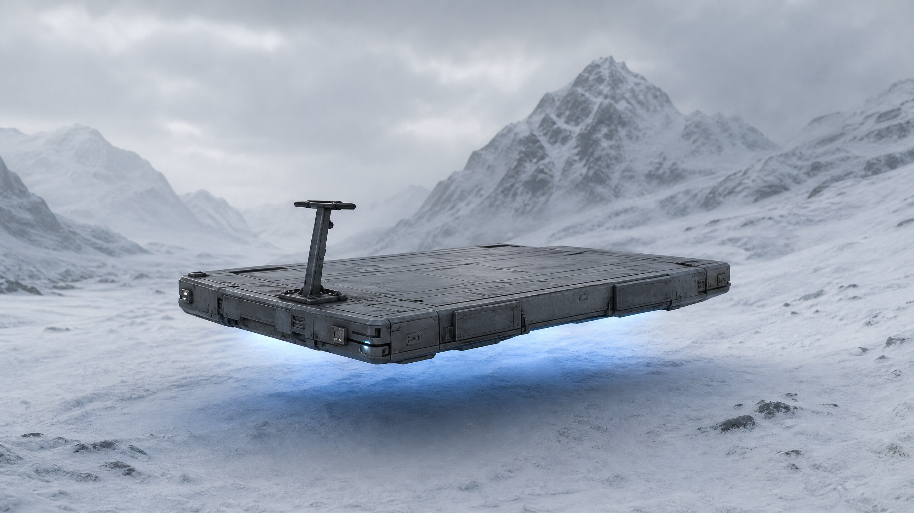

| d6 | Encounter | Core mechanic |
| :-: | :--- | :--- |
| 1 | **Spore-Choked Ravine** | DC 15 CON or poisoned 1 h with ship-flashback hallucinations; DC 14 DEX piloting; flyable |
| 2 | **The Watching Herd** | 12 infected deer, shared initiative, spore bursts; DC 16 Insight — they're *scouts*. George: "The mold doesn't just infect — it networks." |
| 3 | **Alien Echoes** | Escaped frost-coated cloaker ambush from above; its mold has *adapted to cold* |
| 4 | **The Fungal Avalanche** | Infected remorhaz beneath the ice triggers avalanche; 3 rounds of DC 15 DEX piloting |
| 5 | **Sky Hunters** (set piece) | See below |
| 6 | **The Frozen Pilgrims** | Merged corpse shambling mound (cold-resistant); journal: *"The smell is sweet. We thought it was flowers. We were wrong."* |

### Encounter art

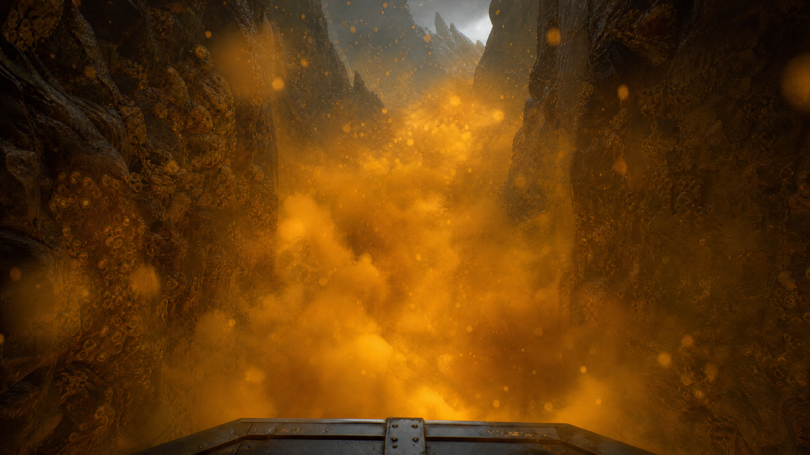
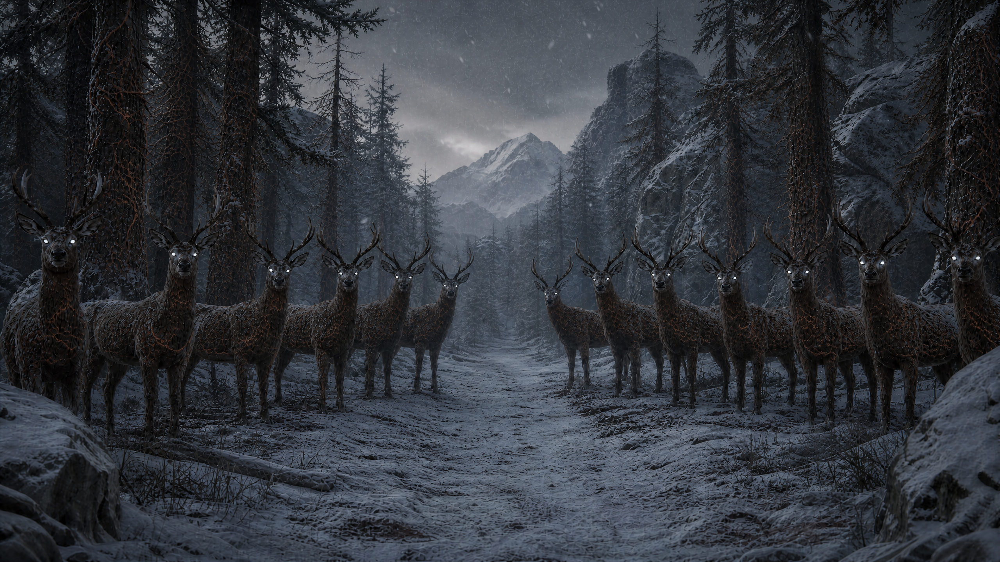
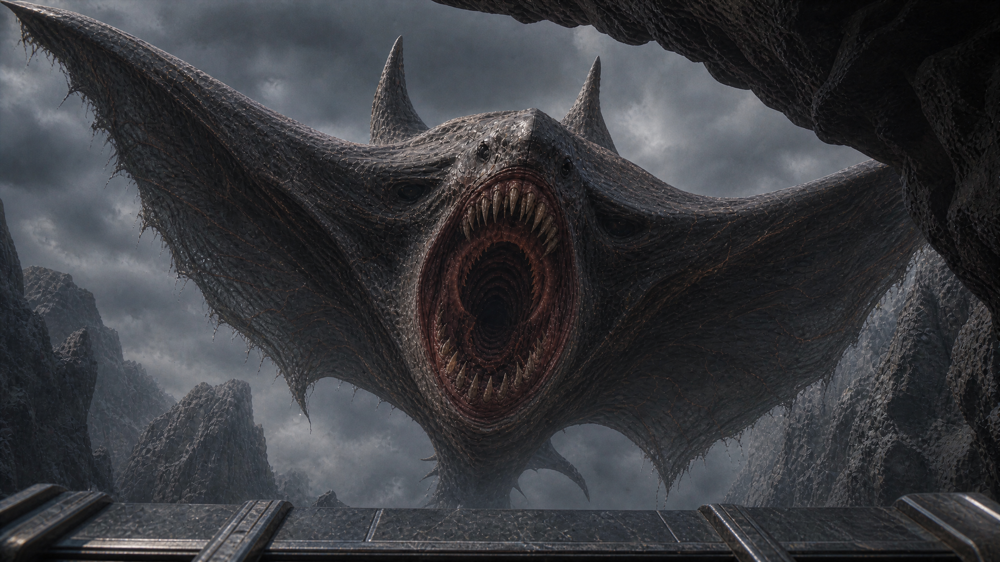
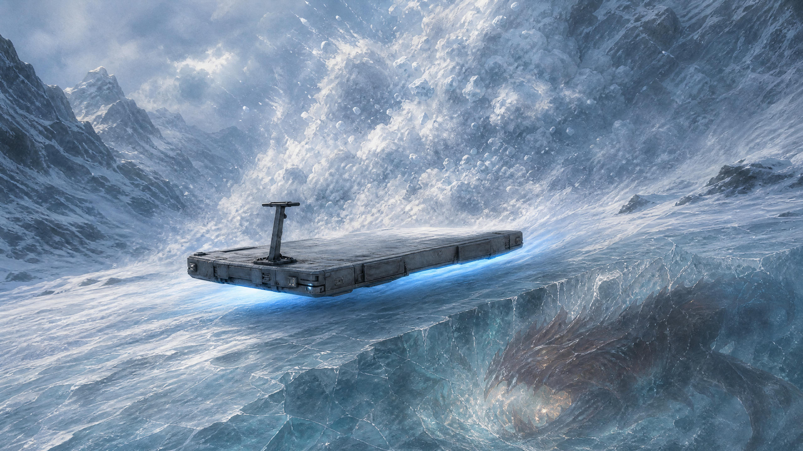
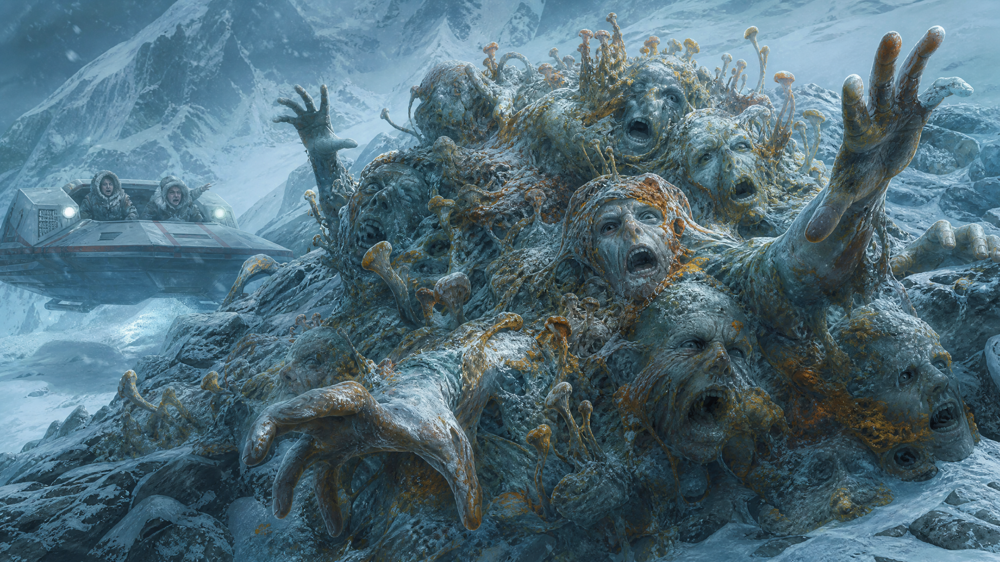

**Set piece — Sky Hunters:** exposed half-mile ridge; 3 **fungal perytons** (CR 2, dive +2d8, spore release when pierced) + 2 **spore-touched snowy owlbears** on flanking outcrops punishing anyone who lands. Hoversled control checks on initiative 20 when damaged; crit-fail throws a passenger. Designed for a flying party — keep it three-dimensional.

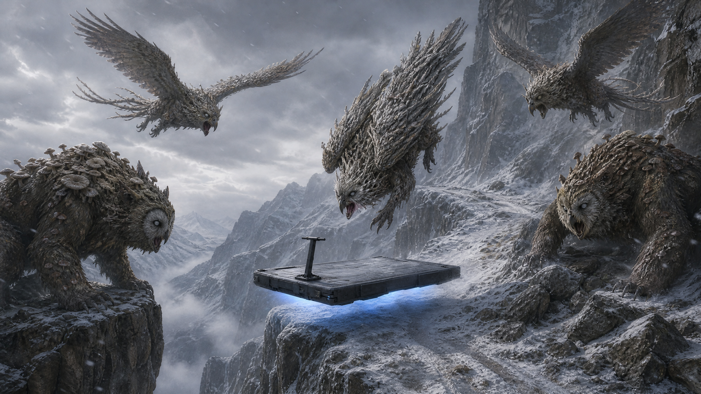

**No-encounter hours:** use the 6-entry "Signs of Spreading Infection" atmosphere table (tracking pine branches, sweet orange streams, a fungal-antlered goat, a hatched-open condor, absolute silence, a thrice-repeated roar).

## Act II — Arrival at Frostwatch

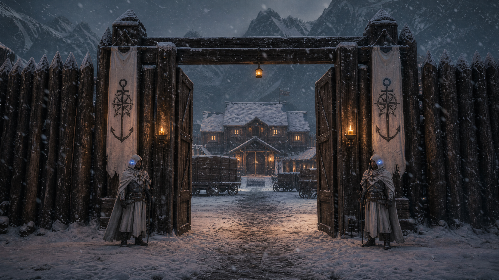

The hold repaired but re-flagged with the Administrator's seal; ~30 [Spásistren](/World/Factions/The-Spasistren) (20 initiates / 8 Sisters / 1 High Sister) cataloguing, interviewing, unpacking **alchemical incendiaries and containment gear** — and explaining nothing: *"Those matters will be addressed at the council tomorrow."*

- **Copper's warning** (granary scene): the [invisible infection](/Campaign/Plot-Threads/The-Invisible-Infection) theory, delivered once, quietly, terrifyingly.

  

- **Korrin in the stables:** axe in hand between his dogs and the initiates; "cleansing materials"; *"They're here to manage us."*

## Act III — The Council of Frostwatch

**Seating:** [Valerius](/NPCs/High-Sister-Valerius) (implant pulsing), [Copper](/NPCs/Copper-the-Surgeon), the stranger [Kaelen al-Hajra](/NPCs/Kaelen-al-Hajra) (knife placed handle-forward, watching the doors), and [McReady](/NPCs/McReady) in the chair nearest the door.

**McReady in the corridor:** rested, clean, the calmest person in the building. *"Let me do the talking for the first minute."* And at the door: *"The High Sister is Jak's voice in this room. But she's also the smartest person in it. **Don't confuse those two things.**"* Inside, he opens: "These are the people who went into the ship. They came back… **I'll vouch for all of them.**"

### Sequence

1. **The report:** the party recounts the ship. Valerius asks exactly three questions: is the infection centrally directed or autonomous; any cure or kill-switch; is the ship re-enterable.
2. **The Severing:** guards dismissed, the implant pressed dark — *"Jak cannot hear us now."* Heresy, trust, and a test at once.
3. **Revelation:** three villages quarantined, two silent; network anomalies; her fear — *purposeful without being intelligent, the way a river is purposeful*.
4. **Kaelen names it** — the module's new centerpiece scene.
5. **The Three Paths** (below).
6. **The question:** *"You have been there. What is your counsel?"*
7. **Codas:** the invisible-infection warning ("Sleep well."); McReady's dis-trans bat confrontation if the party pushes.

### The naming scene — "We call it Rajaat."

Kaelen places one hand flat on the table and gives the council the true scale (full read-aloud in source):

- In the deep desert is a place her people call the **First Source** — *"The place where it began. The place where it has always been."*
- Aerun had forests, rivers, cities — the infection came first, spreading "slowly, then all at once" — and the people who understood **made a desert. On purpose.** *"They killed the land to save the world."* No water, no organic matter, no host for the bloom. The desert is a **quarantine** — the only containment ever found that works — and **it has held for a thousand years**.
- Her ancestors tried walls first. The walls held **eleven years**; then the bloom came from *beneath* — the spores had been in the groundwater all along.
- *"What you have in your mountains is a **second Rajaat**… sitting in a valley full of trees, animals, rivers, and people. Your desert does not exist yet. And creating one large enough would take generations and kill everything between here and the sea."*

**DM note (source):** after this, the Three Paths are no longer a political debate — they are **planetary triage**. *(Table canon layering: how the desert was made — defiler magic — and the [College](/World/Factions/The-Defiler-College) that keeps it are details Kaelen does **not** volunteer in open council; they surface if pressed or in private, per the [First Source](/Campaign/Plot-Threads/The-First-Source) two-tier secrecy. The worms she now half-names — "contained only by sand and worms and the prayers of people the coastal cities have never met" — but never the Spice.)*

### The Three Paths (with scripted responses per voice in the source)

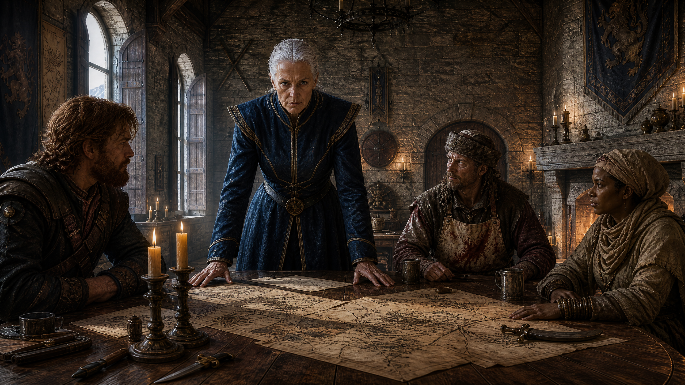

**Path One — Containment: Seal the Ship.** Avalanche-charges close seven passes *and a team re-enters the ship to seal it* — hull breaches closed, bulkheads locked, the source contained in its own alien alloy. Buys weeks-to-months. Copper: a door can rot — what happens when the seal fails and no one's left who knows the way in? Kaelen: her ancestors' walls held eleven years. McReady: *"You'd be sealing them in with it. I want that said out loud… That said — if sealing the ship gives us time to find a cure, **I'll carry the charges in myself.**"*

**Path Two — The Purge.** Orbital incendiary strike; everything burns today. Valerius adds the new caveat: destroying the second source **does not address the original**. Copper: "Do it. Do it now, before we talk ourselves out of it." Kaelen: ugly solutions are still solutions — *"but understand what you are choosing… You are not curing anything. You are only removing the second outbreak."* McReady puts on record what burning three hundred years of mountain homes means — and: *"even if we burn this valley clean, the problem isn't over. It's just quieter."*

**Path Three — The Cure.** Go deeper; find the medical/research levels; synthesize a cure or system-wide decontamination — **and if it works here, it may work on Rajaat itself.** Not a delay. An end. Kaelen: *"This is the path Aerun never had… My people have been the wardens of Rajaat for generations. A cure would free them too."* McReady: *"This isn't just about the Scarlands anymore. This is about the whole world."*

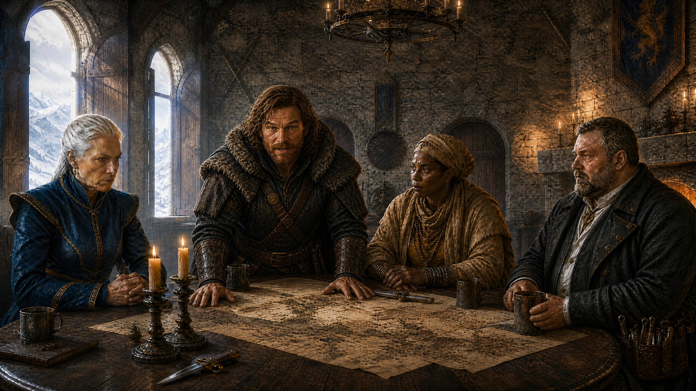

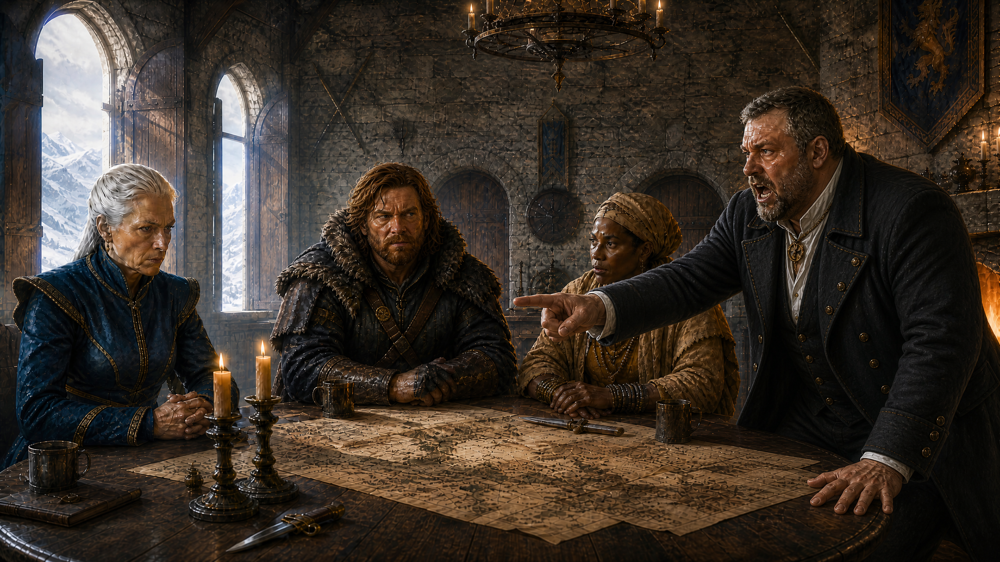

### DM note — triage, not a vote

The paths are **not mutually exclusive**: seal now to buy time, then pursue the cure; attempt the cure with the purge as fallback. **The council is not asking for a final answer — it is asking for a direction.** Whatever the party chooses, Valerius accepts it as the council's recommendation, reconnects, and reports to Jak in terms that protect the party's agency — never mentioning the severing.

**Kaelen's vote (if asked):** *"The cure. Because it is the only path that ends it rather than delays it or destroys everything around it. And because a cure does not just fix what is in your mountains. It fixes what is in mine. My people have been the wardens of Rajaat for a thousand years. We did not choose that. A cure would give us a choice for the first time."*

**McReady's role:** the only person at the table who knows the party, speaks for the mountain folk, and reports to Jak — and the only one advocating nothing. Both his signals are true. Neither is the whole truth. Full decision reference: [The Lighthouse Dilemma](/Campaign/Plot-Threads/The-Lighthouse-Dilemma).

## Appendix

New stat blocks in source: Fungal Peryton, Spore-Touched Griffon, High Sister Valerius (CR 7). Infection sidebar: [Russet Mold & Infection](/Game-Mechanics/Russet-Mold-and-Infection).
