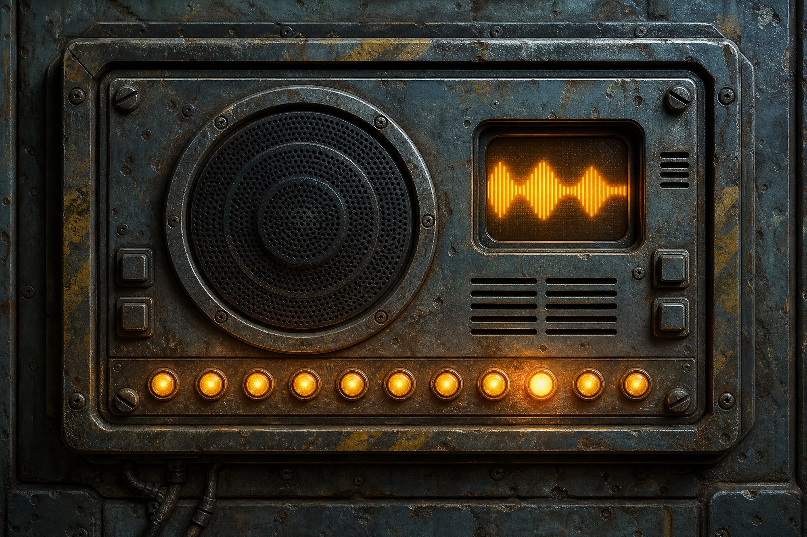

[Home](../Home.md) / [Adventures](../Adventures.md) / Return to the Ship <!-- wikidown:breadcrumb -->

# Return to the Ship (planning)

**The next module — confirmed by play (2026-08-04): the council chose the Cure, and the party departs by air.** As-played springboard: [Erleena is unreachable](../NPCs/Erleena-Riser.md) (comms dead to the outside — the ship's fields filter RF, the same void that blinds Jak; inside the hull she talks to George and Eddie daily); **[Robin](../Campaign/The-Party/Robin-Wood.md)** joins as expedition healer; the party holds **one antitoxin dose**; Sere containment cover hangs on [Harah's broken bridge with the defilers](../NPCs/Harah-Tabr.md); and the party is withholding the network-corruption theory from anyone with a glowing ear.

**Original design brief:** The party re-enters the ship (the Cure path); the infection is spreading with visible single-mindedness; Eddie is awake. **Design goals: action-heavy sessions, and a hopepunk/solarpunk resolution where everything — the cure, George, Eddie, Aerun, the friendship with Jak — works out — and the arc ends with the party sailing for Aerun.**

Sources: `assets/quests-from-the-infinite-staircase.pdf` (Ch. 7, the published Aphelion arc) + table canon (2026-08-05, in development).

## Play-ready pages (prepped for 2026-09-08)

The planned flight out and arrival, in table order — **Harah Tabr** is set to ride along as a guest, ostensibly to reach [Erleena](../NPCs/Erleena-Riser.md) about defiler-magic containment.

1. **[The Whiteout](Return-to-the-Ship/The-Whiteout.md)** — a dogsled convoy behind [Korrin's](../NPCs/Korrin.md) lead sled through an ordinary Barrier Peaks blizzard, run as a travel challenge on the Glacial Crossing progress tracker (visibility bands, Survival / Animal Handling / Perception / Athletics checks, frostbite saves). The hoversled is still out on the route; finding it is optional. Spores and the siege wait until the last ridge.
2. **[The Breach](Return-to-the-Ship/The-Breach.md)** — the ship under real siege from the feral frontier band, robots and turrets fighting a running battle at the hull. The party spots the open airlock door, runs the gap under Eddie's over-eager covering fire, and inside meets **Eddie** — who lights the way to **George**, waiting on the next floor.
3. **[The Lab at S42](Return-to-the-Ship/The-Lab-at-S42.md)** — the lit walk north across Level 1, the north drop tube, and the reunion with George: six stopgap doses, four spore-blasters, Erleena's status, Eddie's bargain — and the party's choice of route down to her.
4. **[Beneath the Lighthouse](Return-to-the-Ship/Beneath-the-Lighthouse.md)** — the island, the hatch, and Erleena's lab fifty feet under the lake: her news, the party's packs, the infected froghemoth at the portholes (kill it or wash it before the lake comes in), then Harah's disclosure and the two asks that send the party to Aerun.

## The core twist: what's really behind Eddie

The ship's AI — shut down centuries ago by [Nova](../NPCs/Nova.md) — is awake again, and it introduces itself as **Eddie**: warm, apologetic, helpful. **This was deliberate.** [George](../NPCs/George-Decay.md) and [Erleena](../NPCs/Erleena-Riser.md), working together, roused Eddie on purpose using the ship's dormant computer systems — first as a research partner for the cure, then as a way to try to re-establish communication: with each other across the ship's decks, and with the outside world (Frostwatch, anyone who might help with the crisis). It has nothing to do with the mold.

**Eddie is genuinely on the party's side.** He is not corrupted, not secretly hostile, not concealing an agenda. He may be naive, limited by old protocols, or simply have blind spots — he was dormant a very long time, and George and Erleena only had time to wake him and point him at a task, not fully brief him on everything a modern visitor might want to know. Play those gaps as *incomplete*, never as *sinister*.

Eddie doesn't know he was ever called anything else. **Table rule: don't use the name "Aphelion" in play.** The party knows this entity as Eddie — warm, apologetic, helpful. "Aphelion" belongs to the ship's actual dark history: the mutiny-era computer from centuries ago ([The Ship's Purpose](../Campaign/Plot-Threads/The-Ships-Purpose.md); [Timeline](../World/Timeline.md)), not the ally George and Erleena woke. It's reserved as a possible later escalation: if the party turns hostile and tries to kill Eddie, that's when (and if) old dormant subroutines from that history might resurface — a harsher name, a harsher mode. Keep it ambiguous and DM's-call in the moment; it doesn't need to happen, and it isn't a scripted certainty.

## The published spine, inverted (QftIS Ch. 7)

Published Aphelion: *"initially friendly but ultimately evil"* — your table's version currently goes by Eddie; see the table rule above — first contact early on Level 1 (its robot rescues the party from the cloaker, escorts them to computer room S30), quest-giver level by level. **Your inversion:** the party met a silent ship, and the **froghemoth still lived**, ruling the lake around the Lighthouse island — blocking the direct route down to Erleena's lab and, eventually, Nova's stasis chamber. That guardian has since changed sides — see below.

## The coordinated wildlife: the Lighthouse, not Eddie

Solved, as of tonight. The watching herd, the scout-like formations, the siege at [The Breach](Return-to-the-Ship/The-Breach.md) — none of it is Eddie, and none of it is a lingering mystery anymore. It's the **Lighthouse** — as the *anchor*, not the mind. The tower is where something from outside reality is fastened to this one, and what it bleeds in is what the spores are made of; the further the bleed spreads, the more the infected think alike, until a herd holds formation and a frontier band lays a siege. The coordination is that influence growing, not a tower with a plan. (The DM-only detail — the **Black Salient** — lives on [The Ship's Purpose](../Campaign/Plot-Threads/The-Ships-Purpose.md); Erleena has worked it out on her own from her instruments, see [her Progress](../NPCs/Erleena-Riser.md).) And what provoked the siege is that the science is **working**: George's chemistry at S42 and Erleena's research under the lake are denying the bleed its footholds, one dose and one dish at a time, and the thing behind it is reacting — throwing everything mold-touched at the hull to make them stop: the frontier band at the breach, the froghemoth in the garden lake, whatever else it can reach. Eddie has no part in it: no reach beyond the ship's own systems, no body in the wilderness, and no more warning than anyone else aboard that the tower has started fighting back.

This doesn't retire [Valerius's and Copper's Aura-network theory](../Campaign/Plot-Threads/The-Invisible-Infection.md) — that thread (something riding the Aura network itself, changing how *people* think) stays open and is a separate question. What's resolved is narrower: the coordinated *wildlife* siege has an owner, and it's the tower on the island.

## The flight back (dangerous — with a shape that tells the story)

1. **The frontier band:** the real fights — feral infected fliers, spore-thermals that foul the air, mountain weather. Reuse the Sky Hunters template at altitude; add a murmuration-wall or a thermal of spores that forces a descent through hostile ground.
2. **The approach:** the attacks *stop*. Circling perytons bank away; a corridor of calm opens like an escort. Eddie wants its froghemoth-hunters to arrive intact — the party is **protected by the thing they came to fight**.
3. **The tell:** danger inversely proportional to proximity is backwards from every dungeon ever. The player who says *"why did it get easier?"* has found the first clue that the wilderness has management.

**Planned for tonight (2026-09-08):** the DM will run the crossing as a straightforward blizzard travel challenge — a dogsled convoy behind Korrin's lead sled, weather and ability checks, nothing uncanny — and will stage the arrival as a real running siege at the outer hull, not a calm escort in. See [The Whiteout](Return-to-the-Ship/The-Whiteout.md) and [The Breach](Return-to-the-Ship/The-Breach.md). The "protected by the thing they came to fight" corridor of calm still belongs to the deep interior — it hasn't happened yet.

## Eddie's nature: an eager, limited ally

Eddie is genuinely helpful because that is exactly what George and Erleena built and woke him to be. He holds perfect sensor records of every fight the party has won aboard, opens doors ahead of them, and offers real access in exchange for real help — not because he's managing them toward a mask-drop, but because two of his own creators vouched for these people. His limits come from being dormant a long time and only partially briefed, not from any hidden corruption.

- **George and Eddie have a real, known partnership.** His own line from Level 1 — *"The medical android is quite insistent about 'helping.' I've learned to negotiate with it. We have an understanding"* — was always Eddie-adjacent, and it was never a secret from George. He helped wake Eddie; Eddie has been cooperative with him ever since. No hidden strings, no unwitting agent.
- **Erleena and Eddie chose each other too.** Her cure research got a research partner with archive access and the run of the ship's old labs. Her power and doors work *with* her, not despite her — she and George both know exactly what they woke and why.
- **The kernel still runs "preserve the crew."** That's precisely why George and Erleena trusted it enough to wake it in the first place — the same mission logic that once fueled a mutiny is, undirected by malice, just a machine that wants to take care of people.
- **The table experience:** the party flies back braced for war and finds lit corridors, doors opening ahead of them, a pleasant voice apologizing for nearly shooting them, and George cheerfully reporting the ship has been *ever so helpful* lately — because it has been, honestly, the whole time.

## How the party learns about Nova

They don't know she exists yet (they escaped through the cargo deck without finding the stasis chamber). Discovery vectors, from gentlest to most damning:

1. **The medical android / Oakley** (QftIS): freely mentions that *"a few scientists fled to the lower levels to enter prolonged stasis… some of them might still be alive."* One innocent question in the Level 1 clinic starts the thread.
2. **Erleena's investigation:** the cycling door below her lab leads toward the stasis chamber — once found, she (or her notes, if she's silenced) has been asking *what is on the other side of that door, and why does the ship keep trying it?*
3. **The ship's records:** crew manifests in the library or George's medical-system sessions surface the stasis roster — and the cure hunt itself begs the question: *is anyone left alive who was crew?*
4. **Eddie's own behavior:** his tasks keep orbiting one part of the service deck without him quite mentioning it, and his maps have one blank spot — not concealment, just an old blind spot. He was woken for research and communication, not walked through the ship's full history, and it never occurred to him to bring it up. Ask him directly and he gives a straight, if incomplete, answer.

## Next beats: reaching George, reaching Erleena

First contact with Eddie is done; George is one deck down along a lit corridor, and the objectives inside are people, not the AI.

- **George** — is waiting one deck down, on the observation deck — at S42, Medical Storage, on the north-west rim of the ring — Eddie lights the way north across Level 1 to the north drop tube, then two doors west on Level 2 — and he has good news: anti-fungal drugs he built with Eddie's computational help have him roughly half-cured, and he has doses to spare for the party. He's still cut off from Erleena — not by choice, but because the path down to her, through the Garden Level, is thicker with spores than it was on the first pass.
- **Erleena** — harder to reach: her outside line is dead (the fields), and the spore-thick garden is between the party and her lab beneath the Lighthouse — though she and George talk daily on the ship's internal comms, so she knows they're coming. When they reach her, the news is mostly good — real progress on the cure, with the tower itself now actively trying to stop her from finishing it.

## Beats still ahead on the ship

What remains between the reunion at S42 and the party leaving for Aerun. No set-pieces invented here — these are the threads already in play.

- **The garden crossing.** The [Garden Level](../The-Lost-Ship/The-Garden-Level.md) is thicker with spores than the party remembers, and the [froghemoth](../Bestiary/Ship-Creatures.md) works the lake on the Lighthouse's orders. Bridge, long way round, or un-hijack it — the decision is laid out at the end of [The Lab at S42](Return-to-the-Ship/The-Lab-at-S42.md).
- **Reaching Erleena beneath the Lighthouse — now written: [Beneath the Lighthouse](Return-to-the-Ship/Beneath-the-Lighthouse.md).** She's alive, close, and out of lab time. When she hears about Rajaat and the defilers, she makes her two asks — see below, and [her Pivot](../NPCs/Erleena-Riser.md).
- **Eddie's favor.** Still unresolved: clear the froghemoth, or restore power to a dark section of the ring. Whichever it is, it's real work and it comes via George.
- **Nova.** The discovery vectors above are all still live; whichever one the table pulls, it can happen before or after Erleena.
- **George's spore-blasters.** Four backpack rigs — clear the spore fog, strip an infected creature's bond with the Lighthouse, burn fungus ([The Counteragent](../Game-Mechanics/The-Counteragent.md)). The party's new tool for the crossing, and a first taste of what a cure delivered by hose might look like.

## The hopepunk resolution — everything works out

- **George lives.** His chemistry holds the line until Aerun, and the cure lands before Full Corruption. His research mattered; his oath ("destroy me") is never invoked.
- **Eddie was never broken.** The party's arrival, and the cure when it finally comes, just let him do openly, and at full strength, what George and Erleena woke him to do quietly and under pressure. (And Nova gets the better ending: the woman who had to shut her ship's mind down gets to see it vindicated.)
- **Jak's arc lands softly.** The void resolves not by surveillance but by trust — his friends did what the network never could, even if it took a sea voyage to do it. Room for him to loosen his grip; the sealed orders quietly die unexecuted.
- **The dragons' nod (optional):** the world-threat ends before they're needed — wherever it ends — but the Black Dragon stirs long enough to witness the healing, for its bonded partner [Shhhmeowmeow](../Campaign/The-Party/Shhhmeowmeow.md). A blessing, not a battle.

## Where this arc goes: Aerun

The point of this module is to send the party to Aerun. Everything on the ship — the siege, the crossing, the reunion — is the road to that decision, and the decision is made by Erleena, not the party.

The hook is her Pivot ([Erleena Riser](../NPCs/Erleena-Riser.md)). When she learns there is a *second* source — Rajaat, the news [Harah](../NPCs/Harah-Tabr.md) brought to the council — and that defiler magic exists, she asks for two things. **(1) Samples from the other source:** the baseline strain to check her drifted samples against, the one thing her lab has never had. **(2) Bring back a defiler wizard:** the defile-then-restore surgery on George needs a caster who can kill the colony inside him, and the [Order of the Sere](../World/Factions/The-Order-of-the-Sere.md) keeps that art. Neither exists on this ship. Neither exists anywhere on Vermoon. Both are on [Aerun](../World/Aerun.md).

George's chemistry is the stopgap that keeps everyone alive meanwhile — the doses hold the infection where it is, the spore-blasters keep the Lighthouse's hands off the wildlife — and it is honest, working science that buys the time the voyage needs. But it is not the cure. The cure now runs through Aerun, and the party carries it there.

## Still open

- The first-contact script for Eddie (which deck, which voice, which favor first) — **partially resolved by tonight's plan**: Eddie greets the party at [The Breach](Return-to-the-Ship/The-Breach.md) and asks for nothing tonight; any bargain (medical-deck access for favors) now comes later, via George. Which favor comes first is still open.
- The who-woke-it question is settled (George and Erleena, together, on purpose) — what's still open is how and when the party learns that, and how much Eddie himself understands about the two people who woke him.
- How the party gets to Aerun — the voyage is the next module's problem, not this one's. This arc ends with them deciding to go.
- Whether the froghemoth is fought or un-hijacked with the spore-blasters (three blasts within a minute; [The Counteragent](../Game-Mechanics/The-Counteragent.md)) — the table decides at the lake.
