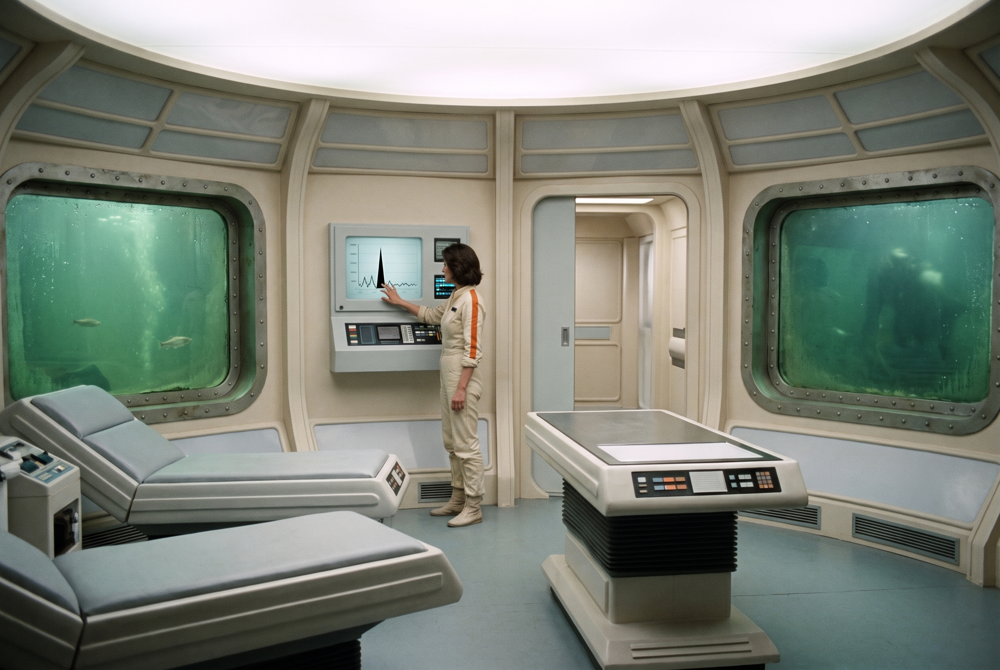
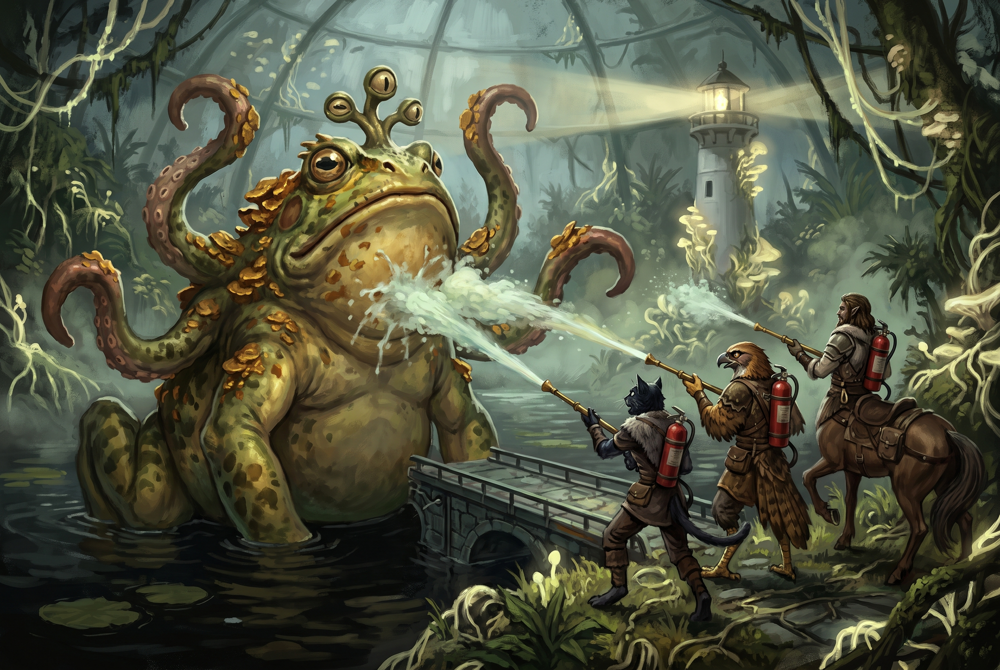

[Home](../../Home.md) / [Adventures](../../Adventures.md) / [Return to the Ship](../Return-to-the-Ship.md) / Beneath the Lighthouse <!-- wikidown:breadcrumb -->

# Beneath the Lighthouse

*Return to the Ship, the turn — the island, the hatch, the lab fifty feet under the lake, the infected froghemoth at the glass, and the scientist who decides the cure is on Aerun and that she is going to get it.*

## Read-aloud — the island

> *However you crossed, you are across. The island gives under your boots — this is not ground, it is the mold, skinned over old concrete — and the tower stands over you: white once, now wrapped seam and root in pale cords that glow where they knot. High up, the halo turns around the lantern room, gold-white, slow, deliberate. The beam swings out over the black water and every spore in the air leans after it.*
>
> *Eddie has not stopped talking. "That's the Lighthouse," he says, helpfully, as though you might have taken it for something else. "I wouldn't stand in the beam."*

**Don't let the beam touch you.** The halo goes to whatever the beam lights; a flyer caught in it is dragged down to the island and lands in the thick of it (exposure save, [Russet Mold & Infection](../../Game-Mechanics/Russet-Mold-and-Infection.md)). Walk it like a searchlight — move when it's away, hold when it's near.

**The comms (DM note).** Nothing radio gets in or out of the hull — the ship's hyper-dimensional fields filter RF the same way they blind the Aura network and stop teleportation ([Ship-wide properties](../../The-Lost-Ship.md)). Every call the party made from Frostwatch died in that void: *"No signal. Your number cannot be completed."* Not spores, not the tower's output, not Eddie. Inside the hull the wiring reaches everywhere — Eddie has watched the whole crossing, and Erleena's lab below the garden sits on the same internal comm line as George's pocket at S42, which is why she and George have talked every day for a month and still can't reach each other: the garden is between them, not the wiring. So Erleena knows everything George knows — the half-cure, the rabbitoid, the packs, that the party reached S42 — and nothing at all from the outside world. **That gap is the party's cue.** They are carrying a month of news she has never heard, and the council's news above all.

**The last time they spoke.** The party's last words with Erleena were in these sealed levels on the first survey: she told them she would build her cure lab here, and she asked them to make the cycling door below stay shut. Then they left through the lower deck's cargo doors and never got a call through again. She has not forgotten either thing.

**The hatch.** Inside the tower, under the mycelium-choked stair, the heavy circular floor hatch: **DC 15 Strength** to turn the fouled wheel **plus the green key card** — the one they pulled off the skeleton in S50 on the survey. A blaster wash on the wheel first gives advantage; the mold lets go of the metal.

## Down

Through the hatch they remember and down the iron spiral stair, the mold thinning with every turn. Her lab's door at the bottom is already standing open when they reach it, and a speaker on the stair wall crackles before anyone is within ten steps of it.

## Read-aloud — Erleena

> *"You're late." The voice out of the speaker is flat with exhaustion, and under it there is something that, on a better day, might be a laugh. "Eddie's been calling your crossing like a regatta. I know about the bridge. I know about the frog. And in the gaps I've had George telling me not to worry, which is how George worries." Somewhere below you, a door grinds the rest of the way open on her word. "Keep walking. The doors know you're coming. So do I."*
>
> *The stair turns down out of the spore fog and into clean air. At the bottom the door is open and she is leaning in the frame — a lab coat over a month-old jumper, sleeves pushed up, arms folded — like it is holding her up, which it is. Inside the door, on a rack, hangs the containment suit: scarred, empty, helmet on the hook above it. She looks at each of you in turn and does not smile.*
>
> *"Well. You came back. Through all of that." A breath. "Don't make a thing of it. I've had a month to practise not making a thing of it and I'd hate to waste the work."*

Then a beat. Let her count heads — five, and one of them new: Robin — and sit down heavily on a bench because it is the first time in weeks she has had a reason to.

The room: a **30-foot circular chamber, fifty feet under the lake**, 10-foot ceiling, cold stale air, blue-green emergency light. Concave portholes look out into murk, and under everything there is a soft, irregular thudding on the glass — pale shapes smearing against the dark outside and sliding away. Nothing grows here. The lake overhead is the reason — fifty feet of black water is a better spore filter than anything the ship's engineers built — and that is exactly why a scientist picked this room. Erleena's lab: benches, a rack of sample dishes under glass, a month of notes in a hand that got smaller as the month went on, and one more stair going down, sealed. Through a hatch on the far side, **her quarters**: the sealed levels were crew space once, and she has a bunk, a hotplate, ration crates hauled down from the ship's stores, and a month of laundry. She lives here, in the lake's clean air. The suit is for the stair.

## The exchange

**Her first question is the door.** She picks up the last conversation exactly where it stopped, as if it were yesterday: *"The door. It's still doing it. Every few hours — open, shut, open. I asked you to make it stay closed."* It isn't an accusation; she wants to know if they learned anything about it on their way out through the lower deck. They didn't. But **Eddie knows what it is**, and if anyone asks the ceiling, he tells them: the door's control station is on the lower deck, on the far side of it, and its override is set to LOCAL and physically jammed there — he can see the fault on his board and can't clear it from his end. *"Somebody has to go and push the actual lever."* Erleena has heard this explanation every day for a month and would like it to stop being true. That errand is its own page: **[The Jammed Override](The-Jammed-Override.md)**. It can be done now, on the way out, or never — it doesn't gate anything on this page.

**What she has — mostly good news:**

- **She knows what it is.** Before the dish, before anything, she pulls a tray of slides and a month of instrument traces and lays them out on the bench in date order. The same black spike on every one — every reading, every day, a little taller, and always pointing the same way: *up*, at the tower over their heads. Something is anchored to the Lighthouse, a protrusion from somewhere that isn't here, bleeding energy into the world with the wrong sign; the spores are what that bleed looks like when it touches living matter. She has a name for it, because her instruments kept drawing the same shape: *the black salient*. *"The mold isn't the disease. It's the symptom. I've spent a month treating the fever, and the fever has noticed."* It's why the infected think alike, why her dish worked — she starved the foothold, not the fungus — and why the tower is at her door and George's: his soap does the same thing at scale ([her Progress](../../NPCs/Erleena-Riser.md)).
- **It works in a dish.** She stopped the drifted strain replicating — a real result, not theory. What's missing is the two things it always was: a **baseline** to check it against, and **time**.
- **The Lighthouse is fighting back.** That thudding under everything is the lake's small infected things — leechoids, poison-spined scintillating fish, quipper swarms — throwing themselves at the portholes in relays, day and night, for days now. The glass holds; nothing that size can break it — narrate smears on the panes and dents in the frames, never damage. But a lake does not organize itself, and it is how she knows the tower has noticed her. The one thing in the water that *could* break the glass is the froghemoth, and she has seen its eyes. She knows the siege at the hull is aimed at her, too — George did that arithmetic out loud for her over the comm, more than once. *"It's turned around. A month ago everything in this tower was pointed out at the valley. Now it's pointed at George and me. I'd be flattered if I weren't fifty feet under its lake."*
- **Her suit.** She only wears it to go up. Sealed, it gives her **four hours of self-contained air** — the round trip up the stair and back, or one garden crossing — and **20 points of suit integrity** before the seal fails. A month of trips to the hatch has used some of both. She does not say how much. It hangs by the door, and she looks at it the way other people look at a bill.

**What they bring from the ship — none of it news:**

George has told her all of it, daily and at length: the doses, the half-cure, the rabbitoid, the fire extinguishers with opinions. She has told him what she thinks of a man who builds a door out of a fire extinguisher and then can't walk through it himself. She asked him for a pack a week ago.

- **The pack.** If the party carried one down for her — George will have hinted at S42, and Eddie will have hinted louder — hand it over and she is, for the first time in a month, **mobile**. If they didn't: *"Four packs. He told you there were four packs, and he told you I was down here, and at no point did anyone do the subtraction."* She lets it sit. *"Fine. Somebody's lending me theirs for the stairs."* Either way she shoulders it over the lab coat and cinches the gurney webbing without being shown. *"A month in a room I couldn't leave, and the answer was in the hallway with a hose on it. Don't tell him I said that. He'll have it from Eddie by dinner anyway."*
- **The sixth dose.** George made six. Five for the party, and the sixth is hers — he said so at S42, and if nobody remembered to bring it, she knows exactly how many he made. She takes it without comment. Fifty feet of lake has kept her clean; the stair has not always.

**What they bring from outside — all of it news.** This is the thing she does not have, and she asks for it straight: *"Now. Tell me what you learned out there. All of it. Start with whether Frostwatch is still standing."* It leads straight into the turn — once the frog is dealt with.

## The froghemoth

*If the party already un-hijacked the froghemoth on the crossing (the third option at [The Lab at S42](The-Lab-at-S42.md)), the eyes never come — skip this section and go straight to the turn.*

**Erleena names the danger.** Before the party can answer her question, she stops mid-sentence and points at a porthole without looking at it. The three eyes are there — they have been there, on and off, for days. She has watched the beast come and go and she has stopped believing it is curious. The fish and the leeches are noise — the glass will outlast every small thing in the lake — but this is the one thing out there that can finish what they started. It has been *testing* the glass, one pane at a time, the way a thing does when it is following instructions rather than appetite: it was an animal once, and now it is a hand on the end of a very long arm that runs back through the lake to the tower. If the tower decides to, the lab breaches and the lake comes in — the dish, the slides, the month.

> *"It's been at the glass four days. Not hitting it — testing it. One pane, then the next, then back to the first, like it's keeping notes. It was a frog. It isn't a frog now; something up that stair is wearing it." She does not turn around to look. "Kill it or hose it, I genuinely don't care which. But do it before it works out which porthole is the cheap one, because when it does, everything on this bench goes back into the lake, and so do I."*

**The clock.**

- **Three glowing eyes surface at a porthole** and hold there, unblinking, a foot from the glass. That is round one.
- **Each round the froghemoth is not engaged**, a tentacle hits a porthole: **attack vs AC 13; a hit breaks it (10 HP)**.
- A **broken porthole floods the chamber 1 ft per round**; the ceiling is 10 ft. Once the water is waist-deep, swimming rules — the room is difficult terrain, and anyone in heavy gear or a backpack tank is fighting the water as much as the beast.
- **What's at risk is the lab**, not the party's lives: Erleena's month, the sample rack, the dish under its glass. A flooded chamber is a cure set back to zero.

**Two ways to end it.**

| Way | How it plays | Notes |
| :--- | :--- | :--- |
| **Kill it.** | Full [Froghemoth](../../Bestiary/Ship-Creatures.md) block: CR 10, AC 16/14/12 (tentacles/body/tongue), **HP 184**. Four 20-ft tentacles (DC 18 grapple), 30-ft tongue drag, swallow whole (3d6 acid/turn; 20+ damage from inside forces a regurgitation save). A real fight for five level-11s — the tentacles grab, the tongue drags, the swallow is the scare. Erleena fights from the doorway with the needler and *lightning bolt* — she has no intention of watching. | **Immune to fire and lightning.** Say it plainly at the table: lightning bolts and fireballs do nothing to it — Erleena's capacitor included; she finds that out the loud way. Lasers are radiant and land fine. Periscope eyes read as floating vegetation until they don't. |
| **Wash it.** | Huge: **three blasts within one minute** ([The Counteragent](../../Game-Mechanics/The-Counteragent.md)). Three wielders with it in their cones do it in **one round**; one wielder needs three consecutive rounds within 15 ft of a thing that dives. It has to be **surfaced and inside the 15-ft cone** — and its own attacks put it there. A tentacle grab or tongue drag pulls the wielder to the beast; that is the opportunity, not the disaster. With her own pack on, Erleena is a third wielder. | Washed, the bond breaks for 24 hours: no direction, no interest in the glass. It is a very large, very hungry animal again — most likely it dives and is gone. DM's call if it stays hungry and has someone in reach. It is still infected; this is a leash cut, not a cure. |

**Where it happens.**

- **Go up and meet it.** Back up the stair to the island shore and the bridge; the froghemoth follows the party up, because the party is what it was sent for. Open water, full tentacle reach, plenty of room to be dragged — and the beam still sweeping overhead. Don't stand in it. If Erleena comes up for this, she seals the suit first — it costs her air.
- **Hold the lab.** Tentacles come in through a broken porthole into a flooding, blue-lit room. Close quarters: the wash is easy to land because the beast is *right there*, and hard to land because the wielder is chest-deep and being pulled toward the hole. The water is the enemy as much as the frog — and Erleena is in a lab coat.

Either way, when it's over the lab is quiet, the water is still, and her question is still on the table.

## The turn — "What did you learn out there?"

She asks again, and this time she sits down for it. Let the players tell it in their own words; she interrupts for facts, never for feelings. What she needs to hear, and will dig for if they skip it:

- **The council, and the spread.** One town gone dark, two quarantined, the ravines closed. Frostwatch under the Spásistren. She takes it flat. *"A month. That's what a month looks like from the outside."*
- **Rajaat.** A second source, older, in the deep desert of Aerun — under a thousand years of quarantine. The party heard it from a Sandwalker at the council. Erleena has never heard the name. This is the sentence that stops her.
- **How the desert was made.** If the party heard it — Harah told the council the land was killed on purpose, and told anyone who pressed her that it was **defiler magic**, and that an Order still keeps that art — they can hand it over. If they only have the public version (*"they killed the land to save the world"*), Erleena works the rest out from the word *killed*: something that kills plant life on command, in a world where the spores are plant life. She asks the party for the name of the people who can do it. They may or may not have it. Either way, the next page is the same.

**Her first reaction is the scientist's check.** She taps the black spike on the nearest trace and asks the room whether the thing in the desert is *the same kind of thing* — is there something behind Rajaat, or is it only a very old mold? Nobody in the room can answer that. She writes the question down. *(DM: the answer is yes — there are two Salients, and Aerun's is contained somehow; see [The Ship's Purpose](../../Campaign/Plot-Threads/The-Ships-Purpose.md). She finds that out with her instruments, on Aerun, not here.)*

Then she goes to the bench, and the party watches the experiment change in her head. She turns around with two asks.

**(1) Samples from the other source.** A month against one strain with nothing to hold it against. Rajaat is a **second source** — not the original of this one, and not a copy of it: another outbreak of the same kind of thing, a thousand years older, on another continent. Put the two side by side and what they *share* is the thing itself; what differs is local. The shared part is the target for a cure that works everywhere.

> *"A thousand years under glass. Do you understand what you've just handed me? A second one. Everything I've done down here is one sample of one outbreak — I can't tell what's the disease and what's just this ship. Put another one next to it and whatever they have in common is the thing itself. That's the thing to kill. There's a second data point on another continent, and somebody's been keeping it."*

**(2) A defiler wizard.** The spores are plant life. A defiler kills them *inside George* — the colony, not the man — and restoration magic rebuilds what the mold ate. Defile, then restore; micro-defiling as surgery. She can direct it. She cannot cast it, and neither can anyone on the ship.

> *"Kill the garden, keep the gardener. I can run the room. I can't do the part that matters, and you've just told me who can. I don't have to like them. I have to have one of them standing in George's lab with their hands not shaking."*

Then her point, plainly — and she is the one who says the word:

> *"Neither of those is on this ship. Neither is anywhere on this continent." She looks at the party. "They're on Aerun. So that's where the cure is. Not here."*

## The archaeologist

Erleena knows Aerun. Before Jak's service she was an **archaeologist** — the ancients' technology was her field, and the mission where the party first met her, two years ago, was a dig, not a rescue: a hunt for what the old world had left buried, that ended with the planet-wide comm network switched back on and dragons in the sky ([her History](../../NPCs/Erleena-Riser.md)). She has dug on Aerun. She knows the buried elemental cities, each with a Titan at its heart ([The Elemental Cities](../../World/The-Elemental-Cities.md)), and she knows which one lies under the rim town of Eldorado: the **fire city**.

> *"I've dug on Aerun." She says it the way other people say they've been to a wedding there. "Everyone who does this work has. There's a town on the rim above Tyr — Eldorado — where the prospectors have been bringing salvage down out of the high country for five hundred years and nobody asks where it comes from. I know where it comes from. The fire city is under that pass. One of the old elemental cities — a Titan at the heart of it, like all of them." She shrugs. "It's got nothing to do with any of this. But if we're going to Aerun, I know the way in from that side, and I know who to talk to in Eldorado."*

**This is Shhhmeowmeow's hook, not the cure's.** The fire city under Eldorado plays into the tabaxi's backstory — a thread the player brought to the table ([Shhhmeowmeow](../../Campaign/The-Party/Shhhmeowmeow.md)). It has no connection to the infection, to Rajaat, or to the Salient, and this page does not make one. What it gives the arc is a second reason to go, from inside the party: when Erleena says *Eldorado*, let Shhhmeowmeow's player react, and let Erleena be pleased to have a guide who wants to go for their own reasons.

**And then the part the whole arc has been walking toward: she is going.**

> *"I'm not sending you across a sea with a sample jar and a shopping list. This lab is finished — not the work, the room. The tower knows I'm here. Every day I stay, something else comes for the glass, and one day it'll be something you're not standing next to. So the work leaves." She starts packing the slides as she talks. "I'll take the notes, the dish, and the traces. I'll take my own readings at the source, with my own instruments, next to something that has been managed for a thousand years by people who know what they're doing. And I'll come back with a defiler and a baseline, and George gets his surgery." A pause. "I've already told him. He said 'oh my.' That's a yes."*

## George stays

She has talked this through with George on the comm, and the party will hear his side of it again at S42 on the way out. The shape of it is simple, and she lays it out because it is the reason the plan works:

- **George can't go.** Spore air is the one thing his treatment can't handle, and the garden is the least of it — a sea crossing and a desert would finish him. He stays in his pocket at S42, on his own doses.
- **George and Eddie make more soap.** The synthesis rig at S42, fed by the ship's medical stock, with Eddie running the search space: more anti-fungal, more alkaline mold-killer, refilled tanks. Eddie already knows where every fire-suppression station on the ship is.
- **The robots carry it.** The worker robots can carry tanks and hoses; the combat robots can escort them. Deck by deck, Eddie's robots wash the mold back and hold what they clear. Slowly. It is a holding action, not a cure, and both of them know it.
- **Keep it looking at the ship.** This is her real point, and she makes it plainly. The tower turned inward because the science is working. *"As long as it's fighting George, it isn't spreading. Every day it spends throwing frogs at this ship is a day it isn't in the valley. That's the whole plan. Keep it busy here, keep it angry here, and it stops bleeding out into the world — for now. George buys the time. We go and get the thing that ends it."*

**For now** is the phrase. Say it at the table. Nobody in the room thinks this holds forever.

## Leaving the lake

There is no decision on this page about whether she stays. She comes up. What the party decides is *how*:

- **She packs light and fast:** the slides, the traces, the dish under its glass, the notebooks, the sixth dose in her pocket, a spore-blaster on her back. At the door she takes the suit off its rack and seals it — the first time the party has seen it closed since the hatch, a month ago — and its four hours of air is the budget for the garden crossing: the same crossing the party just made, with one more person and no more packs. The lab coat stays on the hook.
- **Back to S42 first.** George and Erleena in one room for the first time in a month — the reunion, the plan said out loud with all three of them present, the last refills on the tanks, and George's *"ensure she doesn't make the same mistake I did"* answered to his face.
- **Then out through the breach, and the long way home.** The voyage to Aerun — how, on what, and with whom — is the next module's problem. This arc ends with Erleena on the sled behind Korrin's, and the party knowing where the cure is: **not here.**

The **cycling door** below is still cycling when she goes, unless the party has been down to the control station and pushed the lever ([The Jammed Override](The-Jammed-Override.md)). She looks at it once on the way out. If it's quiet, she says *"Thank you"* and nothing else; if it isn't, she says nothing at all.

## Running it

The froghemoth is the action beat and it's real — let the flooding room or the open water be scary, and let the wash be a thing someone has to earn by getting close. The turn comes after, in the quiet: let the party tell her the news in their own words, let her be the one who says "Aerun" first, and let her be the one who says she's going. The archaeologist beat is a paragraph, not a scene — she names Eldorado and the fire city and moves on; the reaction that matters is Shhhmeowmeow's.

---

*Deeper knowledge:* [Erleena Riser](../../NPCs/Erleena-Riser.md) · [George Decay](../../NPCs/George-Decay.md) · [Shhhmeowmeow](../../Campaign/The-Party/Shhhmeowmeow.md) · [The Jammed Override](The-Jammed-Override.md) · [The Lighthouse](../../The-Lost-Ship/The-Lighthouse.md) · [The Garden Level](../../The-Lost-Ship/The-Garden-Level.md) · [Froghemoth](../../Bestiary/Ship-Creatures.md) · [The Counteragent](../../Game-Mechanics/The-Counteragent.md) · [The Elemental Cities](../../World/The-Elemental-Cities.md) · [Aerun](../../World/Aerun.md) · [The Lighthouse Dilemma](../../Campaign/Plot-Threads/The-Lighthouse-Dilemma.md) · module: [Return to the Ship](../Return-to-the-Ship.md)
