[Home](../../Home.md) / [Adventures](../../Adventures.md) / [Return to the Ship](../Return-to-the-Ship.md) / Flipbook <!-- wikidown:breadcrumb -->

# Return to the Ship: Flipbook

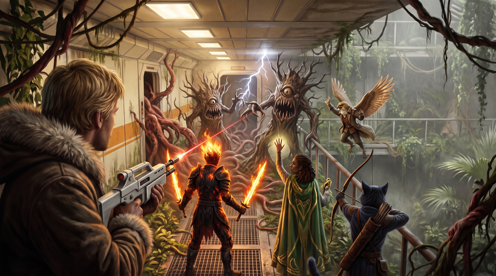

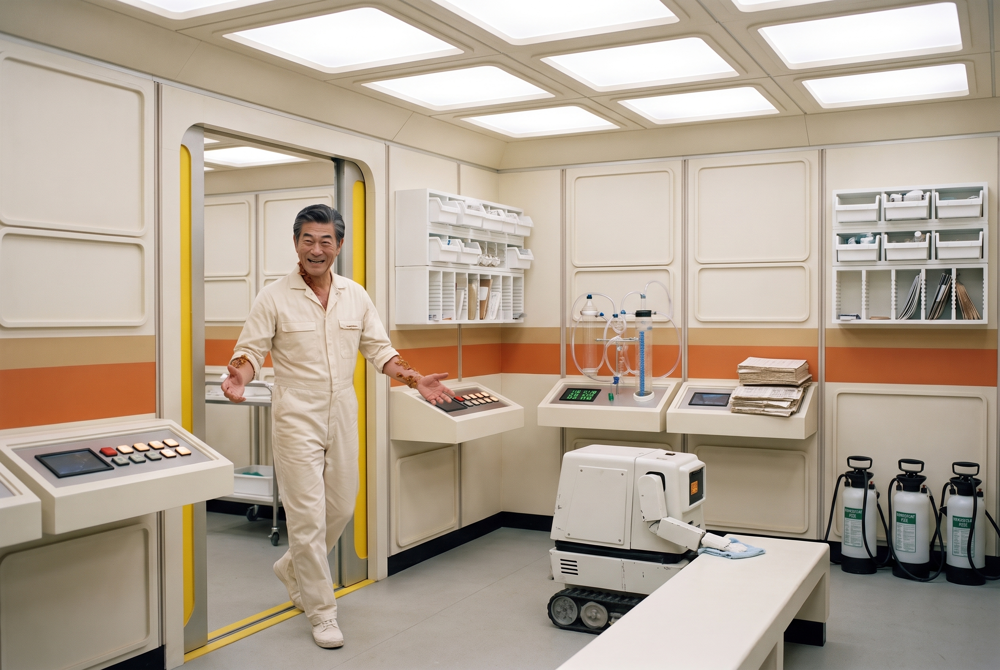

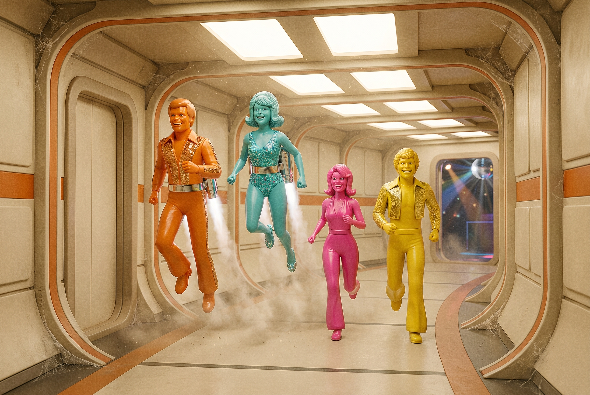

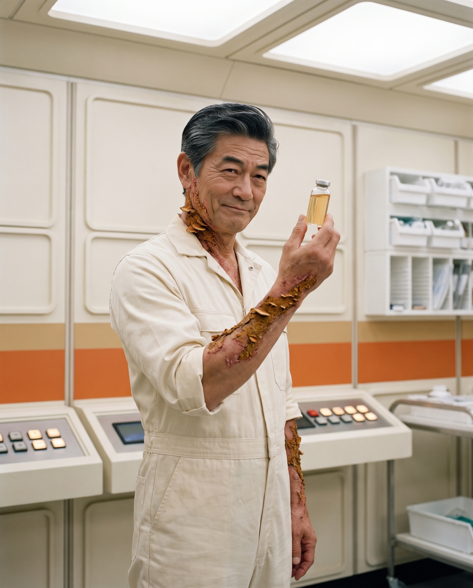

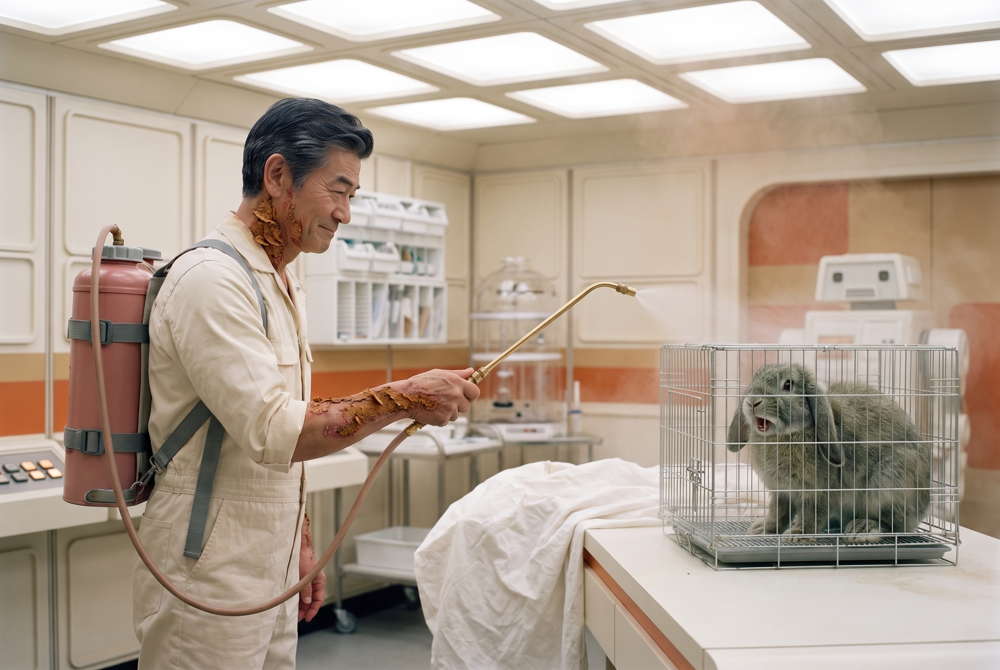

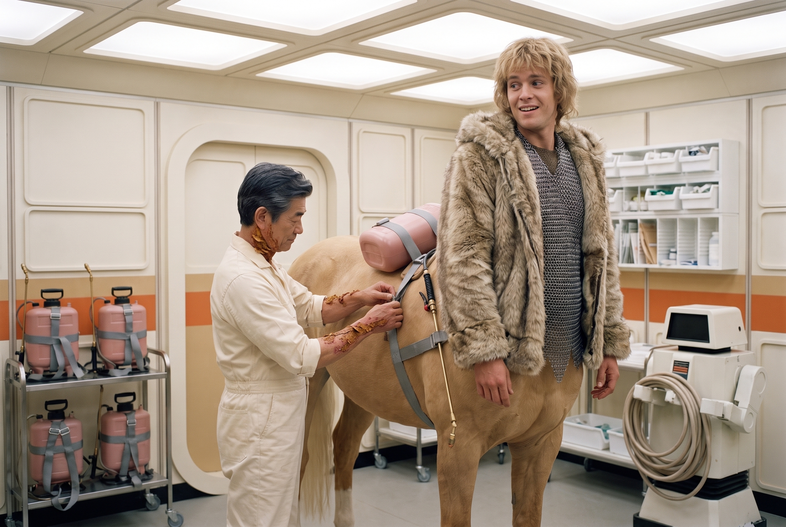

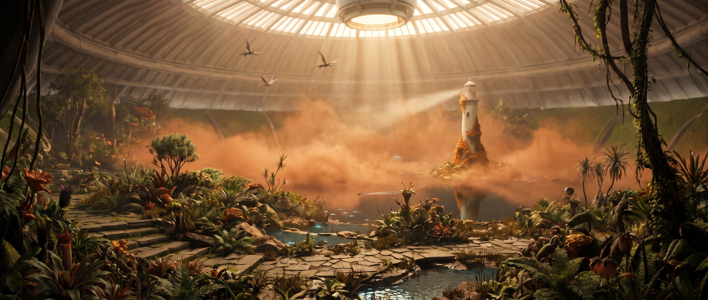

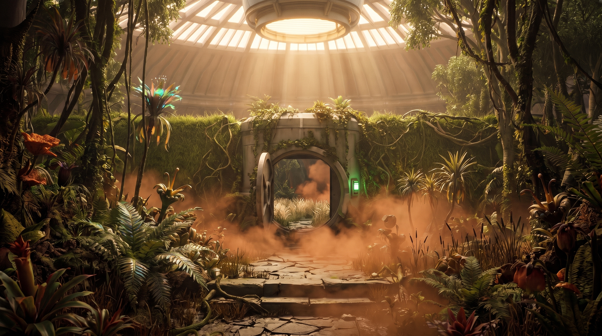

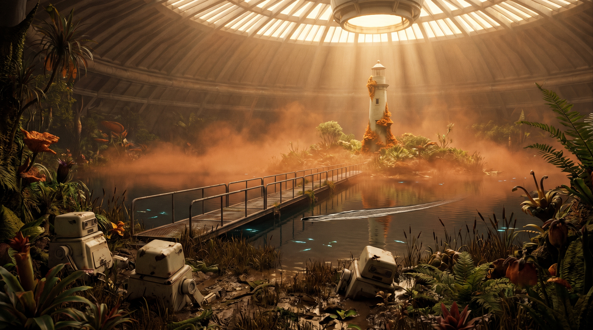

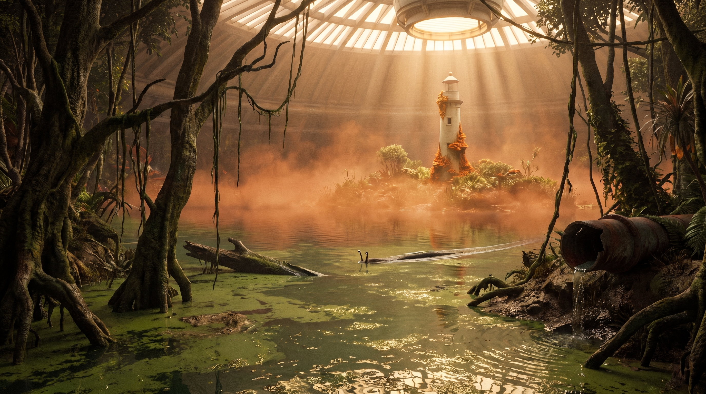

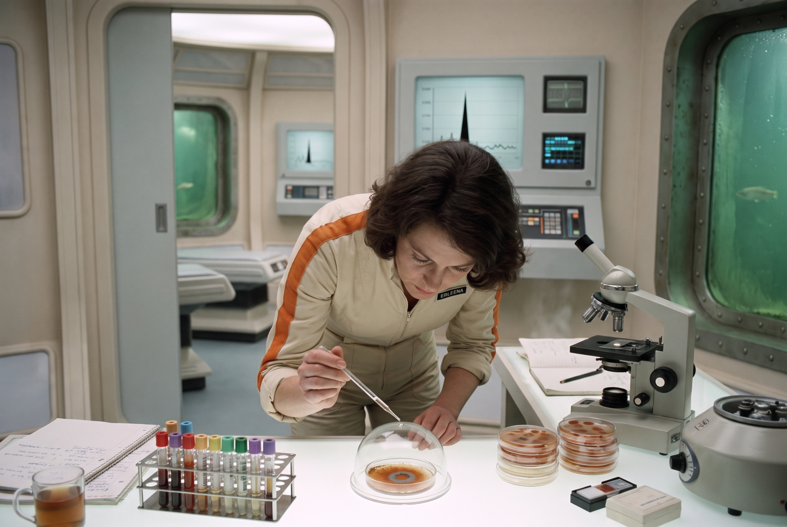

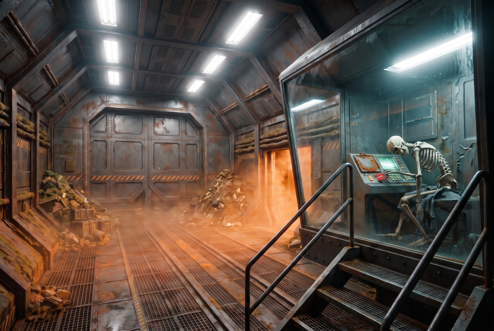

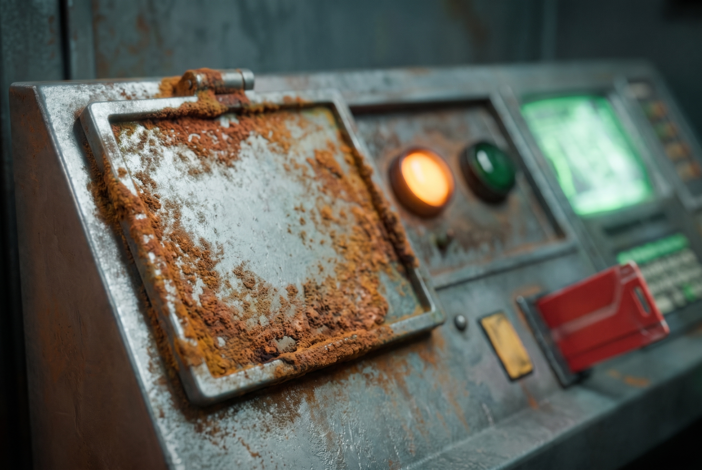

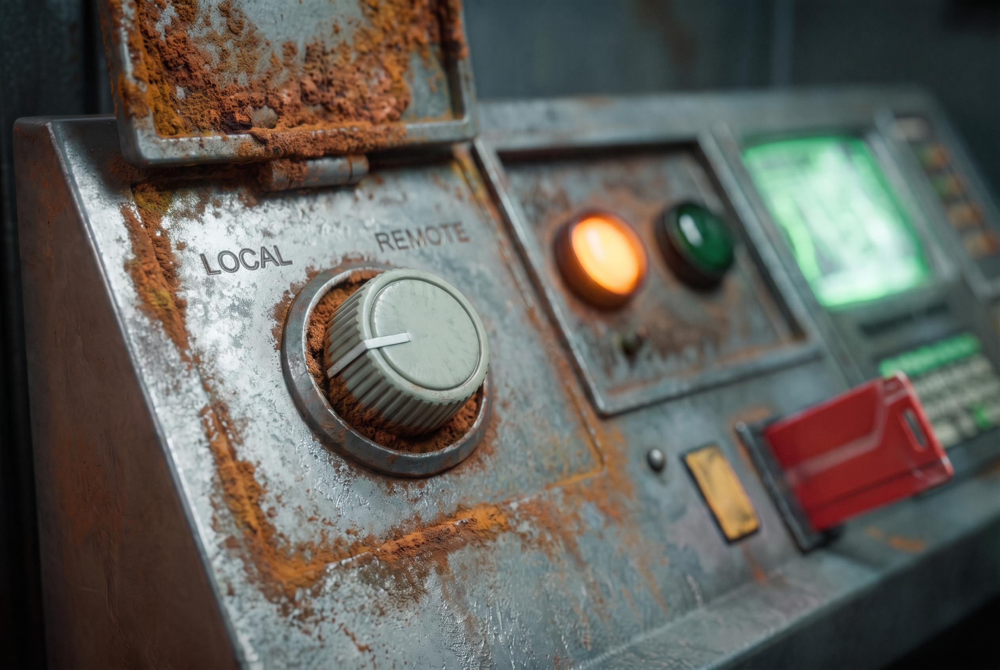
