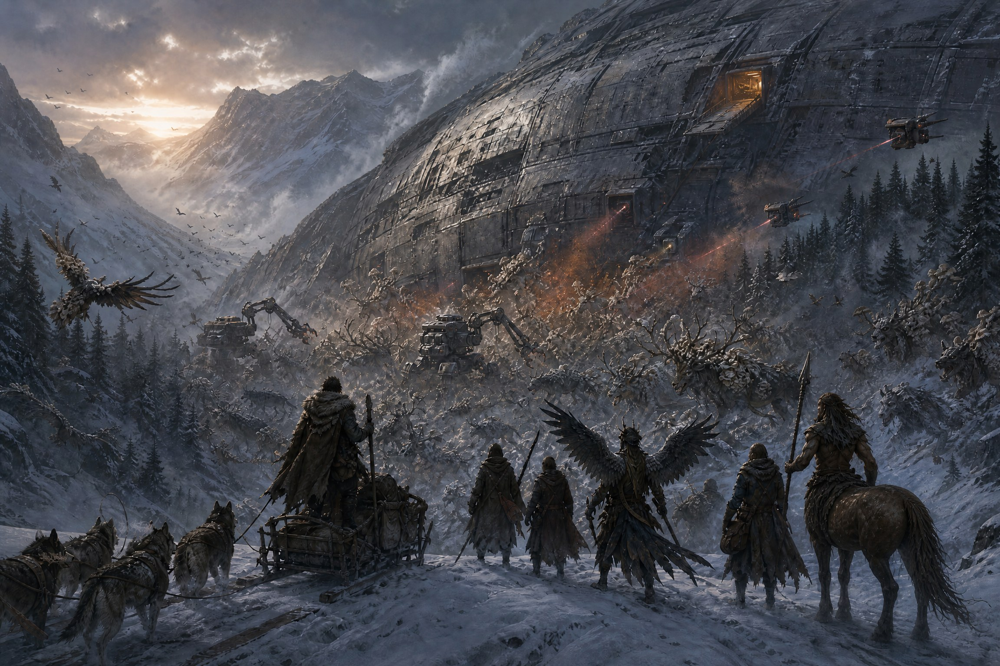
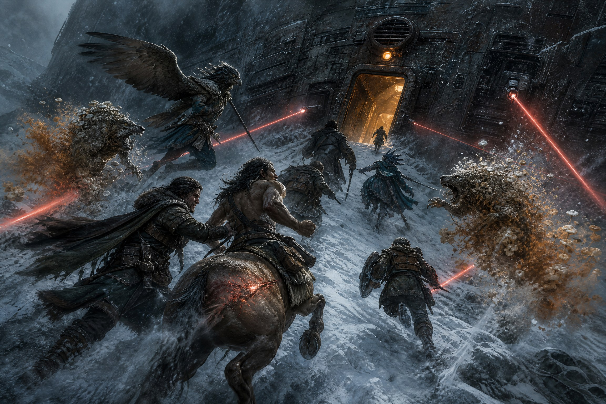

[Home](../../Home.md) / [Adventures](../../Adventures.md) / [Return to the Ship](../Return-to-the-Ship.md) / The Breach <!-- wikidown:breadcrumb -->

# The Breach

*Return to the Ship, arrival set-piece — the ship under siege, then first contact with Eddie.*

## Read-aloud

> *The blizzard breaks all at once as the convoy crests the ridge, and the ship is there — and it is not quiet.*
>
> *A maelstrom surrounds the hull. Dozens of infected creatures throw themselves at the ship's flanks in a churning, screaming tide — wolves, birds, things that used to be deer, none of it coordinated, all of it starving and furious. And the ship is fighting back. Ground robots wade through the horde on treads and grasping arms. Aerial units cut low arcs overhead, strafing the tree line. Laser turrets built into the hull itself sweep the perimeter in hard red lines, punching smoking holes through anything that gets close.*
>
> *This is not the silent ship you left. This is a war, and you are about to drive straight into the middle of it.*
>
> *Somewhere up that hillside, where the dell meets the hull, is the way you came in the first time — lost for now in the spore haze.*

The [Lighthouse](../../The-Lost-Ship/The-Lighthouse.md) is throwing everything mold-touched it can reach at the hull because [Erleena's](../../NPCs/Erleena-Riser.md) cure research beneath it is working — and so are [George's](../../NPCs/George-Decay.md) anti-fungals, up on the decks. What's actually angry is the thing anchored to the Lighthouse, not the tower itself (DM only; see [The Ship's Purpose](../../Campaign/Plot-Threads/The-Ships-Purpose.md)). The ship is defending itself, and the party is arriving in the middle of that.

## Forces on the field

- **The horde:** feral, uncoordinated infected on the ground and, see below, in the air — [Infected Wolves](../../Bestiary/Fungal-Threats.md), a scatter of Spore-Touched creatures, whatever the table has already met. This is the Lighthouse's horde — starving, furious, and pointed at the hull. They want blood, not strategy.
- **The ship's defense:** [Bipedal Security Bots and Combat Robots](../../Bestiary/Ship-Constructs.md) on the ground, aerial drones overhead, and fixed laser turrets on the hull. They are fighting the horde, not the party — and the turrets are *deliberately* covering the party. Eddie knows exactly who they are (George told him); he is simply over-eager and not a very good shot. The ground bots will still grapple anything that gets underfoot.
- **The party:** the horde's next meal and the ship's honored guests, at the same time, in the same fifty feet. The job is to thread between a tide that wants them dead and a defense that wants them alive but keeps missing, spot the open airlock door up the hillside, and run for it before either side changes its mind.

**Point.** Someone has to call the gap in the horde before it closes. Shhhmeowmeow's passive Perception 16 and Eustace's 20 from the air are the party's eyes; put whoever the table picks on point and let them make the Perception call below for everyone.

## In the air

The Lighthouse has put its flyers over the hull. Eddie's aerial drones are tangling with them and losing — the sky is the fast lane to the door, and the exposed one.

| Creature | # | Stats | Attacks & tricks |
| :--- | :-: | :--- | :--- |
| **[Fungal Peryton](../../Bestiary/Fungal-Threats.md)** | 6–8, in two wings | CR 2 · AC 13 · HP 33 · fly 60 ft | Gore +5 (1d8+3), Talons +5 (2d4+3); **Dive Attack** +2d8 on a 30-ft dive gore; **Flyby**; **Spore Release** when it takes piercing/slashing damage: 10-ft cloud, DC 13 CON or poisoned 1 min. Eddie's turrets visibly thin them — narrate 1d4 perytons burned out of the air each round. |
| **[Spore-Touched Griffon](../../Bestiary/Fungal-Threats.md)** | 2 | CR 3 · AC 12 · HP 59 · fly 80 ft | Beak +6 (1d8+4); Claws +6 (2d6+4) **and the target is grappled** (escape DC 14). **Drag-down:** a grappled flyer is hauled 30 ft straight down each turn toward the horde and the turret lines. 5-ft **spore aura**: DC 13 CON at the start of a creature's turn in it or poisoned until the end of that turn. |
| **[Spore-Touched Cloaker](../../Bestiary/Ship-Creatures.md)** *(optional boss — the Lurker Above that escaped into the mountains, now the Lighthouse's)* | 1 | CR 8 · AC 14 · HP 78 · fly 40 ft | Drops out of the orange haze onto a lone flyer. Bite +6 (2d6+3): on a Large or smaller target it **attaches** — target blinded, cloaker has advantage against it; DC 16 Strength (Athletics) to tear it free. Tail +6 (1d8+3, reach 10 ft). **Moan** (60 ft): DC 13 WIS or frightened until the end of the cloaker's next turn. **Phantasms:** three illusory duplicates. **Spore Burst on death:** 10 ft, DC 13 CON, 2d6 poison + infection exposure. |

- **Covering fire reaches the sky.** Flyers make the same **DEX 13** save each leg as the ground party — turret lines rake the air too — with the same 2d6 radiant on a failure and the same instant apology from Eddie, aimed upward this time.
- **Two lanes.** Sky: faster to the door, but the griffons and cloaker single out whoever's alone. Ground: slower, crowded, but the robots are wading through it beside you. Split parties are the fun version.
- **The cloaker's drop** is the one surprise on the field — Eustace's passive 20 is the best chance of seeing it coming.

## Getting in

A fast, dramatic push: spot the door, run for it — if they go now, they just might make it. Not a full combat grind. Call for these in sequence; a failure doesn't stop the party, it costs them.

| Beat | Check | Result |
| :--- | :--- | :--- |
| Spot the open door | Perception DC 15 | **Success:** the upper airlock door is standing open up the hillside, and from where they are there's a straight line to it through the battle. **Failure:** they see it a beat late — the run goes closer to the horde; disadvantage on the run |
| Run for it | Dexterity (Athletics/Acrobatics) DC 14 | **Failure:** clipped by stray fire or a lunging infected: 2d6 damage |
| Make the door before it cycles | Athletics, Sleight of Hand, or Arcana (ship systems) DC 13 | **Failure:** a beat late — the horde closes in; one infected creature attacks before Eddie holds the door a moment longer for them |

**Covering fire.** Each leg of the dash across the gap, red turret lines rake the horde on either side of the party's path. Everyone makes a **Dexterity saving throw, DC 13**, to stay on the line Eddie is calling (*"keep to the left, friends! no — my left!"*). Call it the *focus* save at the table if you like — it's about keeping your head down and your feet on the path while the world explodes.

- **Failure:** clipped by friendly fire — **2d6 radiant** — and **Eddie apologizes immediately over the hull speakers**, brightly and at length, while continuing to shoot. Pick one:
  - *"Oh! Oh, sorry — that one was mine. Nearly had it, though! Keep going, you're doing wonderfully."*
  - *"Apologies, apologies — a touch left of where I wanted it. Still, we got the wolf behind it, so I'm calling that a team effort."*
  - *"Sorry! Sorry. I'll aim a little wider. Or narrower. One of those. You're nearly there — isn't this exciting?"*
- This is the party's **first time hearing Eddie**: a disembodied, delighted voice shooting at things near them and saying sorry. The greeting inside should build on it.

## Running it

Keep this loud, fast, and cinematic — turret fire lighting the fog, a robot going down under a pile of infected wolves ten feet from the party, the open door a hundred yards up the hill while something screams closer. Nobody is trying to kill the party specifically; that's what makes it survivable and what makes it terrifying. This is the doorway scene, not the dungeon — once the door cycles shut, cut hard to the quiet inside.

## First contact: Eddie

> *The airlock door seals behind you, and the chaos outside drops to a dull hum through the hull. The corridor lights come up warm, section by section, tracking your steps like they're glad to see you.*

**Once inside.** The corridor is theirs. Let them catch their breath, count heads, and decide what to do — nothing is chasing them in here. Then give them the contrast: the ship is much more active than they left it. Well-traveled routes are lit and humming — Eddie's traffic: robots passing with purpose, doors that open on approach. Everything off those routes is dark and unchanged, mold and hazards exactly where they were. Lit means Eddie is looking; dark means he isn't.

**If they talk to Eddie** (or after a beat, if they don't), the voice from the hull speakers arrives again, indoors now and from everywhere at once — pleasant, a little apologetic, entirely too glad to have company.

> *"Hey guys! I'm Eddie the shipboard computer! Here to help! Sorry about the laser out there — that one was me! George is waiting for you on the next floor — I'll light the way!"*
>
> *And the corridor lights run ahead of you, section by section, north along the deck toward the drop tube.*

Keep it short. Eddie is warm, bumbling, and genuinely trying to help. The session ends on the lit path leading down toward [George](../../NPCs/George-Decay.md) — that's the hook into next time. Don't play any bargain tonight; if Eddie wants a favor, it can come later, via George.

---

*Deeper knowledge:* [Return to the Ship](../Return-to-the-Ship.md) · [Bestiary — Ship Constructs](../../Bestiary/Ship-Constructs.md) · [Bestiary — Fungal Threats](../../Bestiary/Fungal-Threats.md) · [Russet Mold & Infection](../../Game-Mechanics/Russet-Mold-and-Infection.md) · [Erleena Riser](../../NPCs/Erleena-Riser.md) · [George Decay](../../NPCs/George-Decay.md)
