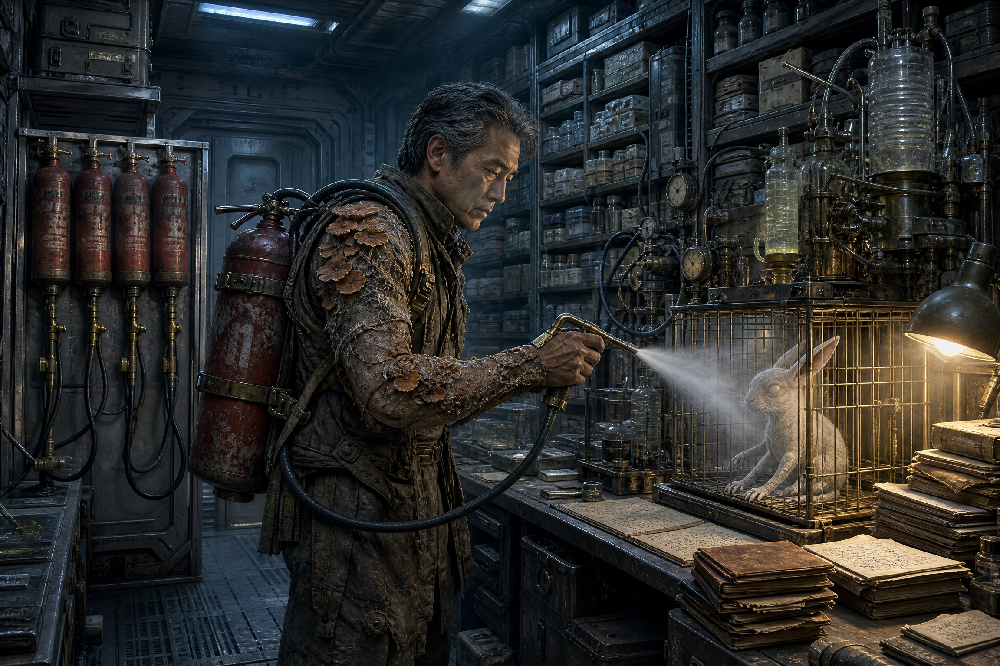

[Home](../../Home.md) / [Adventures](../../Adventures.md) / [Return to the Ship](../Return-to-the-Ship.md) / The Lab at S42 <!-- wikidown:breadcrumb -->

# The Lab at S42

*Return to the Ship, reunion — the lit walk across Level 1, the north drop tube, and George at S42. A breather that ends on a decision.*

## Read-aloud — the lit walk

> *The airlock seals behind you and the war outside becomes a hum in the hull. Ahead, the corridor lights run north, section by section, and keep running well past where you can see.*
>
> *You know this deck. You bled on it. The room where the webbirds came down out of the ceiling is dark on your left; a worker robot rolls out of it with a crate and passes you without a glance. The clinic at S23 is lit and busy — MED-2 bent over a table with something whirring in its hand, not remotely interested in you. The computer room at S30 hums behind an open door. Everything Eddie is looking at is lit. Everything else is exactly as you left it.*
>
> *At the deck's north end the drop tube stands waiting. Its card panel blinks from blue to green as you reach it, and under your boots the anti-grav hums awake.*

## The walk

No checks required — that's the point. After [The Breach](The-Breach.md), the party gets a deck that is safe because someone is watching it. Let them notice that.

- **Optional Perception DC 13:** the *south* tube — ten feet from the airlock — stayed dark while the north one lit. Eddie wants them to go the long way. The south tube lands in the theater (S35); from there it's half the ring to George either way, through the dance club or the lounge robots ([the dark side of the ring](../../The-Lost-Ship/Level-2-The-Theater.md)).
- **Eddie chatter** — drop two or three as they walk, delighted and a little too helpful:
  - *"That was the officers' mess! Very good coffee, I'm told. Well — I'm told there was coffee."*
  - *"Oh — sorry — that door's a second slow. It's a hundred years old. So am I, but I try not to make it everyone's problem."*
  - *"Ooh, the library's just there. Do go in sometime. Not now. Now is for George."*
  - *"Nearly there! Left at the — no, your left. Yes. That one. You're all very good at this."*
- **A worker robot** (QftIS random encounter) rolls up and extends its arms for their gear. Harmless: it carries whatever they hand it to the lip of the tube, then stops and waits — it isn't rated for anti-grav — and holds the bags out for them one at a time. A comic beat.

## Down the tube and along the ring

The tube sets them down at the north **S31** on the observation deck. The lights pick up at their feet and run west: past the **S32 robot station** — dormant combat and worker robots in their alcoves; as the party passes, one turns its head, considers them, and settles — to a yellow door with light under it. **S42, Medical Storage.** Two doors from the tube, and the lights stop there.

One line of texture: the next door south along the west rim is **S43, the whirlpools** — three grells in the brine. George has never opened it and advises the same. Everything else on the ring is dark; see [Level 2's dark-side table](../../The-Lost-Ship/Level-2-The-Theater.md).

## Read-aloud — the reveal

> *The yellow door slides open on a working lab. Medical shelving to the ceiling, half of it emptied into a synthesis rig that clicks and drips on the bench. Notebooks — a month of them — stacked in an order only their author understands. And in the middle of it, on his feet, walking to meet you under his own power: George. The growths are half what you remember. The baritone isn't.*
>
> *"Oh my."* A pause exactly as long as it needs to be. *"You came back. Through* that*. I heard the whole thing — Eddie narrates. Do sit down. No — not there. That is the mold sample."*

Then give the party the floor. Let them look at him, count heads, say what they say. He lets the silence run one second past comfortable before he fills it.

## What George has for them

| | What | The fine print |
| :--- | :--- | :--- |
| **The doses** | His anti-fungal treatment, proven on himself — **six doses**, one per member of the expedition, Harah included. | **Stopgap tier** ([Russet Mold & Infection](../../Game-Mechanics/Russet-Mold-and-Infection.md)): a dose halts progression for 24 hours; it does not reverse a stage. He says so before anyone can ask: *"This is not the cure. This is the thing that keeps you alive long enough to be cured."* |
| **The spore-blasters** | **Four backpack rigs** — the ship's old fire extinguishers refilled with his alkaline mold-killer. He would rather show than tell: see *The demonstration* below. | Stats on [The Counteragent](../../Game-Mechanics/The-Counteragent.md). |
| **The state of Erleena** | Alive, close, and further along than anyone hoped — she stopped the strain replicating in a dish ([her Progress](../../NPCs/Erleena-Riser.md)), and she thinks she knows what the source *is*. George won't spoil it: *"She'll want to tell you herself. She has slides."* George talks to her every day on the ship's internal comms — he told her the moment the party reached S42, and she has heard all about the doses and the packs (she has asked for one). It is the *outside* line that is dead: the ship's fields let no signal in or out of the hull ([Ship-wide properties](../../The-Lost-Ship.md)). What keeps the two of them apart is the garden. And the Lighthouse is fighting back now — the siege outside is aimed at *her*, and at him: it started when the soap started working, and he does not think that is a coincidence. | The [Garden Level](../../The-Lost-Ship/The-Garden-Level.md) between here and her lab is thicker with spores than the party remembers. George can't go — spore air is still the one thing his treatment can't handle. *"I would last an hour. Perhaps two. I have done the arithmetic and I do not care for it."* |
| **The bargain** | Eddie will open the medical decks below — the labs, the pharmacopeia, the cure materials — but he wants *"a small favor or two"* first. George translates: *"It wants things done. It's a computer. It does not know what 'small' means."* | Which favor comes first is the DM's call; don't resolve it on this page. Let Eddie float it from the ceiling and George raise an eyebrow. |

- **Two consistent first favors:** **clear the infected froghemoth from the lake** — genuine lab safety for Erleena now, not a cover story — or **restore power to a dark section of the ring**. Either is real, either is what Eddie means by "small."

## The demonstration

George's fungicide spray packs — the spore-blasters, if you ask Eddie — get shown, not described. He has been waiting a month for an audience.

> *George crosses to a rack by the door and hauls down four packs, one at a time, with the care of a man who has dropped one before. Squat cylinders, still wearing the ship's fire-extinguisher stencils, each trailing a hose to a wand tipped in brass. The harness straps are gurney webbing, cut and re-buckled by hand.*
>
> *On the bench, under a sheet he lifts away, is a wire cage. Inside it, a rabbitoid from the garden. Its eyes are filmed white. It stands perfectly still, nose to the mesh, facing one wall — the wall it has faced all day, by the look of the droppings — and it does not turn when the sheet comes off, or when George shoulders a pack and hefts the wand.*
>
> *He works a lever. The wand hisses and a pale cone washes the cage end to end, and the haze that hung over it is simply gone. The rabbitoid's eyes clear with it. It blinks. It screams — a thin, terrible noise — and hurls itself at the back of the cage and stays there, shaking. Then, after a long second, it turns around, hops to the front, and starts eating the lettuce it has ignored for a week.*

**George's lines** — deliver them in the baritone, and let the pauses do the work:

- *"Alkaline solution, under pressure."* He taps the tank. *"Soap, essentially. Soap with opinions."*
- On the scream: *"Oh my. Yes — it does that. Understand what you have just watched. I did not cure that animal. It is precisely as sick as it was a minute ago. But it is* its own *sick now. Nobody is holding the leash. It gets a day of that, and then the leash comes back — unless somebody washes it again."*
- On scale: *"Anything Large or smaller — one wash and the hold is broken. Something the size of the lake's landlord —"* a pause *"— three, inside a minute. I have not tested that. I would very much like to be present when someone does."*

**Fitting the packs.** He fits the packs on whoever steps forward — cinches the webbing, checks the hose for kinks, puts the wearer's hand on the lever and takes it off again. The number he says out loud, to each of them, is **six**: six blasts a tank, and he says it the way other men say *be careful*. On the centaur the harness won't sit like a firefighter's pack; it rides across the back like a saddlebag, tank on one flank, wand clipped along the other — George adjusts it twice and pronounces it *"ungainly but correct."* The fourth pack he fits on nobody. He stands it by the door and rests a hand on the tank. *"That one is hers. If you can get it down to her without using it, I will be genuinely impressed."* Refills take ten minutes at any of the ship's fire-suppression stations; Eddie knows where every one of them is and volunteers the fact from the ceiling before anyone asks. *(DM aside: this is where someone at the table says "Ghostbusters." Let them have it. Do not give the line to George — he has never heard of it, and he would be offended by the comparison.)*

Full rules — cone, blasts, refills, what a wash does to fungus and to the Lighthouse's hold — on [The Counteragent](../../Game-Mechanics/The-Counteragent.md).

## Harah and George

The primal mind and the scientific mind on one problem, from opposite ends, and they take to each other fast. She offers him the **Sandwalker stabilizer** — not a cure; time and clarity — and he accepts it with the interest of a man who has been his own only test subject for a month. Then her real errand: she means to put **defiler magic** to Erleena — a willing defiler kills the colony inside George, restoration rebuilds what it ate (the surgery Erleena's [Pivot](../../NPCs/Erleena-Riser.md) already sketches). George, intrigued and appalled in the same breath: *"So the treatment is to murder a garden that happens to be me, and then replant. Oh my. — No, don't stop. I'm listening."*

## The decision — the way down

The party leaves George at S42 and goes to Erleena. Both ways down from George's corner land in the **garden's north-west corner** — the choice is how to get down, then how to cross. DM's numbers light.

- **Down — the tube.** The north drop tube (S31 → S47, green-gated — Eddie overrides) sets them down beside **S52, garden maintenance**. Anti-grav; one at a time; hands free.
- **Down — the lift.** The cargo platform in **S33c, one door north of the lab**, lowers a 20-foot platform straight into S52 — everyone and the gear in one go, no anti-grav. The sane way to move a centaur, six doses of anything, and four backpack tanks. Eddie lowers it; George has used it to get supplies up.
- **Then the crossing — the real decision.**
  1. **The bridge route they know:** outer garden (S56) → inner garden (S57) → the bridge at S59 → the island (S60) and the Lighthouse hatch. Fastest, and straight past the [froghemoth](../../Bestiary/Ship-Creatures.md), which is infected and Lighthouse-directed now and works the water on purpose.
  2. **Around the lake** by a quadrant they haven't walked: longer, darker, unknown — but off the froghemoth's line.
  3. **Un-hijack the froghemoth.** Three spore-blasts within a minute break the Lighthouse's hold ([The Counteragent](../../Game-Mechanics/The-Counteragent.md)); it goes back to being a very large, very hungry animal that is no longer hunting them on purpose. Not safe — but no longer chess.

  Either way the garden is thicker with spores than they remember: run exposure frostbite-style, with an infection save per [Russet Mold & Infection](../../Game-Mechanics/Russet-Mold-and-Infection.md) at the DM's cadence (a zone crossed, a stop made). A blaster's cone buys a minute of clear air where it's pointed.

End here. The players choose; the page doesn't.

## Optional trouble (one-liners)

Only if the table wants a jolt.

- The whirlpool door isn't locked — someone leans on the wrong panel and a grell drifts in on the brine-smell.
- The S32 robots wake if the party pokes at them — one combat robot, upright and confused, asking politely for a card.
- Eddie, trying to help, opens a door on the dark side of the ring *"to save you the walk"* — DM's pick from the dark-side table.

## Running it

Warm. Let George be funny and let Eddie be a nuisance in the nicest possible way; give the players the floor and let them enjoy a room where nothing is trying to kill them. The decision at the end matters more than any roll on this page — make sure they know it's theirs.

---

*Deeper knowledge:* [George Decay](../../NPCs/George-Decay.md) · [Erleena Riser](../../NPCs/Erleena-Riser.md) · [Harah Tabr](../../NPCs/Harah-Tabr.md) · [Level 2 — The Theater](../../The-Lost-Ship/Level-2-The-Theater.md) · [The Garden Level](../../The-Lost-Ship/The-Garden-Level.md) · [Russet Mold & Infection](../../Game-Mechanics/Russet-Mold-and-Infection.md) · [The Counteragent](../../Game-Mechanics/The-Counteragent.md) · module: [Return to the Ship](../Return-to-the-Ship.md)
