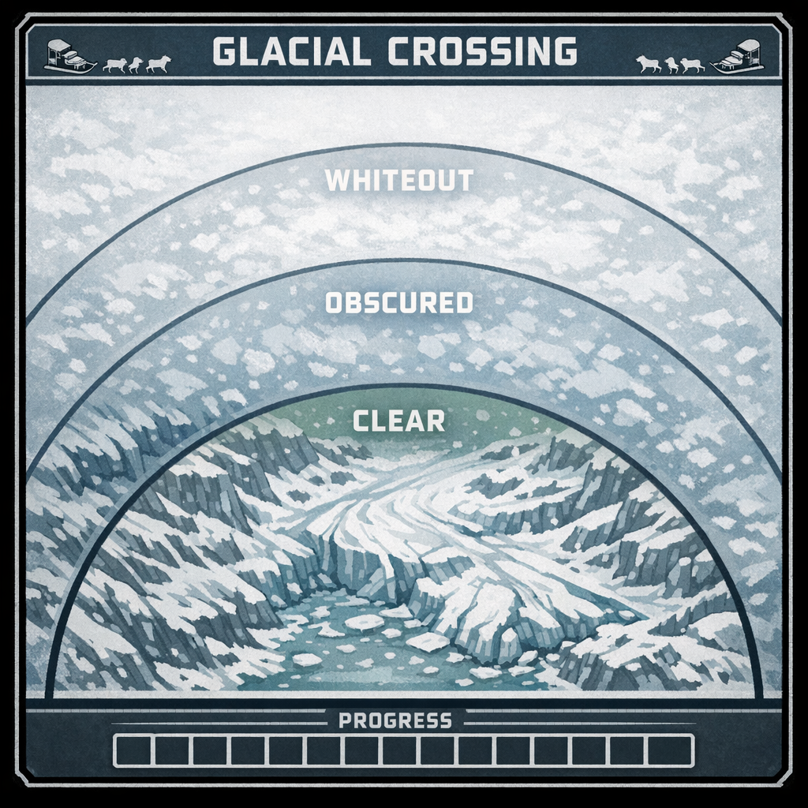

[Home](../../Home.md) / [Adventures](../../Adventures.md) / [Return to the Ship](../Return-to-the-Ship.md) / The Whiteout <!-- wikidown:breadcrumb -->

# The Whiteout

*Return to the Ship, travel encounter — dogsled convoy behind the lead sled, Barrier Peaks blizzard. Environment and ability checks only.*

The abandoned [hoversled](../../Campaign/Current-Status.md) is somewhere on this route, powered down and half-buried. If the party wants to look for it as they pass, a **Survival DC 13** during a Clear leg finds it (DM's call whether it's salvageable) — otherwise ignore it.

## Read-aloud

> *The sleds stand harnessed at Frostwatch's gate, the dogs stamping and steaming in the grey light. Korrin walks the lead team's traces himself — a Frostwatch team, not his own — then turns to you.*
>
> *"I'll lead the way in my sled. You'll follow after me. This storm's rough, but my dogs know this land better than anyone — trust them to find the path. We'd best head out right away. It'll be dark soon, and you don't want to be caught out here after night falls."*
>
> *An hour out, the glacier opens ahead and the weather closes behind. Wind comes down off the peaks and takes the horizon with it — first the ridgeline, then the trees, then everything past the lead sled's runners. Snow drives sideways. The world shrinks to a grey smear moving ahead of you, the panting of the dogs, and the creak of your own sled.*

## The Glacial Crossing

Run the crossing in **legs** — roughly one per half hour in-world, or whenever the scene wants a beat. Each leg, one character makes the check the leg calls for.

**How the board reads.** The three rings are the **distance to the lead sled**. *Clear:* right behind Korrin, his runners in plain sight. *Obscured:* a grey smear somewhere ahead, dogs audible. *Whiteout:* nothing but wind, steering by the last sound of the team. The 16 boxes are **distance across the glacier**. The party **starts in Clear**.

**Each leg,** one character makes the check the leg calls for (table below). Every check is a keeping-up check:

- **Success:** fill **3 boxes**, and if you're not in Clear, the lead sled comes **one ring closer**.
- **Failure:** fill **1 box** (the convoy keeps moving — you've fallen behind, not stopped), and the lead sled pulls **one ring farther away**. Apply the check's own failure consequence too.
- **Failure while already in Whiteout:** you've **lost the lead sled** — see below.
- **In Clear** you don't need to navigate — Korrin's team picks the line — so skip the Survival check; the other hazards (dogs, crevasses, deep snow) still come up. **In Whiteout** all DCs are **+2** (you're steering by sound).

| Check | DC | On a failure (in addition to +1 box and the sled pulling one ring away) |
| :--- | :--- | :--- |
| Navigate — keep the lead sled in sight | Survival 15 | Nothing extra — the ring shift *is* the consequence |
| Calm the dogs when they balk or panic | Animal Handling 14 | Sled stops; disadvantage on the next check |
| Spot the crevasse before the runners do | Perception 14 | Nearest to the edge: DEX save DC 13 or 2d6 bludgeoning |
| Deep-snow slog / dig a stuck sled out | Athletics 12 | Everyone makes the frostbite save |

The crossing is done when all 16 boxes are filled — about 6–10 checks; fill extra boxes freely to speed things up.

**Lost in the whiteout** (a failure while in the Whiteout ring): the lead sled is gone. No progress until they find it. Each leg spent lost, **everyone makes the frostbite save**, then one character tries **Survival DC 15** to pick up the runner tracks or **Perception / Animal Handling DC 12** to hear Korrin's dogs and horn through the wind; success puts them back in the **Whiteout ring** and progress resumes. (His Whiteout Instinct covers his sled, not yours a hundred yards back.) Korrin circles back after about three lost legs — this is a weather scene; nobody dies of a bad roll, but the cold adds up and the light is going.

**Frostbite** (not a keeping-up check — it never moves rings or boxes): **CON save DC 13**, non-natives at disadvantage, after any leg spent in the Whiteout ring or lost, and whenever the sled stops to dig out. Failure: numb hands — disadvantage on DEX-based checks and attacks until warmed; accumulated failures → 1 level of exhaustion. Mitigation per [Cold & Survival](../../Game-Mechanics/Cold-and-Survival.md): huddling, heat, extra furs → advantage; quality gear or magic → automatic success or lower DC.

## Arrival

The storm thins as Korrin's sled crests the last ridge, and the crash site opens out below. Then the air turns orange — spores, thick as the snow was a minute ago — and through it the ship is fighting: hard red turret lines, robots wading through a screaming horde at the hull. Cut to [The Breach](The-Breach.md).

## Running it

Weather scene, not horror scene. Make the dogs and the cold the characters — the team balking at a crevasse lip, fingers too numb to work a buckle, Korrin's horn somewhere ahead in the white. Keep the checks moving: a leg a minute at the table, and narrate the boxes filling.

---

*Deeper knowledge:* [Cold & Survival](../../Game-Mechanics/Cold-and-Survival.md) · [Frostwatch Horror — Act I](../Frostwatch-Horror.md) · [Korrin](../../NPCs/Korrin.md) · module: [Return to the Ship](../Return-to-the-Ship.md)
