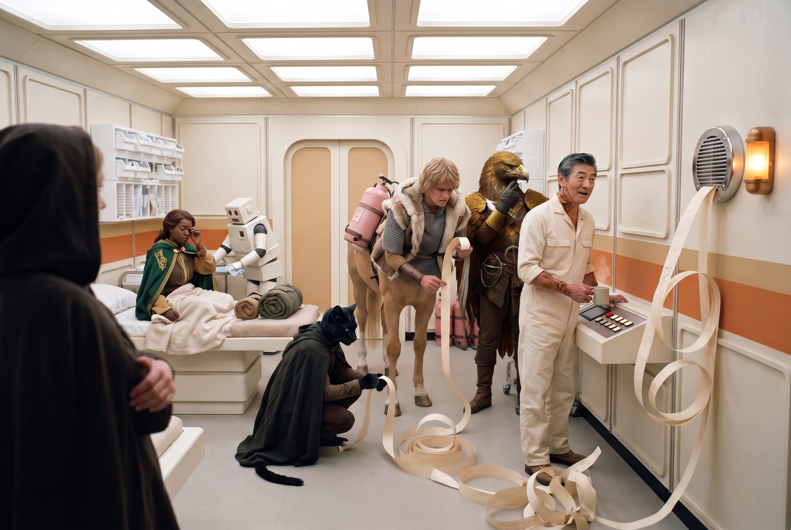
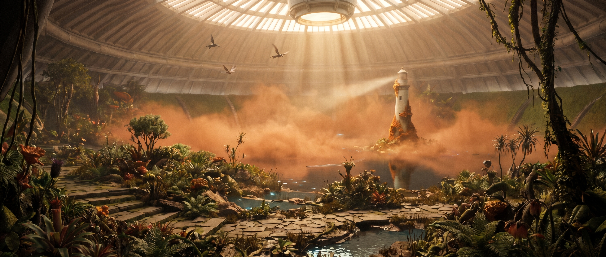
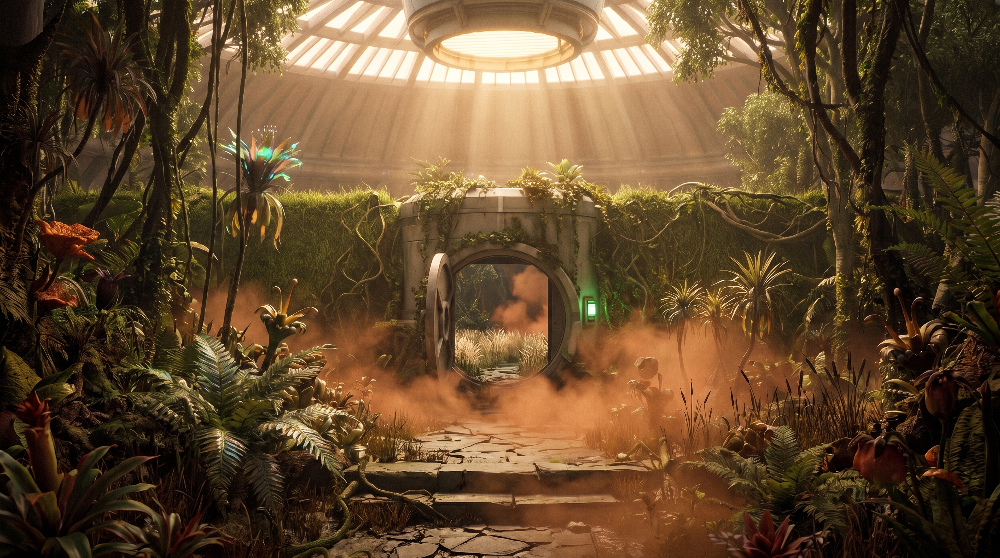
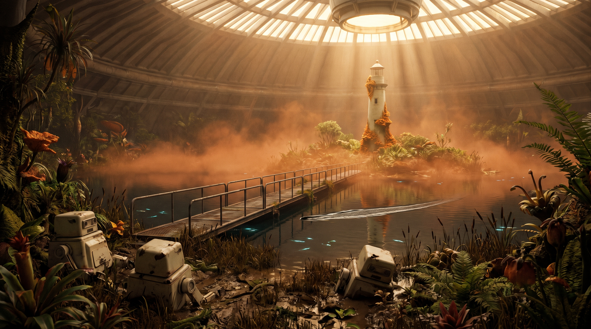
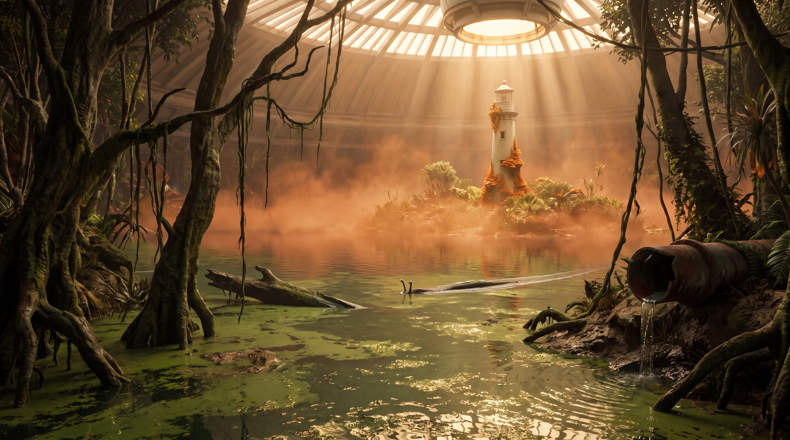

[Home](../Home.md) / [Adventures](../Adventures.md) / The Awakened Ship <!-- wikidown:breadcrumb -->

# The Awakened Ship

**[Flipbook](The-Awakened-Ship/Flipbook.md)**: just the images, in play order, for showing the table.

**The second half of the ship expedition, split out of [Return to the Ship](Return-to-the-Ship.md) for session 3 (2026-10-06).** The party has crossed the glacier, run the breach, met Eddie, burned the ropers, and reached George at S42 ([The Lab at S42](Return-to-the-Ship/The-Lab-at-S42.md)). They hold six doses and a spore-blaster each plus one for Erleena, they have spoken to Erleena on the comm, and they long-rested in George's med bay. The ship is awake and on their side. Now it has a to-do list.

**Design goals:** three jobs in three parts of the ship, in any order the party likes, each with its own flavor: a monster fight (the frog), a dungeon errand (the door) and a comedy (the antenna). Then the turn with Erleena, and the arc closes on [The Send-Off](Return-to-the-Ship/The-Send-Off.md).

## Encounters

1. **[Beneath the Lighthouse](The-Awakened-Ship/Beneath-the-Lighthouse.md)** (**the frog**): the island, the hatch, Erleena's lab fifty feet under the lake, the infected froghemoth at the glass (kill it or wash it before the lake comes in), and then the turn. The party tells her about Rajaat and the defilers, she makes her two asks, names Aerun, and says she's going. George stays to hold the ship.
2. **[The Jammed Override](The-Awakened-Ship/The-Jammed-Override.md)** (**the big door**): the cargo door the party left by keeps opening and letting the siege in. Get to the cargo-bay booth on the lower deck and turn the dial to REMOTE. It puts the party a few doors from Nova.
3. **[The Antenna](The-Awakened-Ship/The-Antenna.md)** (**Eddie's favor**): a 150-lb dish up the iced rocks to the crown of the hull, pointed at the Temple of Nord so Eddie can join the Aura network. Played for comedy.

**After all three:** back to S42 for **[The Send-Off](Return-to-the-Ship/The-Send-Off.md)**, the last scene of the arc.

## The opening: Eddie's list

*Session 3 opens here (2026-10-06), at S42 the morning after. The party long-rested in George's med bay. Erleena already made her two asks on the comm, and Eddie's "small favor or two" from the bargain hasn't been played yet. This is where it lands.*

Eddie wakes the room the way he does everything, too early and very pleased about it. The lights come up a notch at a time. Then the wall speaker starts to chatter, and **a paper tape** feeds out of a slot under its grille, curling onto the floor. Eddie makes lists, because lists are what he's good at, and he reads this one aloud as it prints:

> *"Good morning! I made a list. I'm very good at lists. Number one: the frog. That's Erleena's. Number two: the big door. Also Erleena's. Number three —" a small pause "— is mine. It's a very small favor."*

George, delighted: *"Oh my! Another 'small favor' for Eddie! Sounds exciting!"*

**Number three is [the antenna](The-Awakened-Ship/The-Antenna.md).** Hook it on something the party already knows from play: every call they made from Frostwatch died with *"No signal. Your number cannot be completed,"* and they talked at the council about reaching Jak directly. Eddie explains, cheerfully, that he is the reason for that, or rather the hull is. The ship's fields eat radio, so nothing gets out. **A dish outside the hull, on the crown, aimed at the Temple of Nord, and he's on the network.** George and Erleena woke him to get a message out, and this is the only way he's found. Use his lines from [What Eddie wants](The-Awakened-Ship/The-Antenna.md). George is for it, and so is Erleena if anyone rings down to ask her.

**Let the party argue it here, not on the mountain.** They've been keeping the network-corruption theory away from *"anyone with a glowing ear,"* and this plugs the ship's mind into that same network ([The serious bit](The-Awakened-Ship/The-Antenna.md)). Whichever way they decide is fine. If they say no, Eddie says he's disappointed once and drops it.

## Three goals, any order

None of the three gates the other two. They are in three different places, so the order is the party's choice:

| Goal | Who wants it | Where | How they get there | Page |
| :--- | :--- | :--- | :--- | :--- |
| **The frog** | Erleena: it's testing her portholes | The garden lake, or the glass of her lab | Lift or tube to the garden, then the bridge or the swamp, the island, and the hatch. Or meet it at the lab's portholes | [Beneath the Lighthouse](The-Awakened-Ship/Beneath-the-Lighthouse.md) |
| **The big door** | Erleena: the cargo door keeps opening and the siege gets in | The cargo-bay booth on the lower deck | Drop tube all the way down, or the stair under Erleena's lab | [The Jammed Override](The-Awakened-Ship/The-Jammed-Override.md) |
| **The antenna** | Eddie | The crown, on top of the hull, outside | Up and out the upper airlock, into the siege's sky | [The Antenna](The-Awakened-Ship/The-Antenna.md) |

**How the orders play out:**

- **Top down:** frog at the bridge, then Erleena, then the stair down to the door, then back up the tube. It's the cleanest run, and the frog is out of the way before the lab.
- **Bottom up:** tube to the lower deck, the door first, then up the stair into the lab, with the frog arriving at the portholes. Erleena gets the flooding fight in her own room.
- **The antenna** goes before the descent or after, with Erleena on the way out. Either way works. If it's done before the party leaves the ship, the last scene at S42 can include a call out, placed by Eddie on the intercom.

Clearing **any one** of the three pays Eddie's bargain and opens the medical decks. Eddie still wants the antenna most.

## Getting down to the garden

The frog and Erleena are reached from the top, through the garden. (The bottom route, up the stair from the lower deck, is on [The Jammed Override](The-Awakened-Ship/The-Jammed-Override.md).) Both ways down from George's corner land in the **garden's north-west corner**, so the choice is how to get down, then how to cross. DM's numbers light.

- **Down — the tube.** The north drop tube (S31 → S47, green-gated — Eddie overrides) sets them down beside **S52, garden maintenance**. Anti-grav; one at a time; hands free.
- **Down — the lift.** The cargo platform in **S33c, one door north of the lab**, lowers a 20-foot platform straight into S52 — everyone and the gear in one go, no anti-grav. The sane way to move a centaur, six doses of anything, and a backpack tank for everyone. Eddie lowers it; George has used it to get supplies up.

- **Then the crossing — the real decision.**
  1. **The bridge route they know:** outer garden (S56) → inner garden (S57) → the bridge at S59 → the island (S60) and the Lighthouse hatch. Fastest, and straight past the [froghemoth](../Bestiary/Ship-Creatures.md), which is infected and Lighthouse-directed now and works the water on purpose.

     

     
  2. **Around the lake** by a quadrant they haven't walked: longer, darker, unknown — but off the froghemoth's line. The obvious "long way" is the south-east swamp (S58): knee-deep, burst pipes, giant leeches.

     
  3. **Un-hijack the froghemoth.** Three spore-blasts within a minute break the Lighthouse's hold ([The Counteragent](../Game-Mechanics/The-Counteragent.md)); it goes back to being a very large, very hungry animal that is no longer hunting them on purpose. Not safe — but no longer chess.

  Either way the garden is thicker with spores than they remember: run exposure frostbite-style, with an infection save per [Russet Mold & Infection](../Game-Mechanics/Russet-Mold-and-Infection.md) at the DM's cadence (a zone crossed, a stop made). A blaster's cone buys a minute of clear air where it's pointed.

The players choose; the page doesn't.

## Running it

Open warm at S42 and let Eddie's list do the work: tear off the tape and hand it to the players, so they hold the whole session in one hand and pick their own order. (Prop idea: print the three lines on a strip of receipt paper.) Keep the three jobs distinct in tone. The frog is real danger, the door is a short grim errand, and the antenna is a farce. Save the quiet for Erleena.

---

*Deeper knowledge:* [Return to the Ship](Return-to-the-Ship.md) · [The Lab at S42](Return-to-the-Ship/The-Lab-at-S42.md) · [What's behind Eddie](Return-to-the-Ship.md) · [George Decay](../NPCs/George-Decay.md) · [Erleena Riser](../NPCs/Erleena-Riser.md) · [The Counteragent](../Game-Mechanics/The-Counteragent.md) · [The Lost Ship](../The-Lost-Ship.md)
