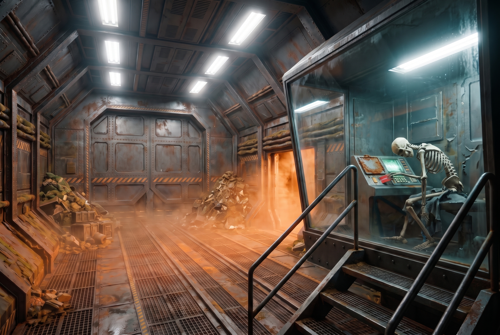
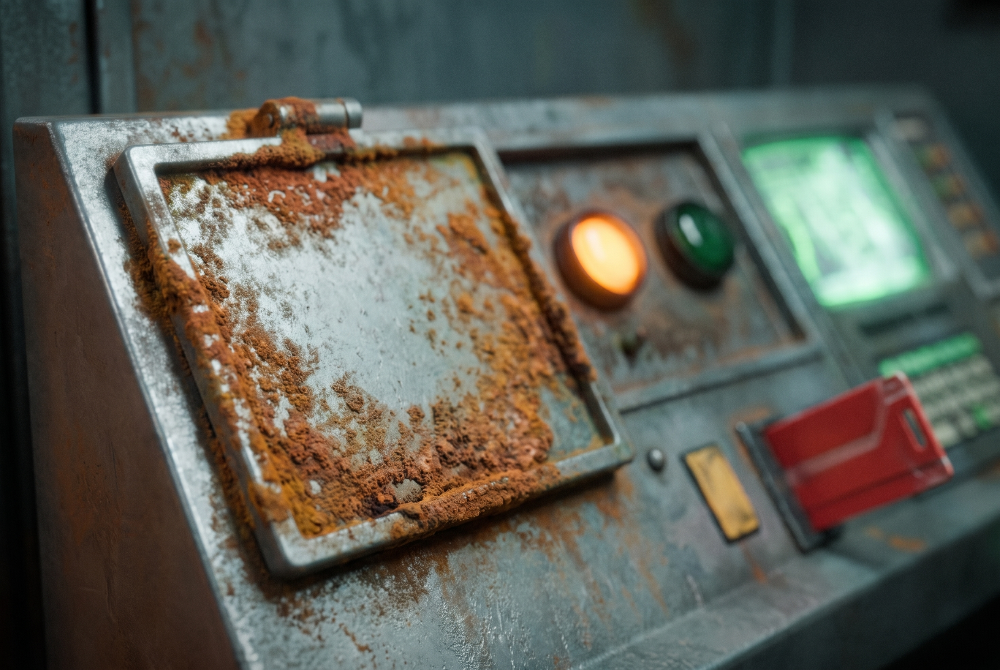
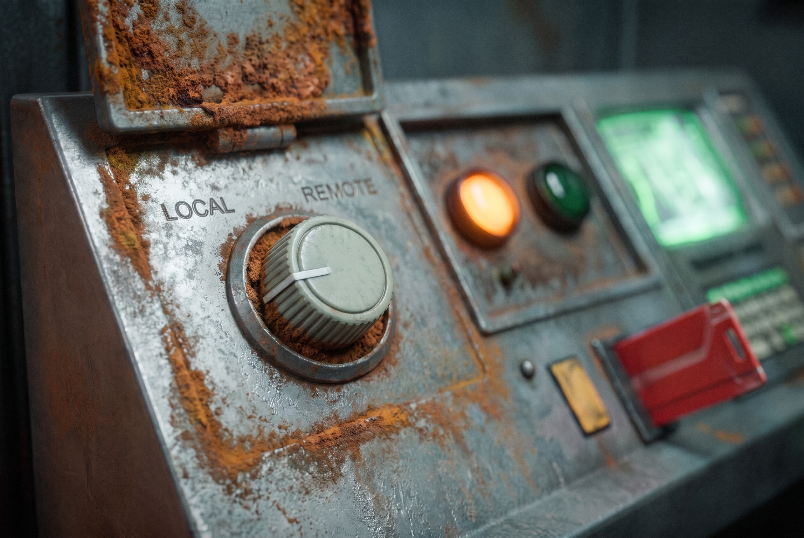

[Home](../../Home.md) / [Adventures](../../Adventures.md) / [The Awakened Ship](../The-Awakened-Ship.md) / The Jammed Override <!-- wikidown:breadcrumb -->

# The Jammed Override

*Return to the Ship, side quest: the big cargo door on the lower deck that the party left the ship through, which keeps opening; the control booth that owns it; and the jam Eddie can't clear from his end.*

## What's actually wrong

**The door is the big one: the 40 × 60-ft cargo door on the lower deck** ([The Lower Deck](../../The-Lost-Ship/The-Lower-Deck.md)), the one the party was flushed out through at the end of the first survey. Erleena asked them back then to make it never open again. It still opens. Every few hours the door grinds open for about a minute and shuts again, and while it's open, **things from outside get in**. The siege at the hull has a way inside the ship.

It is not the tower and it is not a mind. It is a **jammed override**. The door's control station is the cargo bay's control-booth console, *"the same console you used to open it"* (Eddie, 2026-09-24). Its override is set to LOCAL and physically stuck there, with mold grown into the mechanism and a corroded relay behind it. The station keeps re-issuing the last command it was given, the manual purge cycle the party started, so the door keeps executing it. Eddie's board shows the fault, and he can't clear it from upstairs.

> *"Oh, that one. Yes. I can see it. I can see it doing it. The override's set to LOCAL at the console down there, and the console won't take my hand off it. I've asked. I've asked a great many times. Somebody has to go and turn the actual dial."*

That is the whole explanation. Say it plainly when the party asks Eddie, and let it be a relief: one thing on this ship that is simply broken.

## Where it is

The **cargo bay's control booth** on the lower deck: the same booth where the party found the skeleton with the red key card and ran the purge. The skeleton is still in the chair, and the red key card is still in the console slot where they left it. The override is on that same console, at its left end, and from the booth window you can watch the big door cycle. Eddie has the bay's lights back on now. **The party knows the room.** They were in it on the way out last time.

## Getting to the station

1. **Down the drop tubes.** Eddie: the tubes go all the way down to the lower deck. From the tube it's the party's old route through the reactor core (S61) and the decon corridors (S63) to the cargo bay. The wheely sleds are still in S63.
2. **Down the stair from Erleena's lab.** The spiral stair below her sickbay comes out on the lower deck. Eddie opens that door for them.

Either way, roll the lower deck's random encounters as written, **plus whatever came in on the door's last cycle**: infected wolves, birds, or deer from the siege outside, loose in the cargo bay and the corridors near it. The bay is spore-thick around the door, and a spore-blaster buys a minute of clean air where it's pointed. If the party wants it, the door cycles while they're in the booth. Show them the snow, the orange haze, and what's waiting in it.

## Clearing the jam

The override is a small square flip-up cover on the left end of the booth console, **sealed shut** with a crust of mold round its edges and in its hinge. Beside it are two lamps: amber (lit) and green (dark). Under the cover is a **selector dial** with two settings, **LOCAL** and **REMOTE**, turned hard to LOCAL and held there by mold packed round the knob; a corroded relay sits behind it. The red card in the console is not part of this: the override needs no card. Three steps, none of them hard, all of them in a place the party would rather not stand for long:

| Step | Check | Fail |
| :--- | :--- | :--- |
| **Open the cover** | Thieves' tools DC 15, or STR 15 to force it (a spore-blaster wash first: advantage — the mold lets go of the metal) | Time. Another try, another encounter roll. |
| **Turn the dial** | STR 15, or INT (ship systems / Arcana) DC 14 to release it the right way | A fail by 5 or more snaps the corroded relay: the door **locks in whatever state it's in**, and only Eddie's robots with a cutter can open it again — a day's work for George's crew. |
| **Hand it back to Eddie** | Automatic once the dial turns to REMOTE; the amber lamp goes out, the green one comes on and Eddie says something delighted | — |

The moment control passes, Eddie **seals the cargo door**. Erleena's month-old ask is finally done, and the siege has lost its way in. He holds it shut, and he can also open it on request whenever the party wants.

## What it opens

This is the quiet payoff. The errand puts the party on the **lower deck**, and the lower deck is where **S64b, the stasis chamber**, is: twenty pods, nineteen skeletons, and [Nova](../../NPCs/Nova.md). The party still doesn't know she exists. The door was never the mystery; what's a few doors from it is. Don't point at it. Let Eddie, whose map shows S64b as nothing but machinery, light the corridor and say *"I don't go down that way much."* Nova wiped the computer core on her way into the tank, and he has no idea she is there. He isn't hiding anything. There is nothing down there that he knows of.

**A second way out.** With the cargo door under Eddie's control, it is a door to the outside he can open on request. It's a choice for the party when they leave with Erleena: the airlock and the breach, or the cargo door on the lower deck.

## Rewards

- Erleena's request from the first survey, closed, and the siege can no longer get in through the cargo door. If she's still on the ship when it happens, Eddie tells her before anyone else can.
- Eddie's **favor** ([The Lab at S42](../Return-to-the-Ship/The-Lab-at-S42.md)) — clearing the froghemoth or restoring power to a dark section were his two asks; unjamming a door he's been unable to close for a month counts, and he says so.
- A door to the outside that Eddie controls. Whether the party uses it now or later, it's theirs.

## Running it

A short, practical errand in a bad place: the fun is the deck's encounter table and whatever came in on the last cycle, not the console. Fifteen minutes at the table, unless the lower deck rolls badly. Don't let it become a dungeon; it's a dial.

---

*Deeper knowledge:* [Beneath the Lighthouse](Beneath-the-Lighthouse.md) · [The Lower Deck](../../The-Lost-Ship/The-Lower-Deck.md) · [The Lighthouse](../../The-Lost-Ship/The-Lighthouse.md) · [Nova](../../NPCs/Nova.md) · [Erleena Riser](../../NPCs/Erleena-Riser.md) · module: [Return to the Ship](../Return-to-the-Ship.md)
