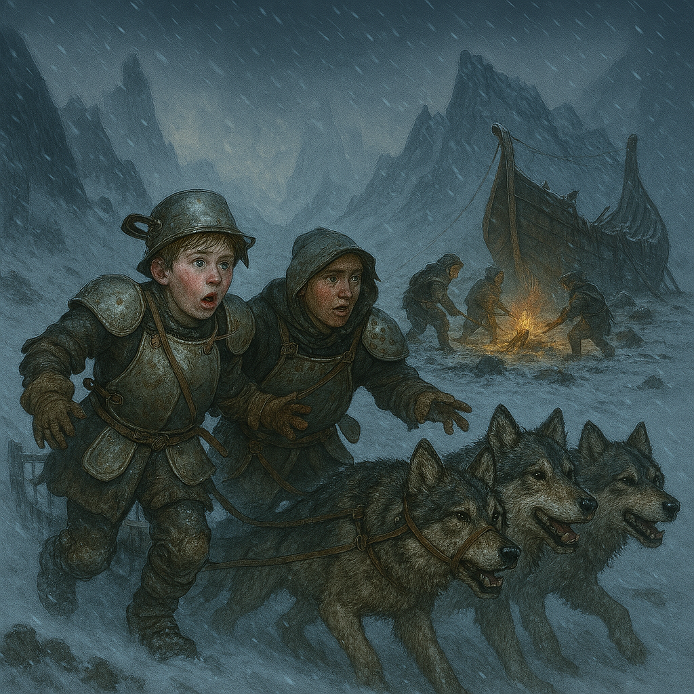

[Adventures](../Adventures.md) / Think of the Children <!-- wikidown:breadcrumb -->

# Think of the Children!

Day-2 set piece at the Foggy Fjord camp: the children's warning, the spore servant horde, and the ice-ball arrival of the Mycelial Frost Giant Skeleton. Source: `assets/Think of the Children.docx`.

## The children

**Sigrid and Toren** — teenage siblings on a battered dogsled, armored in pots, pans, and kitchen scraps; the younger defiantly clutches a bent ladle. Their up-mountain village was "overrun by elves" — pale shapes, glazed eyes, stiff motions, mushrooms growing from faces, humming "a song with no words." Families taken in the night; maybe survivors hiding in the old mill.

**Q&A crib:** Who are you? (village children) · Survivors? (some hid in the mill; most dragged away) · The attackers? (sleepwalkers; fungal growths; wordless humming) · Safe nearby? (the quarry, but cold, and tracked) · Can you fight? ("I have my ladle, and I'll use it if I have to.")

## The battle

1. **Spore servant horde** erupts from the treeline — the "elves," once townsfolk (CR ½ each; continuous spore shed DC 12 CON).
2. **The ice ball**: a monstrous spiked sphere pushed downslope by thorny hunters, shattering to reveal the **Mycelial Frost Giant Skeleton** (CR 9; AC 15, HP 168; greatclub 3d8+6; rock 4d10+6; 30-ft Spore Infestation DC 16 CON, 6d8 necrotic + infection → spore servant on 3 failed post-rest saves; Cosmic Echoes fear hum).
3. **The choice:** stand against overwhelming odds, or abandon the half-packed camp and flee to open water in a barely-seaworthy ship.

## Stakes & aftermath

- If the party dismissed the children's warning, the assault catches them amid scattered supplies — punish the skepticism with positioning, not damage.
- The village fate (mill survivors?) is an open hook the campaign has not yet cashed in — and the [Counteragent village campaign](../Game-Mechanics/The-Counteragent.md) names Sigrid & Toren's village as its emotional summit: the kids get their parents back.
- Treasure: as [Foggy Fjord](Foggy-Fjord.md) (the two documents share the loot list); the axe beaks matter for onward travel.

## Creatures

Spore Servant · Thorny Hunter ×3 · Mycelial Frost Giant Skeleton — stat summaries and art in [Bestiary — Fungal Threats](../Bestiary/Fungal-Threats.md), full blocks in the source docx.
