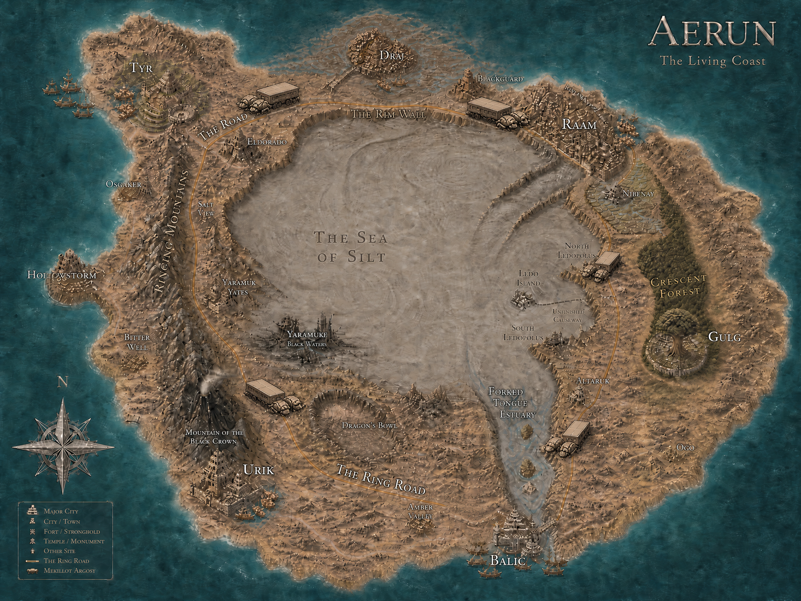

[Home](../Home.md) / [Aerun Players Guide](../Aerun-Players-Guide.md) / Aerun A Primer <!-- wikidown:breadcrumb -->

# Aerun — A Primer

*What everyone on Vermoon has heard about the desert continent, what the well-read know, and what is whispered — set down for players.*

**How to use this:** this page is **player-facing and spoiler-free** — what a traveler could learn before ever stepping onto the Ring Road, and what a scholar or a sharp listener could add to it with a good roll. Hand it out freely. Read it first; then the [Gazetteer](Gazetteer.md) for the places and [The Great Schools](The-Great-Schools.md) for the academies.

*"Beyond the Rim Wall, the world ends."* — coastal proverb.

## What everyone knows (no check)

Common knowledge across Vermoon. A Scarlands fisher, a Taldean factor, and a clerk in one of Jak's temples would all have heard this much:

- **The shape.** Aerun sits at the center of the world, on the equator, closer to every other continent than any of them is to each other. Look at any chart and it is the hub the spokes run to. It is a walled continent: a living coast where the cities are, a ring of mountains and cliffs — the **Rim Wall** — standing behind it all the way around, and above and behind the wall a dead gray interior nobody owns. Coastal folk do not say what is up there. They say *"beyond the Rim Wall, the world ends,"* and they mean it.
- **Aerun is not on the trade route; Aerun *is* the trade route.** The equatorial trade winds make any north–south voyage a long, rough, expensive gamble, so the world does not sail past Aerun — it sails *to* it. Cargo from the northern continents comes ashore on one coast, crosses by road, and ships out on the other for the south, and the same in reverse; every ship on the ocean is bound for Aerun or coming from it. The seven cities take their toll on every bolt and ingot that passes between the halves of the world. It is the richest land under the sun, and everything in it belongs to somebody.
- **It is hot.** Not Scarlands-summer hot — *equator* hot, a sun straight overhead that no northerner is ready for. Midday on the Ring Road passes 120 degrees in the shade, and there is no shade. The day has two halves: the working hours at dawn and dusk, and the **white hours** in between, when the cities close their shutters, the caravans stop, and anything still moving in the open is either dying or a lizard. The noon stop is arithmetic, not piety: a laborer worked through noon costs more in water and burials than they produce, and every ledger on the continent knows it. And because the white hours are the one stretch of day when no party can be traveling away from an agreement, they are when **contracts are read, revised, and signed** — the Reckoners do their finest work between the noon bells. Water is counted, not poured. You will be asked how much you carry before you are asked your name.
- **Metal is shunned — not forbidden, shunned.** Two reasons, and both are the heat. *Weight:* a man in mail at 120 degrees is a man carrying his own grave; nobody can bear steel and water both, and water wins. *Heat:* metal drinks the sun — a steel breastplate at noon is a cook-pot, a sword-hilt blisters the hand, a helm cooks the brain inside it. So steel passes through Aerun as cargo and leaves. **Coin is bone, obsidian, and ceramic.** Aerunite arms and armor are bone, chitin, horn, hide, and good obsidian — light, sun-dead, and cheap enough to break. A traveler who arrives in steel is marked at once as rich, foreign, and about to learn something — starting at the gate scale, where the metal comes off and the water goes in ([The Gate Ritual](The-Gate-Ritual.md)).
- **There are no kings on Aerun.** There is a king in the south — **Jak, the Administrator** — and everyone on the road knows it. He keeps small temples in every city. *They watch; they do not rule.*
- **Three powers, and the players need only remember three:**
  1. **The king in the south** — Jak's temples, his network, his deliberately light hand.
  2. **The seven families** — the merchant kings who **rule the seven cities outright**: Wavir in Balic, Tsalaxa in Draj, Inika in Gulg, Shom in Nibenay, M'ke in Raam, Vordon in Tyr, Stel in Urik. No crowns; a crown is an asset that cannot be sold.
  3. **The Caravan Guild** — no house, no city, no master. Its colossal **mekillot argosies** haul everything on the **Ring Road**, the highway that circles the whole continent; its **silt-crawlers** are the only things that cross the interior. The Guild carries everyone or no one. No army marches without Guild hulls.
- **Armies do not march.** Houses that come to a dispute the ledgers cannot settle send **champions to the arena**, under the **Merchant's Code**, and the stakes go to the House still standing. Every city has an arena for this reason. The bouts empty the streets.
- **Aerun runs on slaves**, and an Aerunite will explain the arithmetic to you without a flicker of shame. There are no jails — a jail is a warehouse that eats. Every sentence resolves to the pits or the arena, and the arena ladder is the only road up. The exception is **Balic**, which pays wages and is hated for it by the other six.
- **There are no gods.** *"Where other lands raise temples, Aerun raises schools."* The five [Great Schools](The-Great-Schools.md) train the mind — the Will and the Way — and a School master is the most respected person in any city.
- **Magic is despised.** Ask any child what made the gray interior and they will say: wizards did. At your **first gate on the continent** you will be asked *"What's your business?"* — and you will declare your business, your goods, your metals, your spell components, and your **exit city**, the port you will eventually leave by. The components are confiscated, sealed in wax, logged in triplicate, and carried under Guild bond to that exit city, where they wait for you — **bonded, not stolen**. You cross Aerun without your magic and collect it on your way off the continent. *Nothing is taken. Everything is held. You leave the continent exactly as armed as you came to it.* The whole ceremony, scale to wax to registry: [The Gate Ritual](The-Gate-Ritual.md). Cast openly inside a city and no writ will save you.
- **Everyone has a wild talent.** Nearly every soul born on Aerun carries some small trick of the mind, and visitors who stay long enough grow one too. Do not gamble against an Aerunite until you have watched him play.
- **Blue eyes mean Spice.** Heavy use of the **Spice** — the desert's one true luxury — stains the eyes a deep uniform blue. It is so dear that the stain is the surest rank-sign on the continent: blue eyes mean great wealth, a House champion's provision, or the deep desert. A beggar with blue eyes is a story walking.
- **Tyr killed its champion and calls itself free.** The Tyrians put down Kalak, their own undefeated champion, when he set himself above the family; the blood-letting freed the city's slaves before it was done. The other six wait, patiently, for the experiment to fail.
- **The Ring Road takes a caravan about two months — six tendays and change — to circle.** Move at dawn, move at dusk, and in the white hours lie still.

## Lore checks

Roll **Intelligence (History)** unless a row says otherwise — **Wisdom (Survival)** for the land and the silt, **Intelligence (Arcana)** for magic and the Way. Aerun natives, and anyone with a wild talent, roll with advantage. A success reveals every tidbit at that DC and below; if several are available, the DM picks which to share.

### DC 10

| DC | Tidbit | Check |
| :-: | :--- | :--- |
| 10 | Neighboring cities sit four to seven caravan days apart — close enough to feud, too far to march cheaply. The whole Ring Road is some fourteen hundred miles. | Survival |
| 10 | The Guild charges **triple rates for war freight**, and a city under siege still has to eat at Guild prices. That is why open war bankrupts the victor, and why nobody fights one. | History |
| 10 | The War of Champions has forms: a House declares a grievance and **stakes** — a contract, a tariff, a bride, a border well; the stakes are **lodged with the Guild**, which notarizes and holds them; then the sand. Most disputes are settled by named gladiators. The gravest call out the Houses' own Champions. | History |
| 10 | Balic is the great harbor of the south and the richest tolls on Aerun; Raam in the northeast is the largest city and the most lawless; Urik's borders are sealed and its legions are for hire; Tyr has the only iron. Everyone needs Tyr's iron, and Tyr never stops mentioning it. | History |
| 10 | The lesser towns have no family seats — **Blackguard** is a grim north-coast waypoint, **Osgaker** and **Hollowstorm** are west-coast fishing and salvage towns, **Amber Valley** a caravanserai on the southern road, and **Eldorado** the rim town behind Tyr: the last provisions before the high country, and all rumors and gold-fever. | Survival |
| 10 | The Merchant's Code is the one law that binds House to House: agreements written are kept, cargo bonded is returned, a declared price is a price, arena verdicts are final, and the caravan and the waystation water are neutral ground. It is not morality. It is infrastructure. | History |
| 10 | A steel weapon is worth more on Aerun than anywhere in the world — and carried, it is worth less than nothing. Tyr's iron goes out as ingots in Guild hulls for the northern forges; it does not come back as swords. The few who do fight in metal fight at night, and they are paid accordingly. | History |

### DC 15

| DC | Tidbit | Check |
| :-: | :--- | :--- |
| 15 | The **Champions** are the names the old books called god-kings — Hamanu, the Shadow King, the Oba, Kalak, Abalach-Re, Tectuktitlay, Andropinis. They **kept the names and lost the thrones**; on Aerun the title was never really *king*, it was Champion, the family's sovereign weapon. | History |
| 15 | The **Long Reach** is the Guild's marked lane across the silt from Raam to Balic: about three hundred and fifty miles, **five or six days** by crawler convoy, against two to three tendays hauling the same freight the long way round the ring. Three waystations — First Mark, Midreach, Saltbone — stand on the firmest shoals. | Survival |
| 15 | **Wavir banished its champion** and bet everything on commerce. Balic fights every War of Champions with hired blades — and wins more than it should. Its agora votes; its militia is every citizen one month in ten. | History |
| 15 | **Raam has been half in civil war** since its champion Abalach-Re died. M'ke holds the palace behind breastworks; the city's armory can arm every citizen, and sometimes does. Forty thousand people and no law. | History |
| 15 | **Draj's champion is broken** — Tectuktitlay was shattered in a champions' duel generations ago and is paraded at festivals as a figurehead. Tsalaxa's spies do the work its champion cannot. | History |
| 15 | The wind is the whole logic of the land: the westerlies come off the ocean heavy with rain, strike the **Ringing Mountains** on the west coast, and give up everything on the seaward slopes. That is why Tyr's valley is green, why Hollowstorm has fisheries, and why nothing east of the crest has had rain in an age. | Survival |
| 15 | Heavy Spice users live long and push their Will further than anyone else; the Guild's argosy pilots and Navigators are the heaviest users on the continent. The families sell it; the Guild eats it; nobody audits the Guild. | Arcana |

### DC 20

| DC | Tidbit | Check |
| :-: | :--- | :--- |
| 20 | **Three Houses have *ascended* champions and four do not.** Stel has **Hamanu, the Lion**, Shom has **the Shadow King**, Inika has **the Oba** — beings who have gone beyond the mortal tiers and never take the sand. They are not duelists; they are deterrents. The champion-less four — Wavir, Tsalaxa, Vordon, M'ke — are, not by coincidence, the Houses that lean hardest on gold, spies, and hired arena talent. | History |
| 20 | The one time an ascended champion made war, **Hamanu erased the city of Yaramuke** and poisoned its oasis black — over nothing grander than obsidian quarrying rights. The ruins sit halfway along the Urik–Raam road as the accord's memorial, and the water there still kills. | History |
| 20 | Kalak was not defeated — he was **assassinated, outside the rites**. Fighting outside the forms is the continent's deepest crime. All seven Houses still pretend not to know who paid, and that is why Vordon rebuilds in shadow. | History |
| 20 | The Guild has embargoed exactly one town in its history, and that town is a ruin with a cautionary name. *Which* town is a matter of argument in every tavern on the ring. | History |
| 20 | The **Veiled Alliance** exists: preservers — wizards who take only what the land can spare — banded into secret cells in every city, working toward a green Aerun none of them will live to see. Every House condemns them. Several find it useful that someone knows how to make things grow. | Arcana |
| 20 | The **desert people** — the Sandwalkers — owe no House. They walk shoals across the silt that nobody else can find, blue-eyed to the last soul, and they enter the cities seldom, trade briefly, and leave. Every absurd story you have heard about them is false, and so is every sensible one. | Survival |
| 20 | **Altaruk**, the caravan fort between Balic and Amber Valley, bars defilers at the gate and asks no other questions. Draw your own conclusions about who shelters there. | History |

### DC 25 — rumors

*These are whispers. The DM decides which, if any, are true.*

| DC | Tidbit | Check |
| :-: | :--- | :--- |
| 25 | They say there are **three roads to ascension**, not one: the **Dragon**, which takes; the **Avangion**, which grows; and a third that nobody owns, taught by masterless orders in the deep desert. The Houses swear the roads are closed. The desert remembers otherwise. | Arcana |
| 25 | They say the Oba of Gulg is no dragon at all — that her great tree, Sunlight Home, was *grown* by her own hand, and a defiler cannot grow anything. Nobody has tested the question. | Arcana |
| 25 | They say **Eldorado looks out over where the charts end** — that from the rim pass above the town you can see the one stretch of the gray where no Guild lane has ever bent, and that the prospectors who walk down into it come back remembering nothing at all. | Survival |
| 25 | They say the Guild's silt lane never turns northwest, by standing order, and that no Navigator has ever asked why. | Survival |
| 25 | They say there was an **eighth city** once, as grand as Tyr, and an eighth House, and that the seven Champions — who have never agreed on anything — agreed on that. | History |

## Words a traveler should know

| Word | Meaning |
| :--- | :--- |
| **Argosy** | A Guild land-train the size of a small village, drawn by mekillots; the Ring Road's freight and its inns |
| **Silt-crawler** | A Guild hull built for the interior; the only thing that crosses the gray |
| **The Code** | The Merchant's Code — the one law between Houses |
| **Champion** | A House's sovereign weapon; the one who fights in the family's name |
| **Ascended** | A Champion who has gone beyond the mortal tiers; a deterrent, never a duelist |
| **Transient** | You: declared at the gate, logged, not owned, not protected |
| **Exit city** | The port you name at your [first gate](The-Gate-Ritual.md); where your metal and your magic wait under Guild bond until you leave |
| **Tenday** | The ten-day week the whole continent keeps time by — a School of Reckoning standard, because base-ten arithmetic keeps the ledgers clean; three to a month, near enough. Visitors say "week" and are gently corrected at the gate |
| **The white hours** | Midday; when the continent stops, and when its contracts are signed. Nothing that wants to live moves in them |
| **The Will and the Way** | Stamina of mind, and the learned technique — psionics, and the one power nobody is ashamed of |
| **Blue-within-blue** | The eyes of a heavy Spice user |
| **The Rim Wall** | Where the living coast ends and the world, by common agreement, ends with it |
