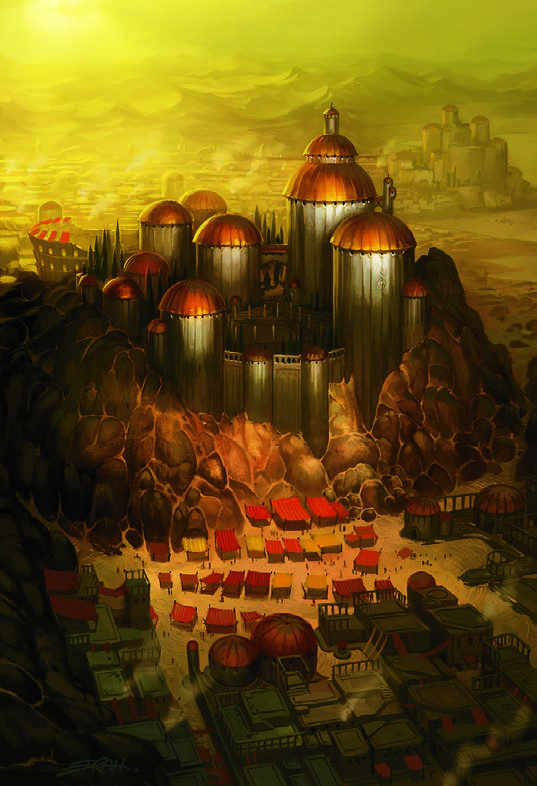

[Home](../../Home.md) / [Aerun Players Guide](../../Aerun-Players-Guide.md) / [Gazetteer](../Gazetteer.md) / Balic <!-- wikidown:breadcrumb -->

# Balic — the Two-Seas City

South coast, built into the great rock dam at the foot of the **Balic Saddle** — the one place the highland comes down low enough to cross. Ocean below on one side; a sea of gray dust hanging above on the other. The richest city on Aerun, and it did not get that way by fighting.

## At a glance

- **Population** ~24,000. Wealthiest of the seven.
- **Ruling family** Wavir — abolitionist, which is to say Balic pays wages, and is loathed for it by every other city.
- **Government** Genuinely peculiar: a **Chamber of Patricians** writes the laws, the templars stand for ten-year elections, and the guilds vote. Cynics note who counts the votes. Optimists note that they are counted at all.
- **Trade** Everything, because everything must cross here: grain, salt, olives, wine, livestock, leather, marble. The tolls are the real crop.

## What a visitor sees

A city climbing in tiers up the face of the dam — precinct above precinct, linked by switchback ramps and tunnels — from the **ocean harbor** and its breakwater lighthouses at the bottom to the **silt quays** at the summit, where schooners sit moored on the gray above the rooftops. Cargo moves between them on human backs: endless files of porters on the **Stair of Sails**, and through the **Cochlea**, the great spiral stair bored down through the rock, turning past market landings at every revolution, lit day and night.

## Traveler's notes

- Ask what turn of the Cochlea a man lives off, and you will know his station. Balicans do it constantly and pretend they don't.
- The **theaters** are the city's glory — dozens, from ramshackle stagehouses to noble amphitheaters. A good playwright is as famous here as a gladiator.
- Try the **Olive Tree** on the Road of Legions for a cheap safe bed; the **Furled Sail** on the docks for the other kind of evening.
- Every free citizen serves three years in the legions, so the innkeeper who pours your wine has probably stood a wall against giants.
