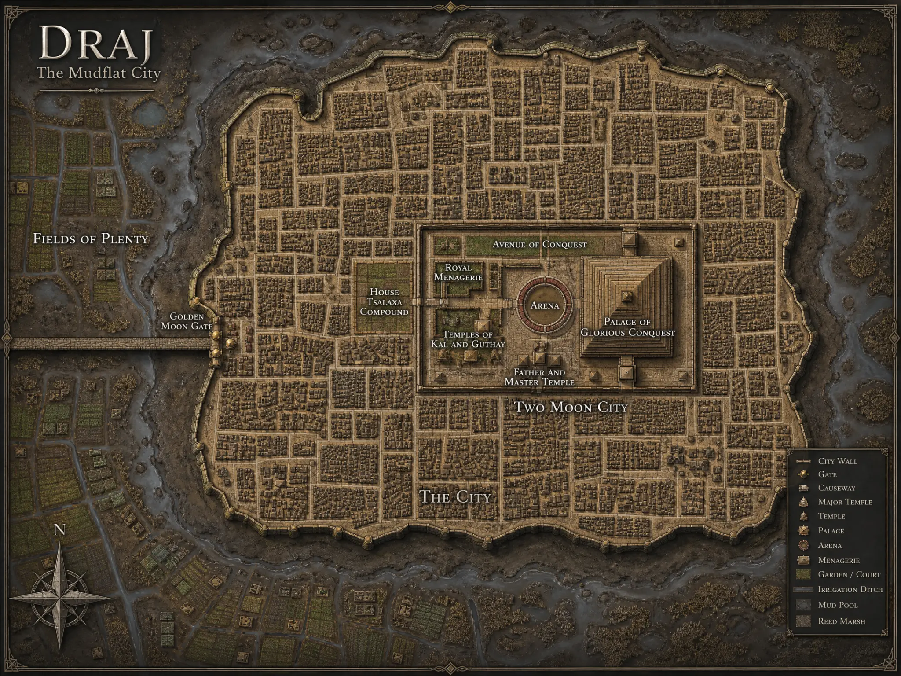

[Home](../../Home.md) / [Aerun Players Guide](../../Aerun-Players-Guide.md) / [Gazetteer](../Gazetteer.md) / Draj <!-- wikidown:breadcrumb -->

# Draj — the Mudflat City

On the north coast, on a broad brown mudflat at the foot of the cliffs, reachable by exactly one road. Draj feeds a third of the continent and is disliked by all of it.

## At a glance

- **Population** ~18,000 in the city, many more in the fields — most of them not there by choice.
- **Ruling family** Tsalaxa, who run the grain, the caravanserais, and (everyone assumes) a great deal else.
- **Trade** The ring's breadbasket: **grain and hemp** in quantity, plus cotton, linen, and rope. Metal is scarce and expensive here — Tyr is a long way off.
- **The causeway** One low stone road crosses the mud from firm ground to the **Golden Moon Gate**. Step off it and you sink. This is the entire defense of the city and it has never needed improving.

## What a visitor sees

A dense grid of clan compounds under a pall of cook-smoke, and at the center the walled **Two Moon City** precinct: the great stepped **Palace of Glorious Conquest**, the arena beneath it, and the temples. Festival days are frequent, spectacular, and involve the arena. Attend if invited; do not volunteer.

## Traveler's notes

- Draji society runs on **clans**: scribes who cast horoscopes, the jasuan knights who hunt captives, and the trader families who deal with outsiders. You will meet only the third kind on purpose.
- Draj is at war with Raam more often than not, and its warriors take prisoners rather than lives — a distinction that is less comforting than it sounds.
- Foreigners lodge near the Golden Moon Gate, in houses kept by Tsalaxa. You will be watched. It is not personal; it is simply thorough.
