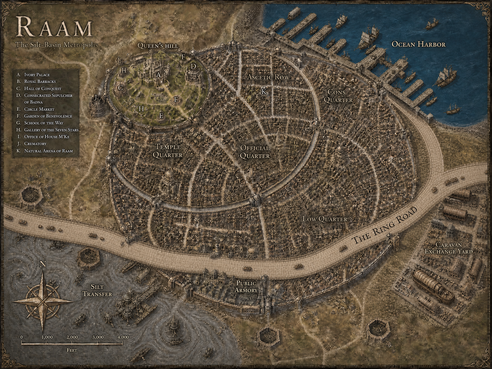

[Home](../../Home.md) / [Aerun Players Guide](../../Aerun-Players-Guide.md) / [Gazetteer](../Gazetteer.md) / Raam <!-- wikidown:breadcrumb -->

# Raam — the Transfer City

Northeast, wedged into the cliff where the highland meets the ocean. Everything that crosses Aerun quickly crosses here. So does everyone with a reason to avoid being noticed.

## At a glance

- **Population** 40,000-odd inside, as many again in the estates outside — **the largest city on the continent**, and the least governed.
- **Ruling family** M'Ke, fortified in their compound and waiting out the trouble with admirable patience.
- **The two harbors** Deepwater piers on the ocean face below; the **silt quays** on the shelf a thousand feet above, where the **Long Reach** lane sets out across the gray.
- **The Ascent** The climb between them: switchback freight terraces cut into the rock, hoist towers, porter barracks, and tenements carved into the cliff. Its porters are organized, numerous, and not to be trifled with.

## What a visitor sees

Concentric quarters spilling downhill from the walled **Queen's Hill** — the Ivory Palace, the Hall of Conquest — through the Temple and Official Quarters into the **Low Quarter**, which has no walls, no watch, and no end. Shrines to Badna stand at every third corner. So do the mansabdars, who are the law in the sense that they collect from it.

## Traveler's notes

- Trade is superb and the streets are dangerous; these facts are related. Hire local guards from a Guild factor, not from the man who offers.
- The **Public Armory** beneath the old palace reputedly holds enough spears for every citizen. Everyone knows this. Nobody says why it matters.
- Whatever your business, the hoist-yards run on schedule and nobody riots near them. If trouble finds you in Raam, walk toward the cliff.
