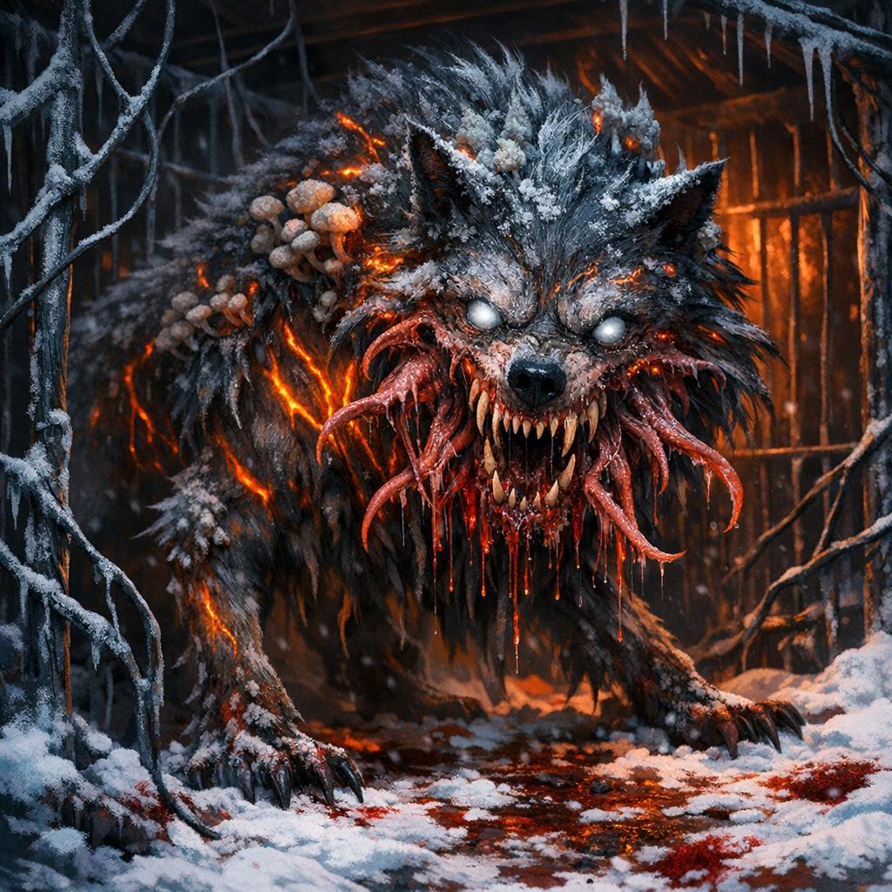
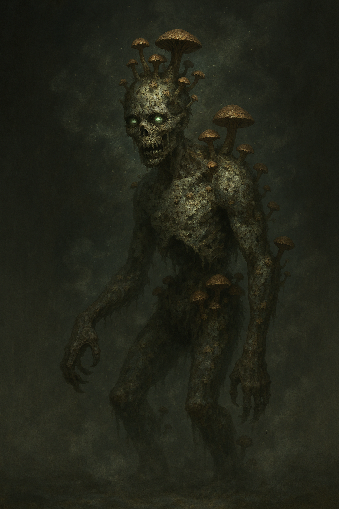
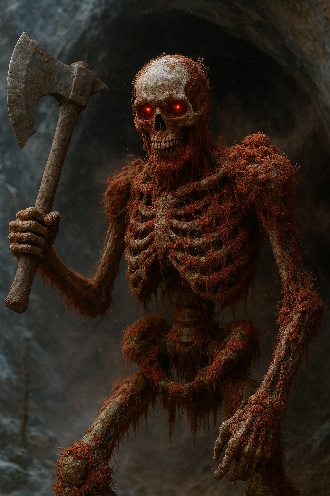
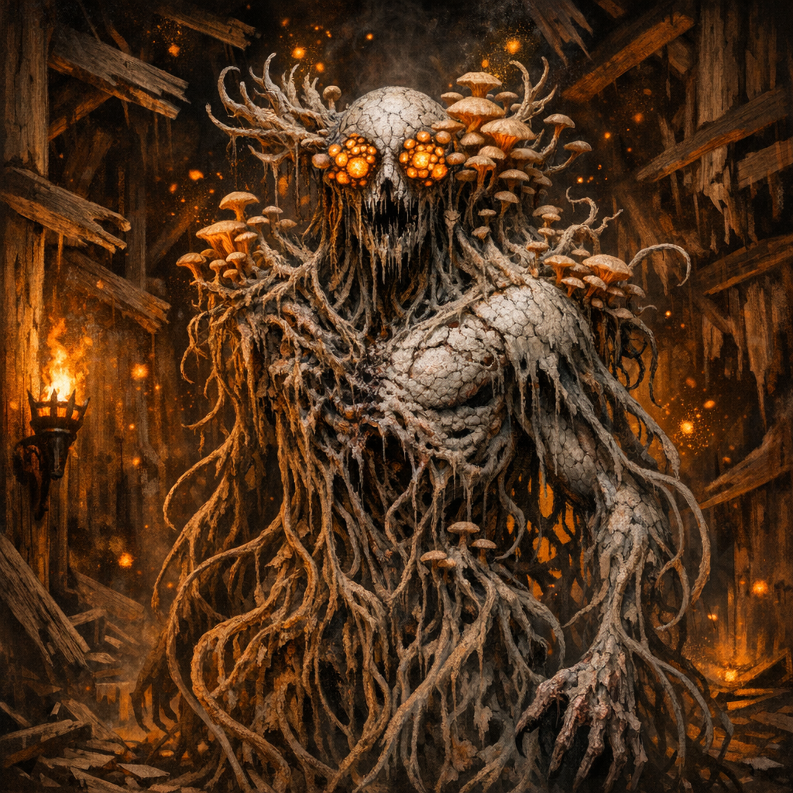
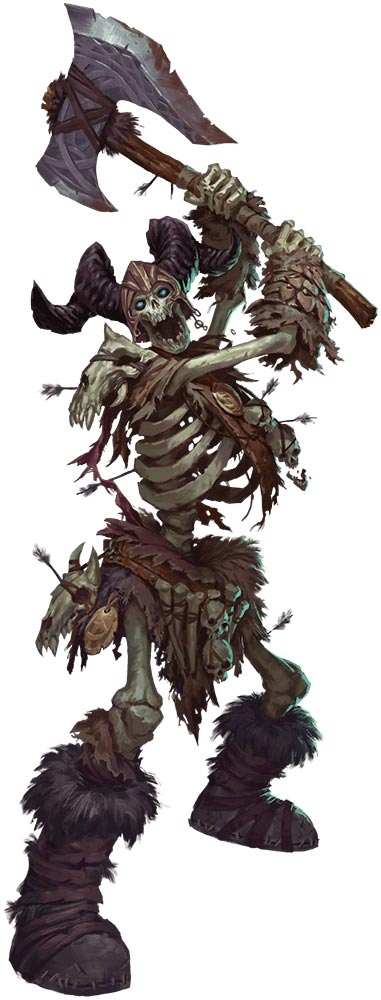
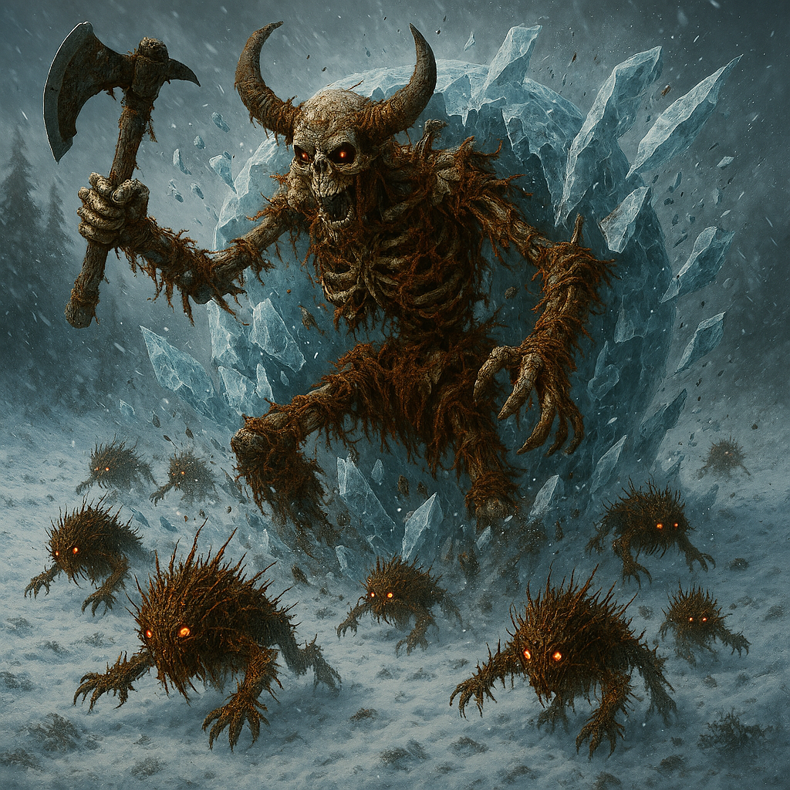
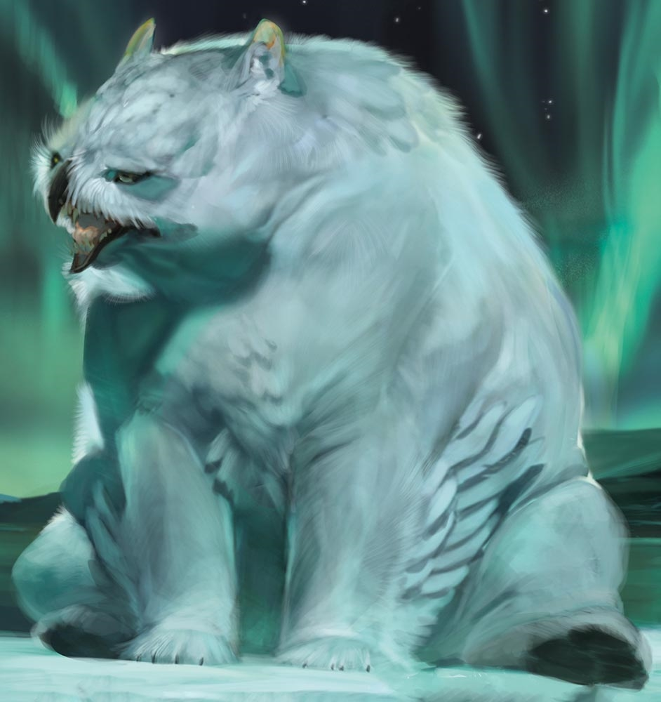
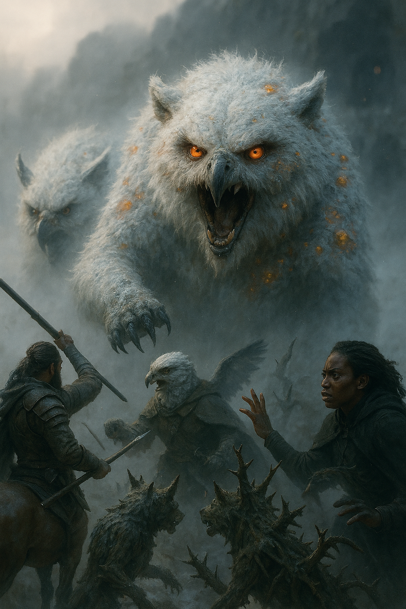
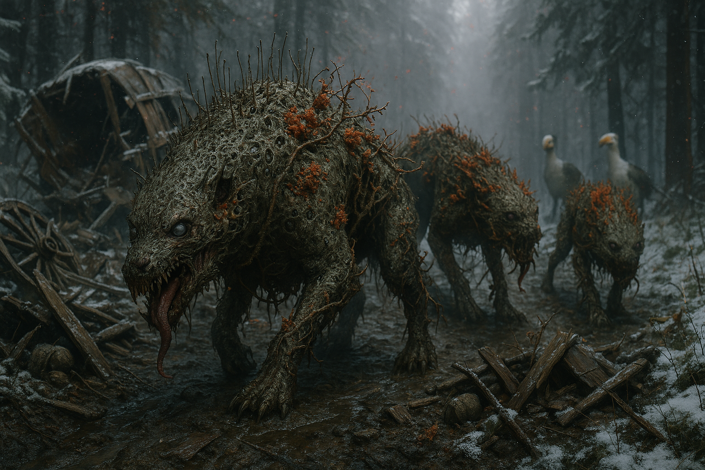

[Bestiary](../Bestiary.md) / Fungal Threats <!-- wikidown:breadcrumb -->

# Fungal Threats

The russet mold's servants, symbionts, and victims. Common threads: cold/poison resistance, poison-condition immunity, spore bursts, and fire as the reliable answer. Infection rules: [Russet Mold & Infection](../Game-Mechanics/Russet-Mold-and-Infection.md).

Full stat blocks: `assets/Frostwatch_Horror.docx`, `assets/Think of the Children.docx`, `assets/Return_to_Frostwatch_Final.md`, `assets/S3_Level1_Complete_5e_Conversion.docx`.

## Transformed humanoids & minions

| Creature | CR | Core stats | Signature |
| :--- | :-: | :--- | :--- |
| **Vegepygmy** | ¼ | AC 13, HP 9 | Former humans/animals, fully transformed; regeneration 3 (stopped by fire/cold/necrotic); plant camouflage (50% invisible against ship walls); tribes scale 1–6 HD with leaders wielding hoarded ship weapons. *Each one was someone.* |
| **Thorny** ("dog") | 1 | AC 14, HP 30 | Vegepygmy hunting-beast; bite grapples, thorns deal 2d6/turn to the grappled; takes only 1 HP from piercing |
| **Spore Servant** | ½ | AC 8, HP 22 | Mold-puppeted dead; continuous 5-ft spore shed (DC 12 CON, 1d6 poison); the "pale elves" of the village raid |

## Wilderness horrors

| Creature | CR | Core stats | Signature |
| :--- | :-: | :--- | :--- |
| **Fungal Horror** (Far Realm entity) | 10 | AC 16, HP 180 | Multiattack bite (4d8+5 +4d6 necrotic, DC 16 CON infect) + slam; 15-ft spore burst; regenerates unless burned; speaks in absorbed voices, mimics loved ones; spreads slick fungal terrain |
| **Mycelial Frost Giant Skeleton** | 9 | AC 15, HP 168 | Arrives inside a rolling spiked ice ball; greatclub 3d8+6, rock throw 4d10+6; Spore Infestation (30-ft, DC 16 CON, 6d8 necrotic + infection → spore servant); Cosmic Echoes fear hum |
| **Thorny Hunter** | 5 | AC 14, HP 85 | 10-ft thorn lashes ×2; spore burst; **Spore Link** — shares senses with all spore-connected creatures within 120 ft |
| **Spore-Touched Snowy Owlbear** | 5 | AC 13, HP 105 | Hallucinogenic spore cone (d6 hallucination table); explodes in spores on death (4d6 + blind) |
| **Infected Wolf / Sled Dog** | 5 / 2 | AC 14, HP 65 | Pack tactics; infectious bite (DC 13 CON); death-burst spores |
| **Fungal Peryton** | 2 | AC 13, HP 33 | Dive attack +2d8; flyby; spore release when pierced/slashed |
| **Spore-Touched Griffon** | 3 | AC 12, HP 59 | 5-ft poison spore aura; grapple claws |
| **Infected Deer (herd)** | — | Elk + mods | Shared initiative (**Hive Awareness**); spore burst when damaged; behave as *scouts* |
| **The Frozen Pilgrims** | 5-ish | Shambling mound + mods | Merged frozen corpses; cold-resistant, prone-immune, half speed; 30-ft spore infestation; individual faces visible in the mass |

## Hazard: russet mold patches

Golden-brown patches with a **3-foot kill radius** — save or become a mold culture (death in 2–5 turns; vegepygmy rises in 21–24 hours); survivors take 5d4. Killed by alkaline solutions, defoliant, fire. Lab B on Level 1 is an avalanche of it. See [rules page](../Game-Mechanics/Russet-Mold-and-Infection.md).

## DM patterns

- Fire is the counter — regeneration, spore terrain, and horrors all respect it; the Spásistren's wagons of *alchemical incendiaries* are this fact at strategic scale.
- Spore-linked creatures share information. If one sees the party, the network knows.
- Death near mold is never the end: bodies must be burned or dissolved or they get back up.
