[Home](Home.md) / Gallery <!-- wikidown:breadcrumb -->

# Gallery

Every image in the wiki, as thumbnails. Click a picture for the full-size file; the line under it links to the page it lives on. Regenerate with `py tools/make_gallery.py --write` after adding art (125 images).

## People

|   |   |   |   |
| :---: | :---: | :---: | :---: |
| [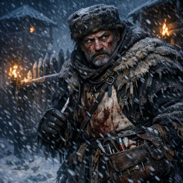](.attachments/copper_portrait.png) [Copper the Surgeon](NPCs/Copper-the-Surgeon.md) | [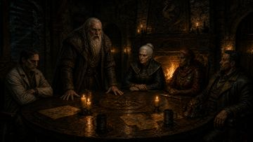](.attachments/council_brennan.jpg) *(not embedded anywhere)* | [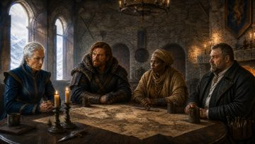](.attachments/council_cast_reference.jpg) [Frostwatch Hold](Locations/Frostwatch-Hold.md) | [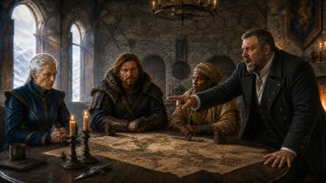](.attachments/council_copper.jpg) [The Council of Frostwatch](Adventures/Return-to-Frostwatch/The-Council-of-Frostwatch.md) |
| [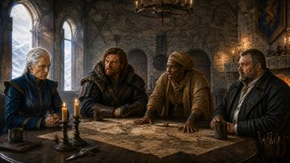](.attachments/council_kaelen.jpg) [The Council of Frostwatch](Adventures/Return-to-Frostwatch/The-Council-of-Frostwatch.md) · [Harah Tabr](NPCs/Harah-Tabr.md) | [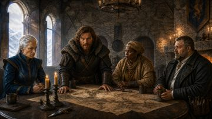](.attachments/council_mcready.jpg) [The Council of Frostwatch](Adventures/Return-to-Frostwatch/The-Council-of-Frostwatch.md) | [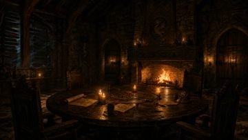](.attachments/council_reference.jpg) *(not embedded anywhere)* | [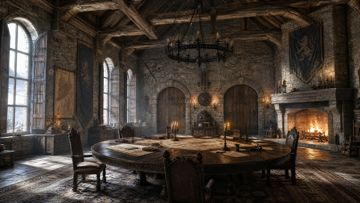](.attachments/council_reference2.jpg) [Frostwatch Hold](Locations/Frostwatch-Hold.md) |
| [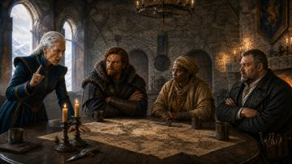](.attachments/council_valerius.jpg) [The Council of Frostwatch](Adventures/Return-to-Frostwatch/The-Council-of-Frostwatch.md) · [High Sister Valerius](NPCs/High-Sister-Valerius.md) | [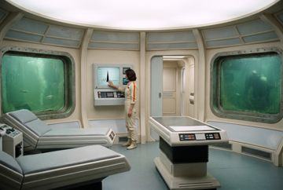](.attachments/enc_beneath_the_lighthouse.jpg) [Beneath the Lighthouse](Adventures/Return-to-the-Ship/Beneath-the-Lighthouse.md) · [Erleena Riser](NPCs/Erleena-Riser.md) | [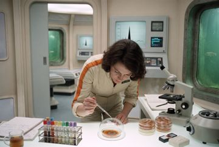](.attachments/enc_erleena_at_work.jpg) [Beneath the Lighthouse](Adventures/Return-to-the-Ship/Beneath-the-Lighthouse.md) · [Erleena Riser](NPCs/Erleena-Riser.md) | [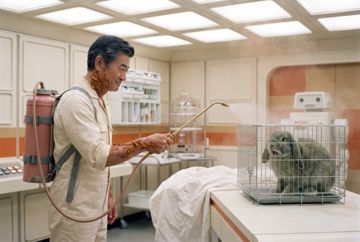](.attachments/enc_s42_demonstration.jpg) [The Lab at S42](Adventures/Return-to-the-Ship/The-Lab-at-S42.md) · [George Decay](NPCs/George-Decay.md) |
| [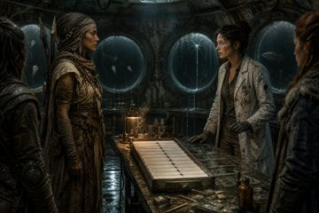](.attachments/enc_the_turn.jpg) [Harah Tabr](NPCs/Harah-Tabr.md) | [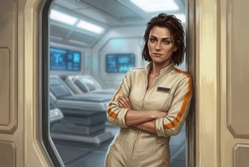](.attachments/erleena_portrait.jpg) [Erleena Riser](NPCs/Erleena-Riser.md) | [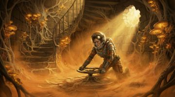](.attachments/erleena_riser.jpg) [Erleena Riser](NPCs/Erleena-Riser.md) | [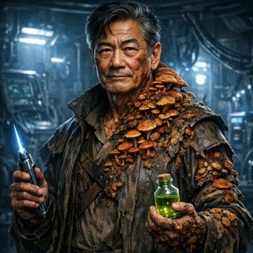](.attachments/george_decay.png) [George Decay](NPCs/George-Decay.md) |
| [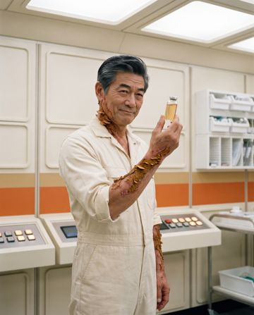](.attachments/george_portrait_s42.jpg) [The Lab at S42](Adventures/Return-to-the-Ship/The-Lab-at-S42.md) · [George Decay](NPCs/George-Decay.md) |  [Jak Bjornsson](NPCs/Jak-Bjornsson.md) | [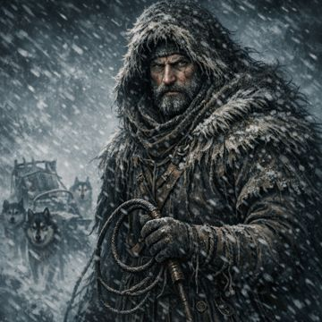](.attachments/korrin.png) [Korrin](NPCs/Korrin.md) |  [McReady](NPCs/McReady.md) |
| [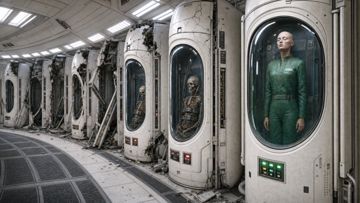](.attachments/nova_in_pod_v3.png) [Nova](NPCs/Nova.md) | [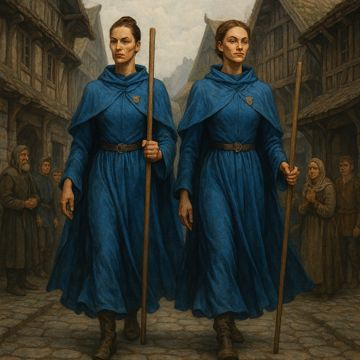](.attachments/spasistren_sisters.jpeg) [The Spasistren](World/Factions/The-Spasistren.md) |   |   |

## Encounters — Return to the Ship

|   |   |   |   |
| :---: | :---: | :---: | :---: |
| [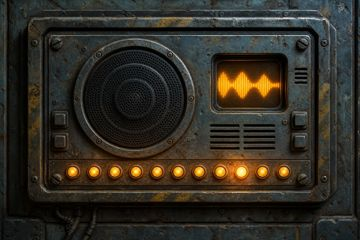](.attachments/eddie_intercom.jpg) [Return to the Ship](Adventures/Return-to-the-Ship.md) · [The Breach](Adventures/Return-to-the-Ship/The-Breach.md) | [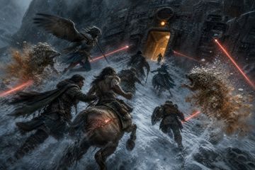](.attachments/enc_covering_fire.jpg) [The Breach](Adventures/Return-to-the-Ship/The-Breach.md) | [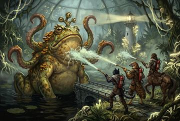](.attachments/enc_froghemoth_wash.jpg) [Beneath the Lighthouse](Adventures/Return-to-the-Ship/Beneath-the-Lighthouse.md) | [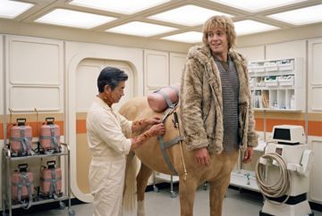](.attachments/enc_s42_fitting.jpg) [The Lab at S42](Adventures/Return-to-the-Ship/The-Lab-at-S42.md) |
| [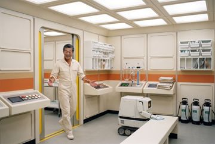](.attachments/enc_s42_reveal.jpg) [The Lab at S42](Adventures/Return-to-the-Ship/The-Lab-at-S42.md) | [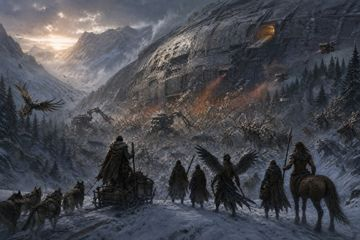](.attachments/enc_the_breach.jpg) [The Breach](Adventures/Return-to-the-Ship/The-Breach.md) | [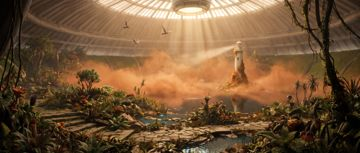](.attachments/garden_arrival_vista.jpg) [The Lab at S42](Adventures/Return-to-the-Ship/The-Lab-at-S42.md) · [The Garden Level](The-Lost-Ship/The-Garden-Level.md) | [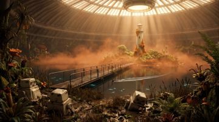](.attachments/garden_bridge_west.jpg) [The Lab at S42](Adventures/Return-to-the-Ship/The-Lab-at-S42.md) |
| [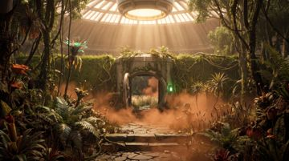](.attachments/garden_inner_gate.jpg) [The Lab at S42](Adventures/Return-to-the-Ship/The-Lab-at-S42.md) | [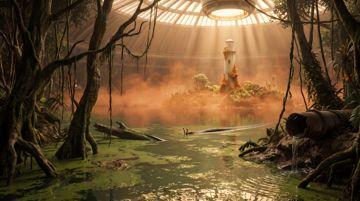](.attachments/garden_swamp_route.jpg) [The Lab at S42](Adventures/Return-to-the-Ship/The-Lab-at-S42.md) | [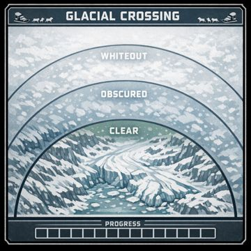](.attachments/glacial_crossing_tracker.png) [The Whiteout](Adventures/Return-to-the-Ship/The-Whiteout.md) |   |

## Encounters — Return to Frostwatch

|   |   |   |   |
| :---: | :---: | :---: | :---: |
| [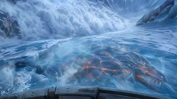](.attachments/enc_avalanche.jpg) [The Fungal Avalanche](Adventures/Return-to-Frostwatch/The-Fungal-Avalanche.md) | [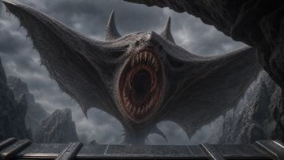](.attachments/enc_cloaker.jpg) [Alien Echoes](Adventures/Return-to-Frostwatch/Alien-Echoes.md) | [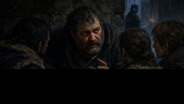](.attachments/enc_copper_warning.jpg) [Arrival at Frostwatch](Adventures/Return-to-Frostwatch/Arrival-at-Frostwatch.md) | [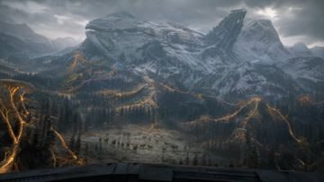](.attachments/enc_departure.jpg) [Return to Frostwatch](Adventures/Return-to-Frostwatch.md) |
| [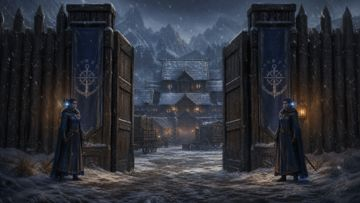](.attachments/enc_frostwatch_arrival.jpg) [Arrival at Frostwatch](Adventures/Return-to-Frostwatch/Arrival-at-Frostwatch.md) | [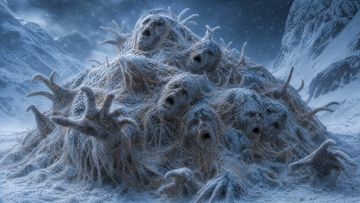](.attachments/enc_frozen_pilgrims.jpg) [The Frozen Pilgrims](Adventures/Return-to-Frostwatch/The-Frozen-Pilgrims.md) | [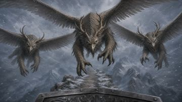](.attachments/enc_sky_hunters.jpg) [The Sky Hunters](Adventures/Return-to-Frostwatch/The-Sky-Hunters.md) | [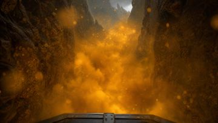](.attachments/enc_spore_ravine.jpg) [The Spore Choked Ravine](Adventures/Return-to-Frostwatch/The-Spore-Choked-Ravine.md) |
| [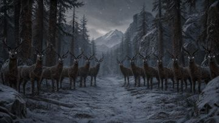](.attachments/enc_watching_herd.jpg) [The Watching Herd](Adventures/Return-to-Frostwatch/The-Watching-Herd.md) |   |   |   |

## The Lost Ship

|   |   |   |   |
| :---: | :---: | :---: | :---: |
| [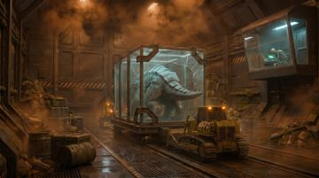](.attachments/dino_containment.png) [Ship Creatures](Bestiary/Ship-Creatures.md) | [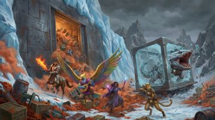](.attachments/dino_fight.png) [Ship Creatures](Bestiary/Ship-Creatures.md) | [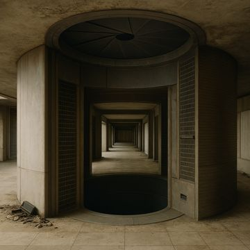](.attachments/drop_tube_corridor.png) *(not embedded anywhere)* | [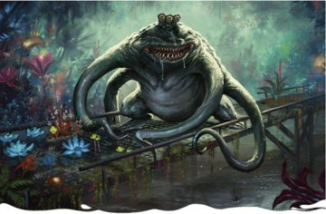](.attachments/froghemoth_bridge.png) [Ship Creatures](Bestiary/Ship-Creatures.md) |
| [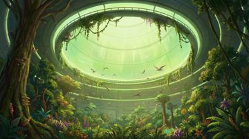](.attachments/garden_dome.jpg) [The Garden Level](The-Lost-Ship/The-Garden-Level.md) | [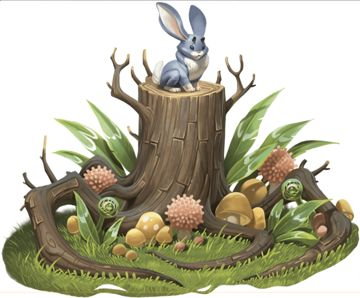](.attachments/garden_stump.png) [The Garden Level](The-Lost-Ship/The-Garden-Level.md) |  [The Lower Deck](The-Lost-Ship/The-Lower-Deck.md) | [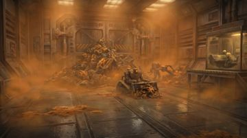](.attachments/level4_cargo_exit_v3.png) *(not embedded anywhere)* |
| [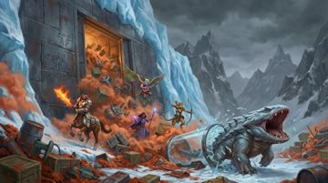](.attachments/level4_ejection_scene_final.png) [The Lower Deck](The-Lost-Ship/The-Lower-Deck.md) | [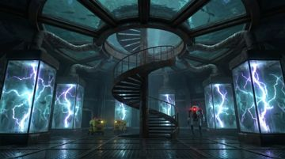](.attachments/level4_reactor_core_v6.png) [The Lower Deck](The-Lost-Ship/The-Lower-Deck.md) | [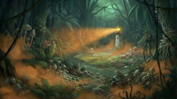](.attachments/lighthouse_jungle.jpg) [The Lighthouse](The-Lost-Ship/The-Lighthouse.md) |  [The Lighthouse](The-Lost-Ship/The-Lighthouse.md) |
|  [Ship Constructs](Bestiary/Ship-Constructs.md) |  [The Garden Level](The-Lost-Ship/The-Garden-Level.md) |  [Ship Constructs](Bestiary/Ship-Constructs.md) |  [The Lower Deck](The-Lost-Ship/The-Lower-Deck.md) |

## Bestiary

|   |   |   |   |
| :---: | :---: | :---: | :---: |
|  [Think of the Children](Adventures/Think-of-the-Children.md) · [Fungal Threats](Bestiary/Fungal-Threats.md) |  [Fungal Threats](Bestiary/Fungal-Threats.md) |  [Fungal Threats](Bestiary/Fungal-Threats.md) |  [Fungal Threats](Bestiary/Fungal-Threats.md) |
|  [Fungal Threats](Bestiary/Fungal-Threats.md) |  [Fungal Threats](Bestiary/Fungal-Threats.md) |  [Fungal Threats](Bestiary/Fungal-Threats.md) |  [Fungal Threats](Bestiary/Fungal-Threats.md) |
|  [Fungal Threats](Bestiary/Fungal-Threats.md) |   |   |   |

## The Scarlands

|   |   |   |   |
| :---: | :---: | :---: | :---: |
|  [Foggy Fjord](Adventures/Foggy-Fjord.md) |  [Chapter 2 Gronnfjord Shops](Adventures/Chapter-2-Gronnfjord-Shops.md) |  [Frostwatch Hold](Locations/Frostwatch-Hold.md) |  [Chapter 2 Gronnfjord Shops](Adventures/Chapter-2-Gronnfjord-Shops.md) |
|  [Foggy Fjord](Adventures/Foggy-Fjord.md) |  [Frostwatch Hold](Locations/Frostwatch-Hold.md) |  [Frostwatch Hold](Locations/Frostwatch-Hold.md) |  [Frostwatch Horror](Adventures/Frostwatch-Horror.md) |
|  [Frostwatch Horror](Adventures/Frostwatch-Horror.md) |  [Gronnfjord](Locations/Gronnfjord.md) |  [Chapter 2 Gronnfjord Shops](Adventures/Chapter-2-Gronnfjord-Shops.md) |  *(not embedded anywhere)* |
|  [Frostwatch Horror](Adventures/Frostwatch-Horror.md) |  [Gronnfjord](Locations/Gronnfjord.md) |  [The Scarlands](World/The-Scarlands.md) |  [Chapter 2 Gronnfjord Shops](Adventures/Chapter-2-Gronnfjord-Shops.md) |
|  [Think of the Children](Adventures/Think-of-the-Children.md) |  [Frostwatch Hold](Locations/Frostwatch-Hold.md) |  [Frostwatch Horror](Adventures/Frostwatch-Horror.md) |  [Chapter 1 The Summons](Adventures/Chapter-1-The-Summons.md) |

## Aerun & world maps

|   |   |   |   |
| :---: | :---: | :---: | :---: |
|  [Aerun A Primer](Aerun-Players-Guide/Aerun-A-Primer.md) · [Gazetteer](Aerun-Players-Guide/Gazetteer.md) · [Aerun City Map Roster](Reference/Aerun-City-Map-Roster.md) |  *(not embedded anywhere)* |  *(not embedded anywhere)* |  [Aerun](World/Aerun.md) |
|  [Aerun](World/Aerun.md) |  *(not embedded anywhere)* |  [Draj](Aerun-Players-Guide/Gazetteer/Draj.md) · [Aerun City Map Roster](Reference/Aerun-City-Map-Roster.md) |  [Gulg](Aerun-Players-Guide/Gazetteer/Gulg.md) · [Aerun City Map Roster](Reference/Aerun-City-Map-Roster.md) |
|  [Nibenay](Aerun-Players-Guide/Gazetteer/Nibenay.md) · [Aerun City Map Roster](Reference/Aerun-City-Map-Roster.md) |  [Raam](Aerun-Players-Guide/Gazetteer/Raam.md) · [Aerun City Map Roster](Reference/Aerun-City-Map-Roster.md) |  [Tyr](Aerun-Players-Guide/Gazetteer/Tyr.md) · [Aerun City Map Roster](Reference/Aerun-City-Map-Roster.md) |  *(not embedded anywhere)* |
|  [World](World.md) |  *(not embedded anywhere)* |   |   |

## Game mechanics

|   |   |   |   |
| :---: | :---: | :---: | :---: |
|  [Alien Technology](Game-Mechanics/Alien-Technology.md) |   |   |   |

## Dark Sun source art

|   |   |   |   |
| :---: | :---: | :---: | :---: |
|  [Aerun City Map Roster](Reference/Aerun-City-Map-Roster.md) |  [Balic](Aerun-Players-Guide/Gazetteer/Balic.md) · [Aerun City Map Roster](Reference/Aerun-City-Map-Roster.md) |  [Mountain of the Black Crown](Aerun-Players-Guide/Gazetteer/Mountain-of-the-Black-Crown.md) · [Urik](Aerun-Players-Guide/Gazetteer/Urik.md) · [Aerun City Map Roster](Reference/Aerun-City-Map-Roster.md) |  [Aerun City Map Roster](Reference/Aerun-City-Map-Roster.md) · [Glossary](World/Dark-Sun/Glossary.md) |
|  [Aerun City Map Roster](Reference/Aerun-City-Map-Roster.md) · [Glossary](World/Dark-Sun/Glossary.md) |  [Aerun City Map Roster](Reference/Aerun-City-Map-Roster.md) |  [Aerun City Map Roster](Reference/Aerun-City-Map-Roster.md) |  [Aerun City Map Roster](Reference/Aerun-City-Map-Roster.md) |
|  [Aerun City Map Roster](Reference/Aerun-City-Map-Roster.md) |  [The Crescent Forest](Aerun-Players-Guide/Gazetteer/The-Crescent-Forest.md) · [Aerun City Map Roster](Reference/Aerun-City-Map-Roster.md) |  [Aerun City Map Roster](Reference/Aerun-City-Map-Roster.md) |  [Aerun City Map Roster](Reference/Aerun-City-Map-Roster.md) |
|  [The Dragons Bowl](Aerun-Players-Guide/Gazetteer/The-Dragons-Bowl.md) · [Aerun City Map Roster](Reference/Aerun-City-Map-Roster.md) |  [The Sea of Silt](Aerun-Players-Guide/Gazetteer/The-Sea-of-Silt.md) · [Aerun City Map Roster](Reference/Aerun-City-Map-Roster.md) |  [Aerun City Map Roster](Reference/Aerun-City-Map-Roster.md) |  [Aerun City Map Roster](Reference/Aerun-City-Map-Roster.md) |
|  [Glossary](World/Dark-Sun/Glossary.md) |  [Glossary](World/Dark-Sun/Glossary.md) |  [Glossary](World/Dark-Sun/Glossary.md) |  [Aerun City Map Roster](Reference/Aerun-City-Map-Roster.md) |
|  [Aerun City Map Roster](Reference/Aerun-City-Map-Roster.md) |   |   |   |

## Unplaced

|   |   |   |   |
| :---: | :---: | :---: | :---: |
|  *(not embedded anywhere)* |  *(not embedded anywhere)* |   |   |
