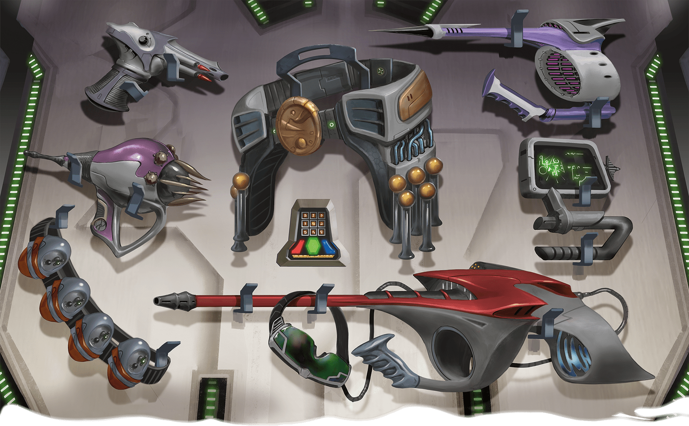

[Game Mechanics](../Game-Mechanics.md) / Alien Technology <!-- wikidown:breadcrumb -->

# Alien Technology

Ship equipment rules, consolidated from the QftIS Appendix A ("Magic Items and Technology"), the DMG futuristic-firearms entries it points to, and the homebrew conversion documents. Most powered items run on **energy cells / power discs**.

## The party arsenal (one of each, identified)

As of the Frostwatch resupply, **the party owns one of every futuristic weapon below and knows how each works** — no identification checks, no fumbling with unfamiliar triggers. (Age-based malfunctions can still apply to *scavenged spares*, per Malfunction culture below — the party's own maintained set is reliable.)

### Firearms (QftIS + DMG)

All are martial ranged weapons with the ammunition and reload properties; energy weapons draw from energy cells.

| Weapon | Damage | Range | Shots / charges | Notes |
| :--- | :--- | :--- | :--- | :--- |
| **Laser pistol** | 3d6 radiant | 40/120 | 50 shots per cell | Beyond-Ce and Shhhmeowmeow each carry a (+1) example |
| **Laser rifle** | 3d8 radiant | 100/300 | 30 shots per cell | Musty-Jo's (3d8+1) — two-handed |
| **Antimatter rifle** | 6d8 necrotic | 120/360 | 2 shots per cell | The armory's (S28) came empty — the party's holds its cell budget in fear |
| **Needler pistol** | 15-ft cone: DC 15 DEX, **8d4 piercing** (half on save) | cone | 10 charges per cell | 1 charge per burst; the [Counteragent](The-Counteragent.md) serum-dart platform |
| **Paralysis pistol** | 60-ft ray: DC 15 CON or **paralyzed 1 min** (repeat save each turn) | 60 ft | 6 charges per cell | The humane takedown — pairs perfectly with pin-and-dose |
| **Blaster rifle** (homebrew salvage) | heavy alien arm | — | 3 charges left | From the umber hulk, Garden Level |

### Grenades

20-ft-radius sphere unless noted; thrown ~60 ft.

| Type | Effect | Source |
| :--- | :--- | :--- |
| **Concussion** | DC 15 DEX, 6d6 force (half on save) | QftIS |
| **Sleep** | DC 15 CON or **unconscious 1 hour** (ends early on damage or an ally's action to shake awake) | QftIS |
| **Fragmentation** | DC 15 DEX, 5d6 piercing (half on save) | DMG |
| **Smoke** | Heavily obscured cloud for 1 minute | DMG |
| Explosive / Incendiary / Poison gas | 8d6 force / 6d6 fire +2d6 per round until doused / DC 15 CON, 5d6 poison | conversion docs |

**Counteragent chassis note:** the sleep-grenade shell is the base for the **dart grenade**, and the needler pistol for **serum darts** — the cure arsenal is these weapons, re-tasked ([The Counteragent](The-Counteragent.md)).

## Powered armor & control devices (QftIS Appendix A)

- **Powered armor:** functions as plate even unpowered; 24 charges per cell, 1 hour per charge. While active: advantage on STR checks + double carry, sealed atmosphere (immune to gases, contact/inhaled poisons, extreme temperatures), **Force Field** (reaction, 1 charge: reduce incoming damage by 3d10), **Propulsion** (bonus action, 1 charge: fly at walking speed for 1 minute). Suits exist in S27 (depleted) and S28 (charged); Aphelion gifts one for three completed errands.
- **Robot controller:** handheld touchscreen, 3 charges per cell. **Control** (1 charge): one Construct within 60 ft, DC 15 WIS or charmed 1 min — obeys verbal commands, repeat save when damaged. **Disrupt** (1 charge): Constructs within 30 ft, DC 15 WIS or incapacitated 1 min. *The single most dangerous item on the ship for the [Return to the Ship](../Adventures/Return-to-the-Ship.md) arc — Aphelion knows it exists.*

## Mobility & utility

- **Anti-grav belt (energy-cell model):** 10 charges per cell; 1 minute per charge; rise/descend 20 ft as a bonus action, hover, scoot along surfaces at half speed. *(The party's salvaged belt is degraded: 1 charge, fails after 30 feet or a second use.)*
- **Wheely sled:** 10×5 ft flatbed; fly 60 ft, hovers; 2,000 lb capacity (double at half speed). The garden/lower-deck sleds have faulty steering: DC 13/16 DEX to corner at speed 2/3; crash 1d6 per 10 ft of speed.
- **Hoversled:** the party's ride down the mountain — covers 2 days of terrain in ~4 hours.
- **Healing spray** (2d12/charge), **healing syringes** (injectable *Potions of Healing, greater*), **restorative ampules** (1 exhaustion level each), **medical injections** (disease/poison/radiation), **atmosphere analyzer**, **language translator** (limited uses), **defoliant spray** (weapon vs. plant creatures — "not a last resort").

## Malfunction culture

Everything is centuries old: hoarded vegepygmy weapons misfire 10% on first use; healing canisters work 1-in-6; the fencing android's epee electrifies; remotes degrade 2%/turn cumulative. When in doubt, roll a malfunction — it's the ship's whole personality. (Exception, as above: the party's maintained one-of-each arsenal fires clean.)

## Consoles

Never free: every computer console press on Level 1 rolls a d12 malfunction (fires, gravity reversal, bulette release, FULL ALERT with sleep gas). Only a gray card cancels a full alert.
