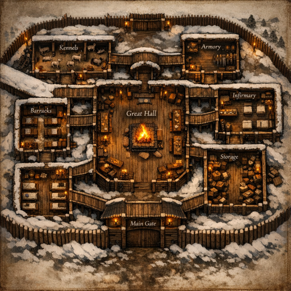
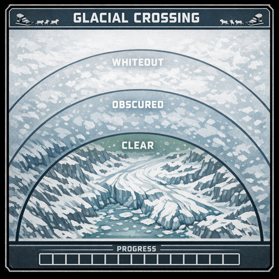
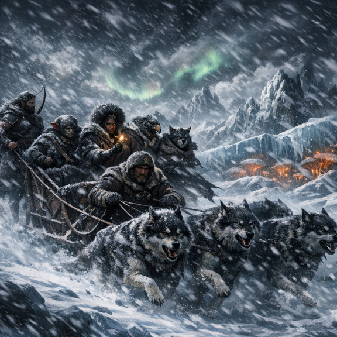
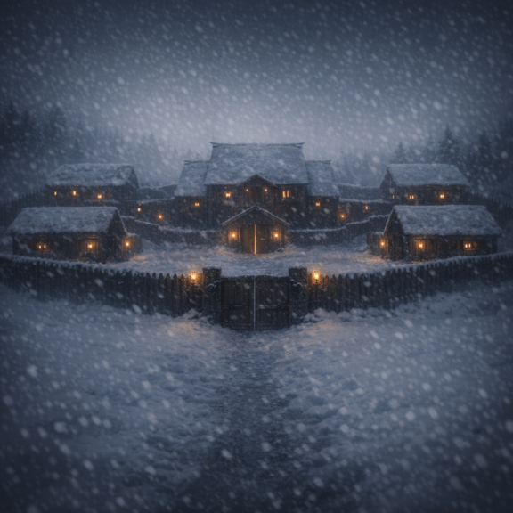
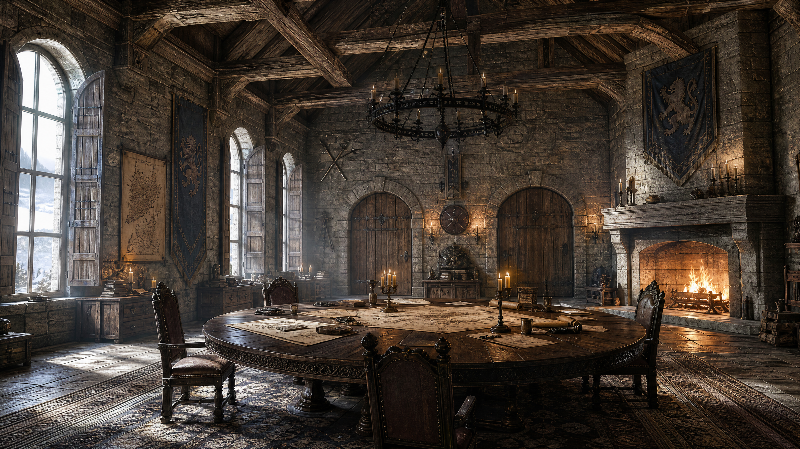
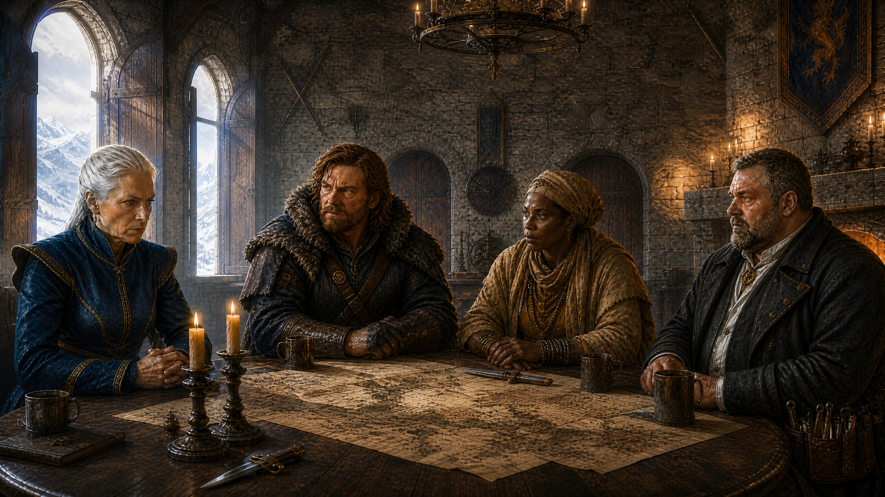

# Frostwatch Hold

The fortified northern outpost at the edge of the Barrier Peaks — timber walls "looming from the snow like a dying giant." Last shelter before the crash site, twice transformed since the party first arrived.

## Reaching it: the Frostwind Crossing

Dogsled passage through blizzard country, led by [Korrin](../NPCs/Korrin.md). Hazards: whiteouts (Survival DC 15), panicking dogs (Animal Handling DC 14), crevasses (Perception DC 14), and frostbite (CON DC 13, disadvantage for non-natives) — see [Cold & Survival](../Game-Mechanics/Cold-and-Survival.md).

## Era 1 — The expedition (Frostwatch Horror)

Commanded by [McReady](../NPCs/McReady.md); key personnel Korrin (sledmaster) and [Copper](../NPCs/Copper-the-Surgeon.md) (medic). The hold reeked of smoke and fear; Korrin and Copper argued over killing the possibly-infected dogs. That night, two **Fungal Horrors** and infected wolves breached the walls; the party survived until dawn. *(Module: [Frostwatch Horror](../Adventures/Frostwatch-Horror.md))*

## Era 2 — The occupation (now)

Repaired with new timber and pale stone — and transformed:

- The grey-wolf-on-white pennants replaced by the **Administrator's seal** (anchor and compass rose entwined with temple symbols).
- **~30 [Spásistren](../World/Factions/The-Spasistren.md)**: 20 initiates, 8 Sisters, 1 High Sister ([Valerius](../NPCs/High-Sister-Valerius.md)).
- Military wagons in the stables: **alchemical incendiaries, containment equipment, surveying instruments**. Access denied.
- They catalogue supplies and interview locals with a precision that feels like *assessment* — Korrin is convinced they're deciding who is expendable.
- The Great Hall rearranged around a single circular council table.

**The locals' voice:** [McReady](../NPCs/McReady.md) speaks for the surviving Frostwatch folk — the hunters, hermits, and steadholders scattered through the mountains whose fate every council option decides. He has wintered here long enough to know the hidden steads no network maps.

## The Council of Frostwatch

Held the morning after the party's return: Valerius severed her implant ("We are alone"), revealed the true spread of the infection, [Kaelen](../NPCs/Kaelen-al-Hajra.md) **named Rajaat**, and the paths were laid out as planetary triage. Full scene-by-scene text: [Return to Frostwatch](../Adventures/Return-to-Frostwatch.md); decision reference: [The Lighthouse Dilemma](../Campaign/Plot-Threads/The-Lighthouse-Dilemma.md).

*(Earlier art kept for reference: `.attachments/frost-hold.png`, `.attachments/council_reference.jpg`.)*
