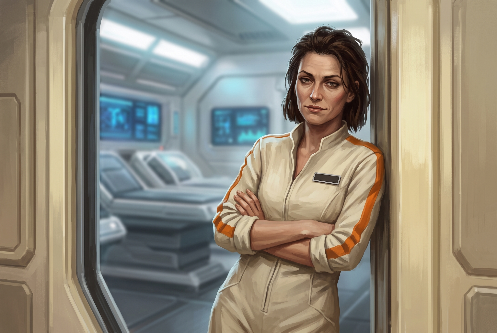

[Home](../Home.md) / [NPCs](../NPCs.md) / Erleena Riser <!-- wikidown:breadcrumb -->

# Erleena Riser

Archaeologist turned scientist, veteran of the party's previous world-saving adventure, and the strongest voice for the cure. Found alive in the Lighthouse; her cure lab is **directly beneath it**, below the sealed hatch. *"I'm not leaving until I understand what this thing is doing to people."* — and now she is leaving, because understanding it turned out to require another continent.

(Some documents spell her *Arlena*; Erleena is canonical.)

## History

**The archaeologist.** Before Jak's service, Erleena's field was the technology of the ancients — the buried world under Vermoon's feet. That is how the party met her, two years ago: the mission where they first crossed paths was a dig into the ancient technology, a hunt for what the old world had left underground, and it ended with the **planet-wide comm network restored** — with the dragons' help ([Timeline](../World/Timeline.md); [The Aura Network](../World/The-Aura-Network.md)). She knows the **buried elemental cities**, each with a **Titan** at its heart ([The Elemental Cities](../World/The-Elemental-Cities.md); [The Titans](../World/The-Titans.md)), and she has **seen every one of the ancient cities from its gate** — the single room the portal puts you in. She knows what the prospectors of Eldorado are bringing down out of the high country: the **fire city** lies under that pass. **She has never dug there.** Its gate room was an oven with every door locked, and that is as far as she has been; she assumes the city is "more of the same" loot as the others, only hotter, and more dangerous the farther down you go. (She is wrong — it is a ruin, [all lost](../World/The-Elemental-Cities.md) — but it is an honest expert's guess.) (That knowledge is a hook for [Shhhmeowmeow](../Campaign/The-Party/Shhhmeowmeow.md), not a piece of the cure — it has nothing to do with the infection.)

**The ship.** Accompanied [George Decay](George-Decay.md) into the ship on Jak's orders. When both were exposed to spores, she chose **physics**: the containment suit from her last mission with the party. She went hunting for an exit route, got separated for days, and was found by the party in the Lighthouse — kneeling over the floor hatch, suit battered but sealed, still trying to turn the fouled wheel (the scene below). *"Well. I'll be damned. You're a long way from home."* In the sealed levels beneath, she told the party she would build her cure lab there, and asked them to make the cycling door further down stay shut. That was the last conversation they had with her; every call from Frostwatch afterward died in the ship's fields.

### The professor — detail from the 2023 board

From Andy's previous-campaign prep (`assets/2023-dnd-campaign.json`; see [The Red Dragon Campaign](../Campaign/The-Red-Dragon-Campaign.md)), where she is **Professor Erlina Riser** *(a third spelling; Erleena stays canonical)*:

- **Where she came from:** a professor at the **Academy of the Fettered Mind** in Yorrem ([The Second-Age Guilds](../World/Factions/The-Second-Age-Guilds.md)), with an office there and a colleague and friend in **Dr. Methuselah Nye**, whom the party rescued from the Titan Fighters. The party first met her when she identified their "evil eye" pendant as a relic of a city of the Fallen called **the Void** — and then again at the new dig site itself, where she went in with them.
- **The language.** She followed Jak's lead into Aura and used her to start **deciphering the written Antari language** — common words first, rare ones slowly — and will teach anyone who asks. It was her reading that put the power source at Lost Rock and the fallen comm tower at Oldspire, and she who worked with Aura and the guilds to raise the replacement tower.
- **Access.** Jak chose what access Aura gave her. When the Administrator woke, she was locked out — and her first assumption was that *the party* had done it. She came to the Farmers Table guarded and suspicious, and left having named the sigil of [the Antari](../World/The-Antari.md) for them.
- **Oceana.** She learned *water breathing* for the trip, fought at range beside the party, and **uploaded the Green Dragon Undaloth's soul back into his rebuilt body** from a lab console while they held the body off. She found the current controls set to manual, shut them down worldwide, and **stayed in Oceana** to see Undaloth through rehabilitation — charging a body that no longer makes its own energy ([The Dragons](../World/The-Dragons.md)). She also identifies found items, and offered to imbue the Enspelled Staff.
- **The argument.** It was Erleena who dug up the Antari's old case against the Titans — that they could not have made all life on Vermoon, and lied — asked the dragons about it, and so found out what Dildro wanted ([The Titans](../World/The-Titans.md)).
- Andy planned for her to join the party aboard **Airlantis** if they kept it flying.

So her résumé runs: the Void, Oldspire, Lost Rock's readings, Oceana, and every city's gate room. The one Antari city the previous campaign never explored — nothing past a locked, overheating portal room — is the one she now names: Eldorado.

**What she knows and hasn't said (DM only, ruled 2026-09-21).** The ship she has been living in is Antari too — a terraforming ark that reached Vermoon long before the refugees whose ruins made her career ([The Ship's Purpose](../Campaign/Plot-Threads/The-Ships-Purpose.md)). **She has made the connection.** Older tech, an older script, but the cards, the pistols, and the stasis tanks are plainly the same people's work, and she saw it early. It seems so obvious to her that **it never came up** — she is not keeping a secret, she just assumed everyone could see it. **If pressed, she will explain it.**

**The book (2026-09-21).** Erleena has published ***[A Brief History of Vermoon](../Aerun-Players-Guide/A-Brief-History-of-Vermoon.md)*** — a short, easy read for the general public, finished and set with Eddie's help (he is the "E." of the acknowledgments; George is the "G." on the cover). It covers what the party would learn by interviewing her: Titans, dragons, the Antari, the Fall, the Second Age, and the previous campaign. The player-facing page is the highlights. **What she left out on purpose (DM only):** the ship and everything aboard it — including that it is Antari, which she knows; the infection, Rajaat, and the council; the Titan Fighters' founder; Eldorado, beyond a line (she has only seen its gate room, and is saving it for when she has dug there). The book also stays neutral on the two points still flagged for Andy — it names neither the Red Dragon nor the Administrator.

## Voice

Wry, exhausted, unstoppable. Teases Jak's methods (*"Only Jak would send a rescue party into a bio-hazard zone without proper containment suits"*), and softens only for George: *"Tell me he's still insufferable. Please."*

## Stats — Artificer 11, Field Alchemist

*The practical half of the science team: if George is the theorist with a laser scalpel, Erleena is the engineer who hits things with the whole lab. Party-parity CR 9.*

**AC** 12 (17 with *shield*) · **HP** 88 (16d8+16) · **Speed** 30 ft · STR 10, DEX 14, CON 14, **INT 18**, WIS 14, CHA 12 · **Saves** CON +6, INT +8 · **Skills** Investigation +12, Medicine +10, Arcana +8, History +8 (the archaeologist), Sleight of Hand +6

- **The uniform:** the containment suit the party found her in is gone. She wears what the ship made her — the **medical androids' livery**, cream with an orange sleeve stripe and a blank name-plate on the chest ([Ship Constructs](../Bestiary/Ship-Constructs.md)); Eddie's doing, and a clean one turns up in her cabin drawer every morning. *"Eddie says it's regulation. Don't."* It is clothing, not protection: in spore air she is exactly as exposed as the party, and gets through it the way they do — George's dose, a spore-blaster, and the saves.
- **Spell-tech** (DC 16, +8): *shield* (kinetic buffer), *cure wounds* (medi-spray), *web* (sealant foam), *lightning bolt* 2/day (capacitor discharge), *haste* (field stims), *greater restoration* 1/day (lab equipment required).
- **Flash of Genius** (reaction, 4/day): +4 to an ally's failed check or save within 30 ft.
- **Laser cutter** (+8, 2d10+4 fire — armor-piercing: ignores AC from nonmagical armor 1/turn) · **needler sidearm** (15-ft cone, DC 15 DEX, 8d4 piercing, 6 charges) · **serum injector** (auto-dose a grappled/willing target — the [Counteragent](../Game-Mechanics/The-Counteragent.md) delivery she designed).
- **Field chemistry:** given 10 minutes and materials, produces 2 alchemical devices per day (acid, alkaline mold-killer, flash powder, smoke).
- **Spore-blaster:** one of George's four rigs is hers from the reunion on ([The Counteragent](../Game-Mechanics/The-Counteragent.md)).

## The lab — and home

**Under the Lighthouse:** the sealed levels beneath the hatch are intact, and the lake above is a natural spore shield — a perfect control environment directly beneath the heaviest spore concentration. Her thesis: *the mold is aggressive, but it's biological. It follows rules.* She built the lab to synthesize a cure — for George, and for everything the ship has infected.

**It is a sickbay now.** When Eddie woke he brought the sealed levels' power back for her, and the dark, stale chamber the party left her in came up as what it was built to be: clean white light, warm filtered air, pale curved walls, a soft steady hum. Three **biobeds** with readout panels above them, a diagnostic table in the middle of the room, wall displays scrolling her instrument traces, her sample dishes in a lit case under glass. Only the portholes are unchanged — murk outside, and things thudding on the glass.

**She lives there.** The sealed levels were crew space once; off the lab she has a proper crew cabin — a bunk, a working galley unit, a drawer of clean uniforms. Fifty feet of lake keeps the air clean, and she has not been up the stair in weeks. When the party reaches her ([Beneath the Lighthouse](../Adventures/Return-to-the-Ship/Beneath-the-Lighthouse.md)), this is how they find her: leaning in an open door in the androids' cream-and-orange, with a bright white room behind her. As of that page, the room is finished as a workplace: the tower has noticed it, and the work leaves with her.

## Progress (what she'll say when they reach her)

She's close, and she knows it — which is exactly the kind of sentence that gets scientists killed. The headline isn't the dish; it's the rule she found under the biology. **The mold is a symptom.** Something is anchored to the Lighthouse above her — a protrusion from somewhere else, showing on every instrument she owns as the same black spike pointed straight up at the tower, bleeding energy into the room with the wrong sign — and the spores are what that bleed looks like when it touches living matter. She has a name for it, because her instruments kept drawing it and a thing needs a name before you can hate it properly: *the black salient*. It explains the three things a fungus never could: why the infected coordinate (the more it bleeds, the more they think alike), why her dish worked (she starved the bleed's foothold, not the fungus), and why the tower turned on her and George (his chemistry does the same thing at scale, and something upstairs has noticed). *"I spent a month treating a rash. Turns out the rash has a landlord."*

Real progress, all the same: an approach that holds up against her own drifted-strain samples, not just theory. *"I stopped it from replicating. In a petri dish. A very small, very controlled, very not-a-person petri dish. Don't get excited yet."* What's still missing is what she's always asked for — a second sample from somewhere else, to tell the thing itself apart from this ship's version of it, or, failing that, just time: uninterrupted lab time, which the Lighthouse has apparently decided she isn't allowed to have anymore. And one question she has no instrument for — the one she puts to the party the moment Rajaat is named, and which nobody in the room can answer: is the thing in the desert *the same kind of thing*, or just a very old mold?

## The Pivot — she's going

The party carries the council's news down to her: Rajaat, the thousand-year quarantine, and how the desert was made. The scientist changes the experiment on the spot — two asks, and they are the two asks that send the party to Aerun ([Beneath the Lighthouse](../Adventures/Return-to-the-Ship/Beneath-the-Lighthouse.md); [The Three Roads](../Adventures/The-Three-Roads.md)):

1. **Samples from the other source.** Rajaat is a second outbreak of the same kind of thing — not the original of the ship's mold and not a copy of it. She has spent a month with one sample of one outbreak and no way to tell what is the disease and what is just this ship; put a second one beside it and what the two share is the thing itself — the true target for a universal cure. *"You're telling me there's a second data point. On another continent. Under a thousand years of quarantine."* Transporting a living piece of Rajaat is the most dangerous cargo on Vermoon and a warden taboo, and she does not care.
2. **A defiler wizard.** The spores are plant life: a defiler can kill them *inside George's body*, and restoration magic rebuilds what the mold consumed — defile, then restore, micro-defiling as surgery. It needs a caster who can actually do it, and the [Order of the Sere](../World/Factions/The-Order-of-the-Sere.md) keeps that art. It is on Aerun. *"I don't need to understand it. I need one in this room, sober, with steady hands."*

Neither ask can be met on this ship. That is the point — and **she goes herself.** She is not sending the party across a sea with a sample jar and a shopping list: she wants her own readings at the source with her own instruments, and the lab under the lake has become a place the tower is actively trying to drown. She packs the slides, the traces, the dish, and the notebooks, takes the sixth dose and a spore-blaster, crosses the garden with the party back to George, and leaves the ship with them. She comes back with a baseline and a defiler, and George gets his surgery.

## In the current dilemma

She is the anchor of **Path Three** ([The Lighthouse Dilemma](../Campaign/Plot-Threads/The-Lighthouse-Dilemma.md)) and the named, sympathetic NPC standing inside any blast radius the other paths would create. Once she leaves the ship, that radius holds George instead.

## Status: unreachable from outside — until the party reaches her

Since the party left, **every call to her from outside the hull has died** — *"No signal. Your number cannot be completed."* Not Eddie, not a power reallocation, and not the spores: the ship's hyper-dimensional fields filter RF the same way they blind the Aura network and stop teleportation — the void that hides the ship from Jak ([Ship-wide properties](../The-Lost-Ship.md)). Nothing radio gets in or out.

*Inside* the hull she is anything but silent. Her lab is on the ship's internal comms, and she talks to [George](George-Decay.md) and Eddie every day — she knows about his half-cure and his spore-blasters, has asked him for one, and heard from George the moment the party reached S42. She works **alone**: the spore-thick [Garden Level](../The-Lost-Ship/The-Garden-Level.md) between S42 and the Lighthouse is why the two of them talk daily and still can't meet. What she has *not* heard is anything from the outside world — the council's news among it. The party brings it; she asks for it before they can offer.

## Open concerns

- The **cycling door** below her lab — still opening and shutting every few hours, a month after she asked the party to make it stay closed. It is the first thing she asks them about. The cause is plain and Eddie will say it: the door's **control station is on the lower-deck side, and its override is jammed at LOCAL** — he can see the fault and can't clear it from his end; somebody has to go down and push the lever. That errand is a side quest ([The Jammed Override](../Adventures/Return-to-the-Ship/The-Jammed-Override.md)), and the stair it opens leads to the lower deck near Nova's stasis chamber ([The Ship's Purpose](../Campaign/Plot-Threads/The-Ships-Purpose.md)). If the party fixes it before she leaves, she says *thank you* and nothing else.
- **The portholes.** The lake's small infected things — leechoids, poison-spined scintillating fish, quipper swarms — throw themselves at the glass in shifts, day and night. The glass holds; nothing that size gets through. The [froghemoth](../Bestiary/Ship-Creatures.md) is the one thing out there that wouldn't have to try twice.
- She has no suit anymore. George's warning stands: "Ensure she doesn't make the same mistake I did." Once she leaves the lake there is no clean room between her and the spores — just a dose, a pack, and the same saves the party makes.
