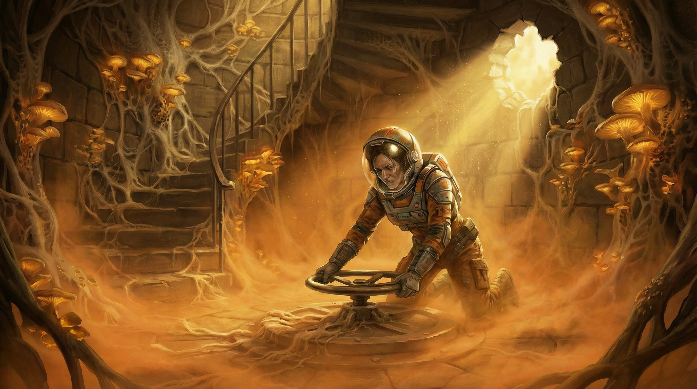

[NPCs](../NPCs.md) / Erleena Riser <!-- wikidown:breadcrumb -->

# Erleena Riser

Scientist, veteran of the party's previous world-saving adventure, and the strongest voice for the cure. Found alive in the Lighthouse; her cure lab is **directly beneath it**, below the sealed hatch. *"I'm not leaving until I understand what this thing is doing to people."*

(Some documents spell her *Arlena*; Erleena is canonical.)

## History

Accompanied [George Decay](George-Decay.md) into the ship on Jak's orders. When both were exposed to spores, she chose **physics**: the containment suit from her last mission with the party. She went hunting for an exit route, got separated for days, and was found by the party in the Lighthouse — kneeling over the floor hatch, suit battered but sealed, still trying to turn the fouled wheel (the scene above). *"Well. I'll be damned. You're a long way from home."*

## Voice

Wry, exhausted, unstoppable. Teases Jak's methods (*"Only Jak would send a rescue party into a bio-hazard zone without proper containment suits"*), and softens only for George: *"Tell me he's still insufferable. Please."*

## Stats — Artificer 11, Field Alchemist

*The practical half of the science team: if George is the theorist with a laser scalpel, Erleena is the engineer who hits things with the whole lab. Party-parity CR 9.*

**AC** 17 (reinforced containment suit) · **HP** 88 (16d8+16) · **Speed** 30 ft · STR 10, DEX 14, CON 14, **INT 18**, WIS 14, CHA 12 · **Saves** CON +6, INT +8 · **Skills** Investigation +12, Medicine +10, Arcana +8, Sleight of Hand +6

- **The suit:** while sealed — immunity to inhaled poisons, spores, and gases; resistance to poison and necrotic damage; self-contained air 4 hours. **Suit integrity 20 HP**: critical hits and acid chip it; at 0, the seal fails (the campaign's quiet countdown).
- **Spell-tech** (DC 16, +8): *shield* (kinetic buffer), *cure wounds* (medi-spray), *web* (sealant foam), *lightning bolt* 2/day (capacitor discharge), *haste* (field stims), *greater restoration* 1/day (lab equipment required).
- **Flash of Genius** (reaction, 4/day): +4 to an ally's failed check or save within 30 ft.
- **Laser cutter** (+8, 2d10+4 fire — armor-piercing: ignores AC from nonmagical armor 1/turn) · **needler sidearm** (15-ft cone, DC 15 DEX, 8d4 piercing, 6 charges) · **serum injector** (auto-dose a grappled/willing target — the [Counteragent](../Game-Mechanics/The-Counteragent.md) delivery she designed).
- **Field chemistry:** given 10 minutes and materials, produces 2 alchemical devices per day (acid, alkaline mold-killer, flash powder, smoke).

## The lab

**Under the Lighthouse:** the sealed levels beneath the hatch are intact, and the lake above is a natural spore shield — a perfect control environment directly beneath the heaviest spore concentration. Her thesis: *the mold is aggressive, but it's biological. It follows rules.* She intends to synthesize a cure — for George, and for everything the ship has infected. A full cure for advanced infection requires materials from the ship's medical labs (undiscovered — a future expedition hook).

## The Pivot (when she learns of Rajaat and the defilers)

The moment the party finds her and tells her about the First Source and defiling magic, the scientist changes the experiment — two demands ([The Three Roads](../Adventures/The-Three-Roads.md)):

1. **A sample of the First Source.** The original strain is the baseline; compare it to the ship's drifted strain and the mold's invariants — the true target for a universal cure — fall out. Never mind that transporting a living piece of Rajaat is the most dangerous cargo on Vermoon and a warden taboo.
2. **Cure George now — defile, then restore.** The spores are plant life: a defiler can kill them *inside his body*, then restoration magic rebuilds what the mold consumed. Micro-defiling as surgery, run as the campaign's operating-theater set-piece.

## In the current dilemma

She is the anchor of **Path Three** ([The Lighthouse Dilemma](../Campaign/Plot-Threads/The-Lighthouse-Dilemma.md)) and the named, sympathetic NPC standing inside any blast radius the other paths would create. Two more scientists now work aboard with her.

## Status: unreachable

Since the party left, **her comms have gone dead** — attempts return only *"No signal. Your number cannot be completed."* Infrastructure failure at best; [Aphelion stirring](../Adventures/Return-to-the-Ship.md) at worst. Finding her is a driving objective of the return expedition.

## Open concerns

- The **cycling door** below her lab — something overrides the lock, opens it, closes it. She asked the party to make it stay shut. It is Aphelion stirring ([The Ship's Purpose](../Campaign/Plot-Threads/The-Ships-Purpose.md)).
- Her suit *can* fail. George's warning stands: "Ensure she doesn't make the same mistake I did."
