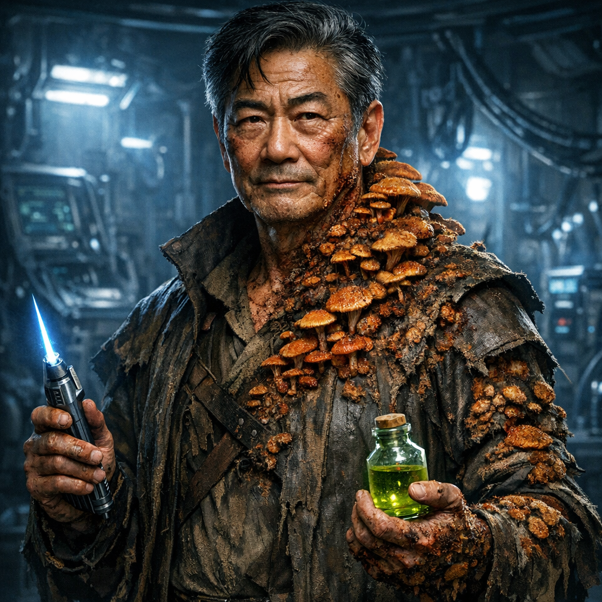

[NPCs](../NPCs.md) / George Decay <!-- wikidown:breadcrumb -->

# George Decay

Infected scientist, party companion, and the emotional anchor of the campaign. Sent by Jak to find the source of the russet mold; found it the hard way. *"Oh my… you've arrived. How fortuitous. And dramatic."*

Full NPC document with d20 conversation table: `assets/george_decay_npc.docx`.

## Situation

Entered the ship a month before the party with [Erleena Riser](Erleena-Riser.md); both were exposed. George chose **chemistry** — an experimental drug cocktail synthesized from the ship's pharmacopeia that slows the infection and keeps his mind razor-sharp while golden-brown fungal growths eat him alive (≈30% of his body). Erleena chose **physics** — the containment suit. His anti-fungal stimulant expires fast and supplies run low; [Harah's](Harah-Tabr.md) Sandwalker remedy can slow the progression and his pain. He knows he is dying; he refuses to be boring about it.

## Voice (George Takei-inspired)

Deep resonant baritone, refined diction, dramatic pauses, signature **"Oh my!"** Dry wit at the edge of the abyss: *"I came to stop the contamination. Now I AM the contamination. The universe has quite the sense of theater."* Touches his growths with clinical detachment. Never slouches. If asked about pain: *"The body may decay, but the mind must endure."*

## Stats (CR 2)

**AC** 12 · **HP** 32 (max reduced 8) · INT 18, WIS 16 · Medicine +9, Nature +10, Arcana/Investigation +7 · resists poison · reads ship language (limited)

- **Infected:** DC 15 CON per untreated 24h or lose 1d6 max HP; at 0 → vegepygmy in 1d4+20 hours.
- **Stimulant cocktail** 3/day: advantage on INT checks/saves 10 min, then 1 exhaustion.
- **Laser scalpel** (8 charges, +5, 2d8+2 radiant); alchemical vials (acid / alkaline mold-killer / flash powder); **Command Medical Android** (DC 15 INT — "MED-2, authorization code Decay-Gamma-Seven!").
- Gear: medical bag (2 healing sprays 2d12), notebook of ship observations, atmosphere analyzer, gray key card.

## His lab

**George's own lab is up on the observation deck (QftIS Level 2)** — separate from Erleena's beneath the Lighthouse. It grew out of his old base in the garden crew room: workbenches of ship instruments, his drug-synthesis rig fed by the medical systems, a month of notes on the mold. (If the mold rode a system call to wake Aphelion, this lab's network sessions are prime suspect — see [Return to the Ship](../Adventures/Return-to-the-Ship.md).)

## Knowledge & limits

Knows: the card system, the mold's lifecycle (21–24h transformation; burn or dissolve the dead), ship history, safe routes through Levels 1–3, the garden's flora rules, the Horrid Plant, the froghemoth's existence. Does **not** know: the wolf-in-sheep's-clothing, the squealer's lair, the froghemoth's full capabilities (it lives — still the lake's ruler).

## The oath

*"If I transform… you must destroy me immediately. No hesitation. Promise me this."*

## Arcs available

- **The surgery (Erleena's Pivot):** defile-then-restore as medicine — a willing defiler kills the spore colony inside him; Robin, Gobbledegook, and restoration magic rebuild what it consumed; Erleena directs; George narrates his own operation in dry baritone. The colony's death screams through the spore network — expect the counterattack of the campaign mid-procedure. Full design: [The Three Roads](../Adventures/The-Three-Roads.md).

- **Saved:** a cure (Erleena's lab, engineering decontamination) makes him a permanent ally and ship-tech interpreter.
- **Transformation:** the party fights what he became — a vegepygmy retaining nothing.
- **Heroic sacrifice:** seal a contaminated section, hold a horde, trigger the decontamination system that kills him. His research must reach Jak; Erleena must be told he completed the mission.
