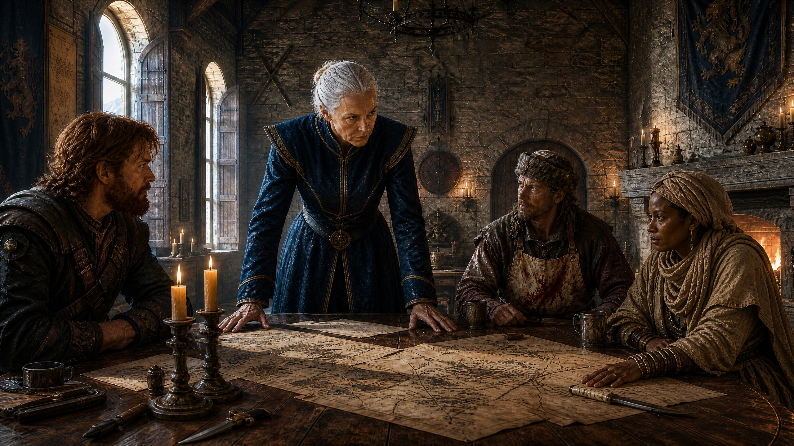

[NPCs](../NPCs.md) / Harah Tabr <!-- wikidown:breadcrumb -->

# Harah Tabr

Dune Strider of the [Sandwalkers](../World/Factions/The-Sandwalkers.md) — deep desert nomad and primal shaman of [Aerun](../World/Aerun.md), warden-born of Rajaat, sent south across the sea to find the source of the Defiling Silence. She has walked across the proof of what happens when a world chooses wrong. *"The desert does not lie. It shows you exactly what the world becomes when power is taken without giving anything back."*

Full writeup: `assets/desert_continent_expansion.md`; deep desert context: `assets/Aerun_TheDesertContinent.md`; her council scenes: `assets/Return_to_Frostwatch_v3.md`.

## How she arrived

Three months tracking the Silence across the sea and over the mountains on foot; found at Frostwatch's gate at dawn, sitting cross-legged in the snow, *waiting to be noticed* — which unsettled the Spásistren more than aggression would have. Carries no implant, no trackable technology: to the network she is a **ghost**. Valerius, at the council's end: *"Then you are invisible to the network. I may need that. Before this is over."*

## Her testimony — "We call it Rajaat."

At the council she placed one hand flat on the table and gave the room the true scale (full read-aloud in source): the **First Source** in Aerun's deep desert; the Green Age; walls that held eleven years before the bloom came through the groundwater; and the ancestors who **made a desert on purpose** — *"They killed the land to save the world"* — a quarantine that has held for **a thousand years**. Her verdict on the Barrier Peaks: *"a second Rajaat… sitting in a valley full of trees, animals, rivers, and people."*

**Her rings of disclosure (DM-critical):**

1. **Public (told at council):** the Rajaat story; the desert-as-quarantine; even a half-naming of the worms — *"contained only by sand and worms and the prayers of people the coastal cities have never met."*
2. **Under pressure / in private:** *how* the desert was made — **defiler magic** — and that the [Order of the Sere](../World/Factions/The-Order-of-the-Sere.md) keeps the failsafe. She states it as fact, not advocacy.
3. **Never:** the full containment ecology and **the Spice's true nature** ([The First Source](../Campaign/Plot-Threads/The-First-Source.md)). Pressed past her limit, the desert's flat finality: *"It is managed."*

## Personality

Economical with words, generous with action. States her position once, then does what's necessary. Dry, desert-dark humor. Deeply suspicious of the Aura network — she watched a single power control a continent's information once before; she says it about Jak "with the flat certainty of someone stating a geological fact." Does not perform grief about Aerun; the grief is in the flatness of her voice.

**Signature lines:** *"I've seen this before. Not this ship. This pattern."* · *"The network sees what it's pointed at. The desert sees everything."* · *"Your friend George is dying. But he's dying with his eyes open. That matters."* · *"It is managed."*

**Her vote (only if asked):** *"The cure. Because it is the only path that ends it rather than delays it or destroys everything around it. And because a cure does not just fix what is in your mountains. It fixes what is in mine. My people have been the wardens of Rajaat for a thousand years. We did not choose that. A cure would give us a choice for the first time."*

## Stats — Athasian Druid 12, Dune Strider (Dark Sun rules)

*Built on the [Dark Sun 5e](../Game-Mechanics/Dark-Sun-5e-Rules.md) chassis: wild talent, preserver casting, desert-forged. Party-parity CR 10.*

**AC** 16 (bone-and-hide + *barkskin* reflex) · **HP** 112 (15d8+45) · **Speed** 35 ft · STR 12, DEX 14, **CON 16**, INT 12, **WIS 20**, CHA 14 · **Saves** WIS +9, INT +5 · **Skills** Survival +13, Nature +9, Medicine +9, Perception +9 · **Resists** poison, fire · Darkvision 60 ft · Common, Primordial (desert), Sandwalker sign

- **Preserver Spellcasting** (DC 17, +9): *entangle, spike growth, call lightning, mass healing word, commune with nature, wall of thorns, heal* — and **[Rejuvenate](../Game-Mechanics/Dark-Sun-5e-Rules.md)** prepared, always. She draws only what the land can give; **she will never defile**, even dying.
- **Wild Talent (Spice-born) — Sandsense:** psionic; she cannot be surprised, and 3/day as a reaction imposes disadvantage on an attack against her (she felt the sand shift before the blade moved).
- **Defiling Sense:** at-will *detect magic* for necromantic/life-drain effects; automatically knows when defiling occurs within 1 mile.
- **Primal Attunement:** senses russet mold within 60 ft; can't be surprised by infected creatures.
- **Bone-tipped spear** ×2 (+7, 1d6+2 plus 2d6 poison — worm-gland venom) · **Desert Dust** 1/day (15-ft cone, DC 17 CON or blinded 1 min) · **Primal Surge** (recharge 5–6: allies within 30 ft heal 3d8+5 and gain advantage on their next save).
- **Desert Endurance:** ignores exhaustion from heat, thirst, or forced march; **Wasteland Stride** (difficult natural terrain costs nothing).

## Roleplay functions

- **Ecological memory:** introduces the [Green Age](../Campaign/Plot-Threads/The-Green-Age.md) through observation, never exposition — she answers history, doesn't volunteer it.
- **Warden of Rajaat:** the cure path is now *personal* — success frees her people from a thousand-year duty they never chose. She wants the party to succeed more than she will ever say.
- **Keeper of ringed secrets:** what she tells, what she yields under pressure, and what she never says — the gaps are where her best scenes live.
- **Gateway to the Sere — with a broken bridge (as played):** the council wants the defilers' containment help, and reaching them runs through Harah. But *"the defilers won't talk to me… They wouldn't necessarily trust me. It's a long story. Meet me at the bar later."* Her past rift with the Order is real, unexplained, and now load-bearing: someone has to make that meeting happen — and hear the story.
- **Network blind spot:** the party's untrackable channel; the merchant houses covet her, and she would refuse every side.
- **The Rite of Remembrance:** her ritual vision of the Green Age is the DM's revelation-delivery tool.
- **With George:** quiet mutual respect — the primal mind and the scientific mind approaching the same crisis from opposite directions. She offers him a Sandwalker stabilizer remedy — not a cure; time and clarity.
