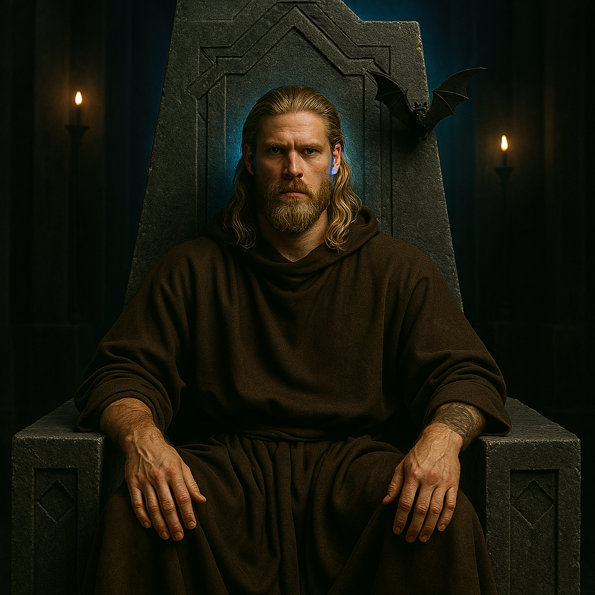

[NPCs](../NPCs.md) / Jak Bjornsson <!-- wikidown:breadcrumb -->

# Jak Bjornsson

The Administrator. Once a simple monk and wanderer from Grønnfjord — the party's steadfast companion — now the open, charismatic ruler of the entire world through the Aura network. *"You are still my friends, despite all this."*

## History

A boy from Grønnfjord on the southern continent who traveled with Wayward, the Friends (WTF) and helped defeat the **First Administrator** aboard the orbital station. Chosen to fill the role, Jak refused the predecessor's shadows: he took the implant, descended, and set his throne of black stone in the **Temple of Nord**, blending religious authority with political power. His all-female guard, the [Spásistren](../World/Factions/The-Spasistren.md), extends his reach; his implant extends his sight to every connected corner of Vermoon.

### Before the crown — Jak as a player character

In the previous campaign **Jakamarr "Jak" Bjornsson** was a PC (Mark's). From his card on Andy's 2023 board (`assets/2023-dnd-campaign.json`; see [The Red Dragon Campaign](../Campaign/The-Red-Dragon-Campaign.md)):

- **Aasimar monk, Chaotic Good.** Fought with a quarterstaff and his fists. Carried his **mother's Ring of Water Walking**, his **uncle's Quarterstaff of Charming**, and a grey **"Six Demon Bag"** of tricks (Andy's margin note: *what is this and what does it do?*).
- **Born under a lucky star,** or so his mother always told him (Andy: *USE THIS IN SOMETHING!!!*). **The seventh son of a seventh son**, and the most handsome of them — golden hair, blue eyes "like the ice and snow of his homeland," a **green peninsula on the southern frozen continent** where only the hardiest folk survive.
- **His father** taught him the sea and the wind, as a devout follower of **Njørd**, god of sailors and fishermen. Jak felt a special connection to Njørd and prayed to him often. **His uncle**, a monk who had traveled the world and come home with tales of exotic lands, taught him to fight with fists and feet. (Andy's open questions: is the uncle still alive, still adventuring? How often do Jak and Njørd actually talk?)
- **The call.** Torn between wanderlust and loyalty to his people, he got his sign: a storm unlike any other swept the peninsula, wrecking crops and homes and threatening the whole village, and in the middle of it Jak saw **a vision of Njørd calling him to a great adventure**. He packed, said goodbye to his family, and boarded a ship leaving the harbor.
- **The Seventh Son door.** On the road from Yorrem to Oldspire stands a door marked *SEVENDE SONN SEVENDE* under a seven-pointed star. It opens for no one but Jak ([Caria](../World/Caria.md)). The library's gloss: the seventh son of a seventh son has healing powers.
- **Aura's first administrator.** In the Void it was Jak who put on the headband. The implant, the ability to read the Antari tongue, and the habit of hearing a helpful voice nobody else can hear all date from there — two years before he had a throne ([The Aura Network](../World/The-Aura-Network.md)). It was Jak who granted Erleena her access, Jak who read out the name *Dirtroit*, and Jak whom Aura asked whether she should bring the world's systems back on her own judgment.
- **A Titan Fighter in good standing.** He turned down a place with the [Titan Fighters](../World/Factions/The-Titan-Fighters.md) on Taldea and was given their sigil with a leader's insignia anyway.
- **A young red dragon.** Andy's board never records Jak's dragon — "Dragons for Gobbeldy and Jak — who are they, where are they?" was still on his loose-ends list at the end — but Mark, who played him, is clear: **Jak has a young red dragon, and it now lives at the Temple of Nord in Grønnfjord.** **The Nords of Grønnfjord know about it; it is not widely known beyond the town.** Its name, where it came from, and what it is to the Red Dragon of the prophecy are not yet written down ([The Dragons](../World/The-Dragons.md)).

The man on the black throne praying at the **Temple of Nord** is the boy who followed Njørd out of a storm. Andy's spelling moves between *Njørd* and *Nord*; they are the same god.

## What he wants

- The **void** in the southern peaks understood and the threat it releases stopped — it terrifies him, personally and politically. His scouts return changed; his best dis-trans bat came back trembling.
- The peace preserved. He believes — sincerely — that he is the right steward for the world and for the ship's technology.
- The party. They are the only people he trusts absolutely, and (his own words) the only ones he *can* trust with the void.

## Stats — Monk 11, The Administrator

*The monk who walked with the party is still in there — the fists still work. What's new is the crown: he fights wrapped in the network's sight. Party-parity CR 10; effectively far more anywhere the Aura reaches.*

**AC** 17 (Unarmored Defense) · **HP** 93 (14d8+28) · **Speed** 45 ft · STR 14, **DEX 16**, CON 14, INT 14, **WIS 18**, CHA 16 · **Saves** DEX +7, WIS +8 · **Skills** Insight +12, Religion +6, Persuasion +7 · **Immune** charmed, frightened (implant)

- **Multiattack:** three unarmed strikes (+7, 1d8+3); **Stunning Strike DC 16**; Flurry, Patient Defense, Step of the Wind (Ki 11); Deflect Missiles.
- **The Administrator's Sight (while networked):** cannot be surprised; knows the location of every implanted creature within 1 mile; advantage on initiative. *The void's edge turns all of this off — his personal nightmare, mechanized.*
- **Command the Faithful** (bonus action): one Spásistren ally he can perceive (in person or through the network) uses its reaction to move half speed or attack.
- **The Network Bears Him Up** (1/day): when reduced below 30 HP, the Aura floods him — regain 40 HP and gain a fly speed of 30 ft for 1 minute as the orbs of the temple answer. Visually unmistakable; theologically alarming.
- **Dis-trans swarm** (1/day): a wheeling cloud of network bats — 20-ft radius within 60 ft, heavily obscured, DC 15 WIS or frightened, 1 minute.
- **Implant vulnerability:** psychic damage forces concentration-style CON saves to keep network features up; if [something rides the network](../Campaign/Plot-Threads/The-Invisible-Infection.md), his greatest asset is his attack surface.

## Playing Jak

- Charismatic, warm toward the party, and visibly carrying fear beneath the authority — white knuckles on the armrests, the implant pulsing erratically when the void comes up.
- He sees the infection as a **political problem** (Valerius's phrase). This is his blind spot: he thinks in networks, populations, and control, not in *vel-keth*.
- He is not a villain. He is a good man holding absolute power, which may be worse. Whether the crown corrupts him — or whether [something rides his network](../Campaign/Plot-Threads/The-Invisible-Infection.md) — is the campaign's long question.

## Secrets & levers

- The **sealed orders**: once the party's mission ends, the Spásistren are to seal the ship, leaving Jak exclusive access to the extracted data ([Tomas Vel-Maret](Tomas-Vel-Maret.md) has a copy).
- [Nordkrist's Hold](../Campaign/Plot-Threads/Nordkrists-Hold.md) is his project; he has not told the party what it is.
- He does not know Valerius severed her connection at the council.
- The dis-trans bat on his throne — his best reconnaissance unit — is a good barometer prop: it trembles when the void is near the conversation.

## The road ahead: Spicy Jak

The long arc waiting past the current crisis: **Jak goes missing** — gone to Aerun to train with the desert's psion-monks on the **avatar road**, taking the Spice in a big way and waking latent talents the network never gave him. Blue-within-blue eyes, sight with no off-switch, a world left leaderless behind him. Full design: **[Spicy Jak](../Campaign/Plot-Threads/Spicy-Jak.md)**.
