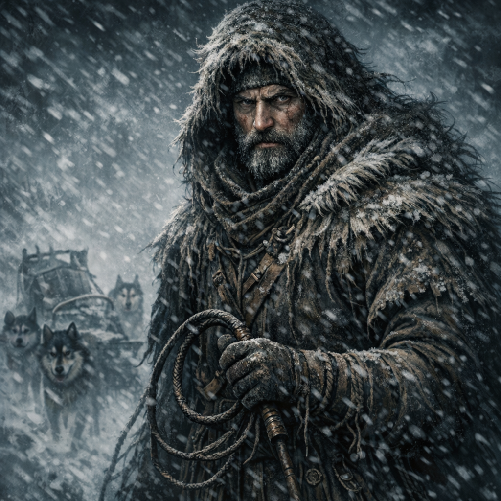

[NPCs](../NPCs.md) / Korrin <!-- wikidown:breadcrumb -->

# Korrin

Sledmaster of the Frostwatch expedition — rugged survivor of the frozen north, bound to his dogs above all. *"Kill the dogs and we die out here."*

## Personality & role

Practical, stoic, slow to trust outsiders. His gruffness hides deep responsibility: he will risk his life for his team or his animals, and he will challenge authority when survival is at stake. As guide, his knowledge of land and weather is the difference between life and death on the Frostwind Crossing.

## History with the party

- Guided them across the Crossing to Frostwatch through the blizzard.
- Clashed with [Copper](Copper-the-Surgeon.md) over killing possibly-infected dogs.
- The siege forced the party to kill his infected sled dogs — one of the hardest moments of the campaign. That wound is still open.

## Stats — Ranger 11, Beast Master of the Frostwind

*Not a soldier — a man the mountains have failed to kill for forty years, with two dogs who survived the siege. Party-parity CR 7.*

**AC** 15 (hide + DEX) · **HP** 97 (13d10+26) · **Speed** 30 ft (ignores snow/ice difficult terrain) · STR 14, **DEX 18**, CON 14, INT 12, **WIS 16**, CHA 10 · **Saves** STR +6, DEX +8 · **Skills** Survival +11 (expertise-grade in the Scarlands), Animal Handling +11, Perception +7, Athletics +6

- **Multiattack:** two attacks — **hand axes** ×2 (+8, 1d6+4, thrown 20/60) or **longbow** (+8, 1d8+4).
- **The dogs — Brakka and Vess** (wolf stats, HP 22 each, AC 13): act on his initiative; Pack Tactics with him and each other; he can forgo one attack to command both. *If a dog dies, so does part of him — the DM should treat it accordingly.*
- **Whiteout Instinct:** neither Korrin nor allies within 30 ft can become lost; advantage on all [Cold & Survival](../Game-Mechanics/Cold-and-Survival.md) checks; automatically detects crevasses and unstable snow within 60 ft.
- **Hunter's Eye** (3/day): +2d6 damage on a hit against a creature that has hurt him, his dogs, or his charges.
- **Spellcasting** (DC 14): *hunter's mark, pass without trace, wind wall* — he calls it weather-sense, not magic.
- **Gear:** sled, axe, rope, the good harnesses, a flask he shares exactly once per earned trust.

## Now (under the occupation)

Found in the stables, hand on his axe, between his remaining dogs and the Spásistren initiates examining them "with clinical detachment." He has overheard fragments: a council; wagons of "cleansing materials." He is convinced the Sisters are assessing who is expendable. He is **not at the council table** — [McReady](McReady.md) speaks for the locals there — which suits Korrin fine; he trusts tables even less than he trusts Sisters.

**Signature quote (current):** *"They're not here to help us. They're here to manage us. There's a difference."*

## DM levers

- If containment, the purge, or the defiling is chosen, Korrin becomes the human face of what gets sealed in, burned, or starved.
- His overheard fragments make him a natural drip-feed for Spásistren logistics intel.
- Threatening his dogs is the fastest way to turn him — in either direction.
