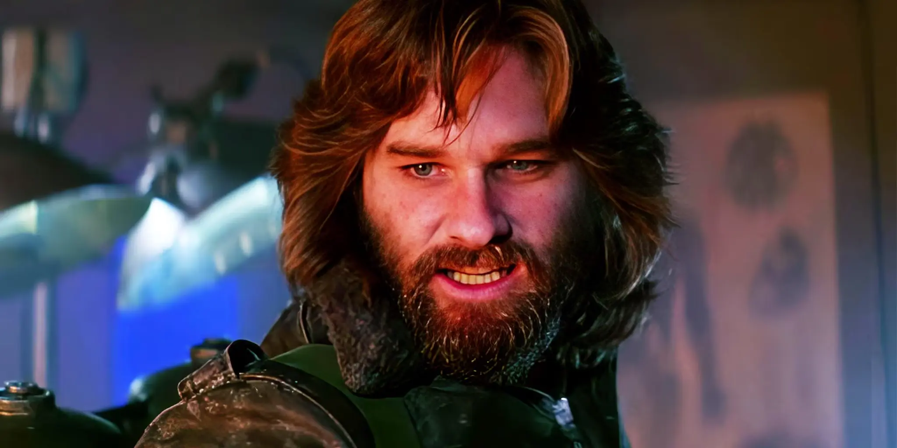

# McReady

Leader of the Frostwatch expedition — weathered, calm, the man who has seen too many winters. The party's steadiest ally in the north, the voice of the mountain folk at the council, and Jak's quiet eyes inside it all. *"We're not at war with each other. We're here to survive."*

## At Frostwatch Horror

Defused the Korrin/Copper standoff, welcomed the party warmly ("Jak says you're the best at what you do"), and led the departure for the site at first light. **Alert PCs may have noticed him at night, speaking into a glass tube to a listening bat** — reporting the party's arrival to a distant Jak.

## At the Council of Frostwatch (v3 canon)

McReady carries a double weight — the party's sponsor and the locals' advocate, all while quietly answering to Jak:

- **The corridor:** rested, clean, *the calmest person in the building*. "Let me do the talking for the first minute." And at the door: *"The High Sister is Jak's voice in this room. But she's also the smartest person in it. **Don't confuse those two things.**"*
- **The opening:** introduces the party ("They came back."), Copper, and Kaelen — *"She has something to say that you need to hear"* — and tells Valerius: **"I'll vouch for all of them."**
- **On sealing (Path One):** *"There are still people in those mountains. Hunters. Hermits. Travelers who don't know the passes are closing. You'd be sealing them in with it. I want that said out loud before we vote."* Then: *"That said — if sealing the ship gives us time to find a cure, **I'll carry the charges in myself.**"*
- **On the purge:** puts on record what burning three hundred years of mountain homes means; delivers Jak's context without inflection (*"Jak would want the ship intact if possible. That's not an order."*); and after Kaelen's testimony: *"even if we burn this valley clean, the problem isn't over. It's just quieter."*
- **On the cure:** *"I wouldn't ask you to go back in. But I'm not going to tell you not to, either. You know what's in there better than anyone in this room. Including me."* And: *"if she's right — if a cure fixes both sources — then this isn't just about the Scarlands anymore. This is about the whole world."*

**DM note (from the source):** McReady is the only person at the table who has been inside the ship's orbit, knows the party personally, speaks for the people the decision lands on, *and* reports to Jak — and the only one advocating nothing. His vouching is calculated: it signals to Valerius that the party is reliable, and to the party that he is on their side. **Both signals are true. Neither is the whole truth.**

If confronted privately about the dis-trans bat: he doesn't deny it. *"Jak needed to know you arrived safely. That's all it was."* Whether that is the complete truth is left to the DM.

## Playing him

Rare, genuine smiles that precede difficult requests. Settles into rooms like a man who knows exactly what they cost. Authority earned, never announced. Use veteran soldier/scout statistics as needed; his weapon is credibility.
