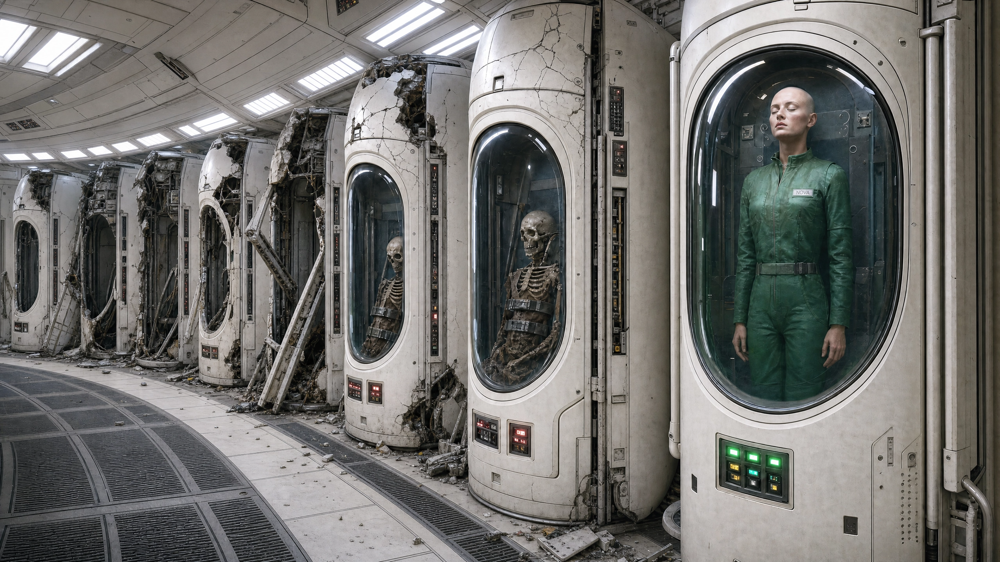

[NPCs](../NPCs.md) / Nova <!-- wikidown:breadcrumb -->

# Nova

The last survivor of the ship's original crew — a scientist in cryogenic stasis on the [Lower Deck](../The-Lost-Ship/The-Lower-Deck.md) (stasis chamber, green access). Shaved head, green jumpsuit, lawful good (noble statistics). **Status: depends on whether the party opened her pod.**

## Who she is

The lone crew member who **shut down Aphelion** — the ship's murderous computer — before stumbling into a stasis tank as the vessel fell. She has been under far longer than is recommended: her memory is foggy. She remembers the shutdown and the ship losing control; she remembers little of the advanced society she came from. If the party recounts what they've found, she is dismayed to learn the fate of crew, scientists, and passengers.

## What she offers

- **The true history** of the ship, hazily: the dying homeworld, the ark mission, the computer going haywire, the robot mutiny, the mold outbreak, the final hunt ([The Ship's Purpose](../Campaign/Plot-Threads/The-Ships-Purpose.md)).
- **Technology instruction:** she instinctively recalls how to use the ship's devices and can teach the party any equipment they've recovered.
- A base presence: she insists on staying aboard to assess damage and salvage the servers — a third scientist for the ship's growing research colony (with [Erleena](Erleena-Riser.md) and George).

## DM notes

- Freeing her: DC 12 Intelligence (Investigation) on the pod.
- She does not yet know **Aphelion is waking up** — and per the published spine adopted in [Return to the Ship](../Adventures/Return-to-the-Ship.md), the AI's fixation is **eliminating her**: she is the one person who knows the shutdown. The froghemoth that blocked its path is already dead, courtesy of the party. Her knowledge of how to shut it down *again* is the keystone of the next expedition.
- She may recognize the mold. Whether it boarded as cargo, stowaway, or weapon is a revelation the DM controls through her recovering memory.
