[Reference](../Reference.md) / Aerun City Map Roster <!-- wikidown:breadcrumb -->

# Aerun City Map Roster

This roster is grounded in the [Aerun glossary](../World/Dark-Sun/Glossary.md) and [merchant-house records](../World/Factions/The-Merchant-Houses.md). The seven family seats are the primary city-map series; **Blackguard, Osgaker, Hollowstorm, Amber Valley, and Eldorado** remain possible follow-on settlement maps. Each city will be researched, drafted, reviewed, and approved as a separate deliverable, preserving the approved **Aerun Atlas** visual language at street level: districts, gates, marketplaces, water access, major buildings, and local terrain.

The continent-level anchor (approved):

## The roster

| Order | City | Player-facing map identity | Confirmed map anchors | Ruling context |
| :-: | :--- | :--- | :--- | :--- |
| 1 | **Tyr** | Mountain-backed iron city with a free-city veneer | Ringing Mountains foothills; iron mines; great ziggurat; stadium; templar district; elven market; warrens | House Vordon; Kalak slain; rebuilding through shadow and mercenary power |
| 2 | **Draj** | Mudflat warrior-theocracy dominated by a stone pyramid and arena | Inland silt-basin mudflat; single stone causeway; 200-foot pyramid; arena; hemp and grain fields | House Tsalaxa; broken Tectuktitlay remains a ceremonial figurehead |
| 3 | **Raam** | Densely packed silt-edge metropolis on the edge of civil war | Coastal silt basin; noble toll-lands; palace on a grassy knoll; breastworks; vast public armory | House M'ke; Abalach-Re dead; the city is fractured while the house stays fortified |
| 4 | **Nibenay** | Decadent, relief-carved spring city at the forest's northern edge | Bubbling springs; rice paddies; stone reliefs; agafari logging routes; Crescent Forest edge | House Shom; the withdrawn Shadow King remains its dragon-general |
| 5 | **Gulg** | Compact forest city living behind a wall of thorn-trees | Living hedge; forest canopy; mud-hut rings; giant agafari palace; hunter-warrior routes | House Inika; the Oba is worshiped as dragon-goddess |
| 6 | **Balic** | Open merchant harbor between the southern sea and the Forked Tongue Estuary | Ocean and estuary docks; agora; Elven Market; olive orchards; grain farms; militia spaces | House Wavir; abolitionist merchant democracy; Andropinis banished |
| 7 | **Urik** | Sealed, walled war-city on the stony barrens | Fortress walls; Ringing Mountains backdrop; Black Crown obsidian quarries; sealed roads; military grounds | House Stel; Hamanu the Lion commands its military power |

## Reference maps & art (extracted from the source PDFs)

Every city has an official labeled map from the Dark Sun 4e Campaign Setting's atlas chapter (`DD4_DarksunCampaign.pdf`) — plus Tyr's two poster maps from the boxed set and 4e poster, and mood artwork where the chapter provided it. Use the maps for district logic, gate placement, and scale; use the art for architecture, light, and mood; restyle everything into the Aerun Atlas language.

### 1. Tyr

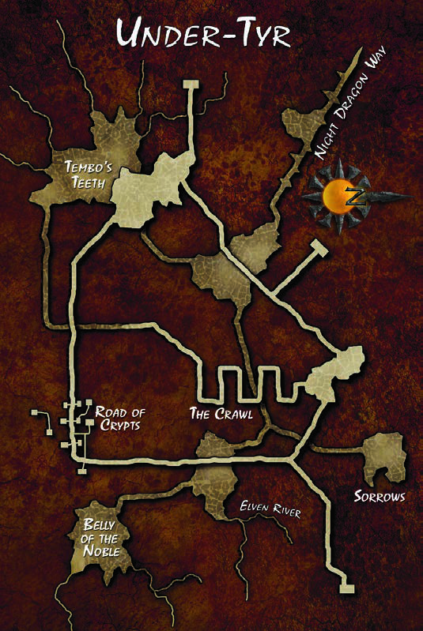
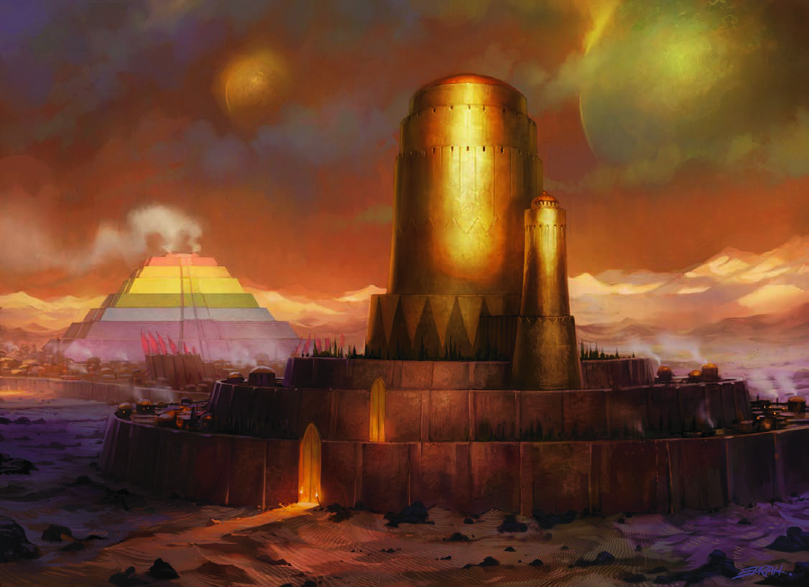
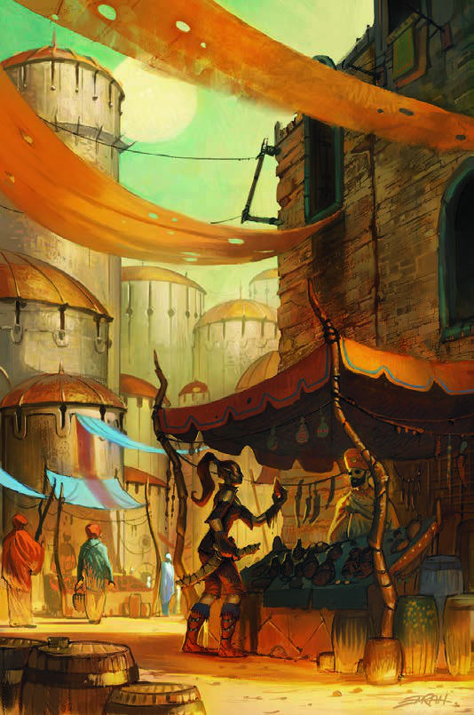
*Bonus: **Under-Tyr**, the buried city beneath the city — the Crawl, the Road of Crypts, the Belly of the Noble. Every old city on Aerun could hide one. The Golden Tower art sets the skyline; the bazaar art sets the street level.*

**District & lore notes (for the map):** ~15,000 inside the walls, as many again in the noble estates and villages of the **Tyr Valley**. Districts: the **Templar District**, the **Caravan District** and **Merchant District** (thirty inns apiece), the squalid **Warrens** with the **Elven Market** inside them, the **Stadium of Tyr** with its ragtag bazaar, the **King's Gardens**, the **Golden Tower**, and the **sealed Ziggurat** — Kalak's mad final project, shut since his assassination. **Seventeen public wells** tap the deep aquifer, each under guard; one hand-carried container per citizen per day. The **Tyrian Guard** (~5,000 — an uneasy mix of old royal soldiers, house contingents, revolutionaries, and freed gladiators; marshal: the mul ex-mercenary **Zalcor**) polices a city where every faction schemes to fill the champion-shaped hole — and House Vordon steers the chaos through a puppet king. The **iron mines** lie a day up a mountain road guarded by three outposts.

### 2. Draj

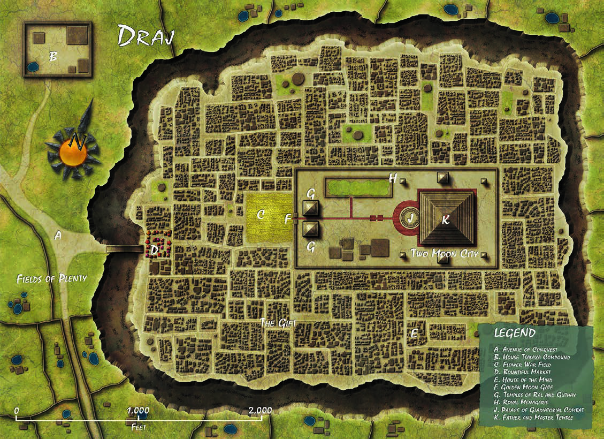
*Walled grid on the mudflat, the pyramid-and-arena compound at center, the Two Moon Gate, fields of plenty outside the walls. Add the single stone causeway prominently — it is the city's whole defense. (No dedicated art in the chapter — the pyramid identity carries it.)*

**District & lore notes (for the map):** ~18,000 in the city plus slaves and guards in the fields. Society runs on **clans**: the **calmec** scribe-clans (writing, astrology, horoscopes), the **jasuan knights** (five hundred noble captive-takers, named for the ambush drake), and the **pochte** trader-clans — of whom **Tsalaxa** is merely the largest. The **moon priests** (templars) run the broken god-king's theater; his face adorns every wall. The fertile fields are the **Gift**; deep wells there tap the water table. Caravanserais cluster at the **Golden Moon Gate** — nearly all run by House Tsalaxa, because Draj is xenophobic and visitors are tolerated only where the spymasters can watch them. Feathered-serpent banners, grain and hemp wealth, chronic metal scarcity (Tyr is far).

### 3. Raam

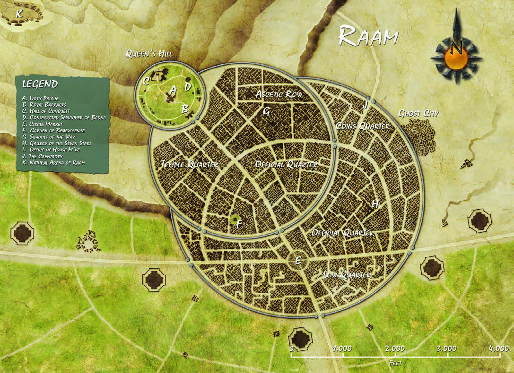
*Concentric sprawl with the queen's hill and walled inner districts dissolving into unwalled outer chaos — exactly the "fractured metropolis" identity. Put the silt docks on the basin edge.*

**District & lore notes (for the map):** 40,000+ inside, 40,000 more in the **warlord estates** outside — the ring's biggest and least-governed population. Since the champion's death the **mansabdars** (the law in name — thugs and bribe-takers in fact) lead the largest army on the ring, mostly wretched slave-soldiers; whole districts are no-go for them. The **Badna priesthood** maintains shrines to the four-armed god the dead queen invented; the **saddhus** (mystics) keep the older faith. Exhausted alabaster quarries and gem mines, abandoned shuttered quarters, inns clinging to life at the gates, the **hidden armory** beneath the palace — and House M'ke fortified in its compound, waiting out the warlords. Map key wants: the palace knoll and breastworks, warlord quarters, shrine-crowded streets, silt docks.

### 4. Nibenay

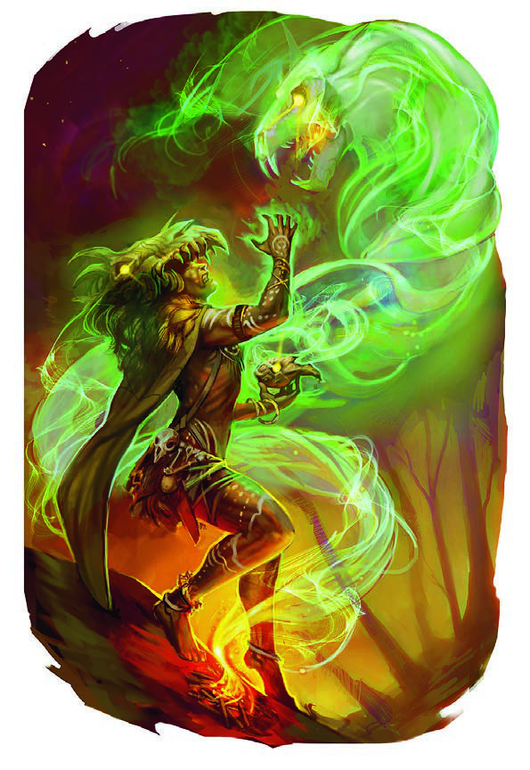
*Western/Sages'/Hill/Reservoir districts with the naggaramakam (the dragon's forbidden sub-city) walled at the heart. Springs and rice terraces belong on the forest-facing side; the half-giant art is the face of Shom's thousand-lance core.*

**District & lore notes (for the map):** ~24,000 in the city, as many in tenant farms and villages. Every surface carved — heroes, ancestors, and shocking hedonism in stone relief. The **Naggaramakam** is the walled forbidden dominion at the heart; only the **templar-wives** enter (Nibenay's all-female bureaucracy, ceremonially wed to the Shadow King, several hundred strong, organized under five temples). Districts: the **Sages' District** (inns, scholars), noble **Cliffside**, the **Hill District** (flophouses), the **Reservoir District** — and the noble-owned **hot springs**: all water in Nibenay is bought from the houses that own the springs. Defense: the **Shadow Guard** (a thousand half-giants) plus five thousand **janissaries**. Culture for street flavor: the three dance forms (whirling liaka-ih, comic priytu-ih, martial wriquo-ih) and the **Exalted Path** monasteries teaching submission of self. Exports: agafari timber, stone, spices, beans.

### 5. Gulg

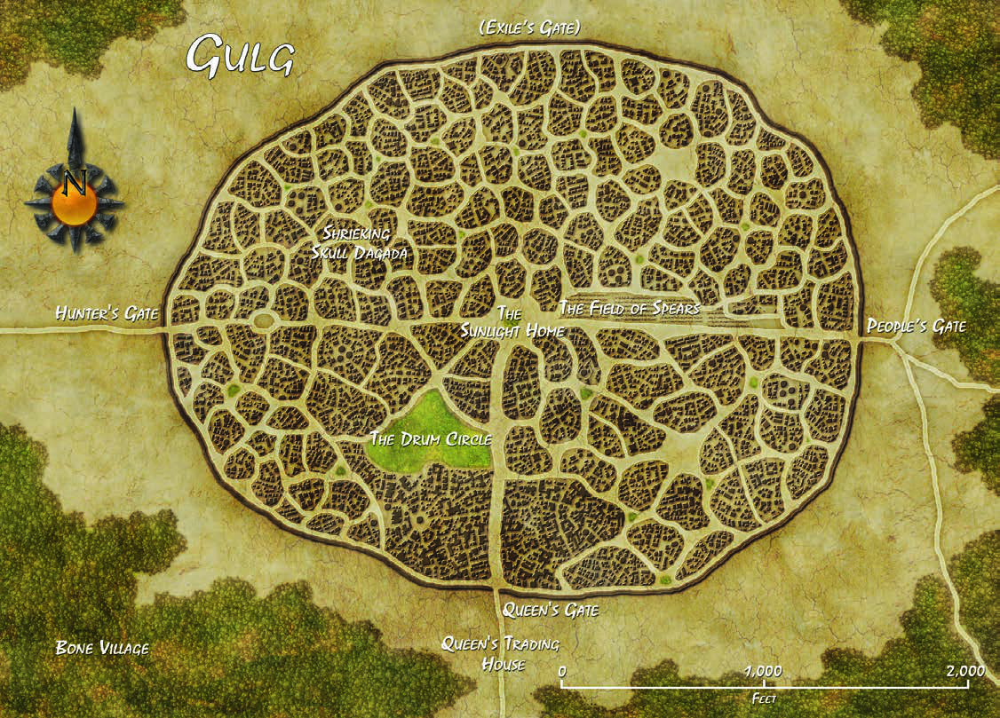
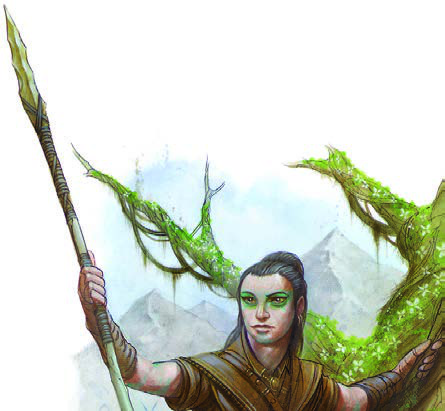
*The hedge-ring is canon-perfect: a single organic oval of thorn-tree wall, hut-cluster dagadas inside, the Oba's tree at center, People's Gate and Queen's Gate. The hunter art is the city's warrior-nobility.*

**District & lore notes (for the map):** the city is nothing but **dagadas** — walled hut-compounds crowded along twisting roads, small dusty squares, animal pens, and groves; no districts, no grid, and outsiders can't navigate without a local. Each People (the clan-tier) keeps a **dagafari**, an ancestral tree-lodge in its own agafari's branches — elevation in a living tree is status here. At the center, visible from every dagada, stands **Sunlight Home**: the Oba's small wooden palace in the highest limbs of an agafari **grown to titanic size by her magic**, with the huts of the **nganga** — her templars, secretive witch doctors seen only in their aftermath — in the branches below. An inner **Mopti Wall** rings the royal precinct; the **People's Road** is the main artery; name-drops for the map key: the **Drum Circle** (storytellers' dagada), the small **Elven Market** dagada, the travelers' dagadas outside the wall, and House Inika's lone **Trading House**. **Ring Road note:** the highway passes the forest's edge; Gulg hangs off it by a guarded **forest spur track** to the People's Gate. With a gathered-food economy and no open market (one assigned templar barters for the whole city), Gulg needs the Guild less than any city on the ring — it merely tolerates the road.*

### 6. Balic

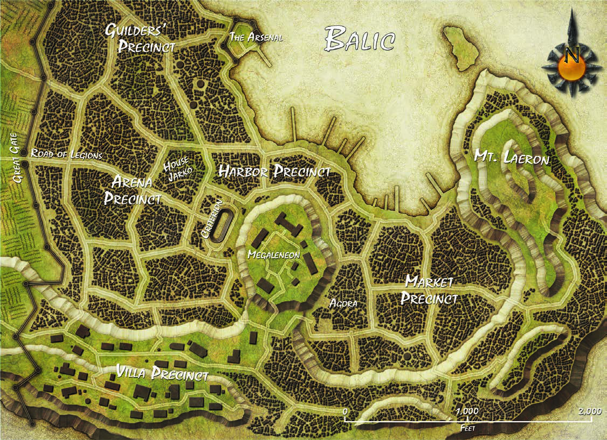

*Named precincts (Guilders', Arena, Harbor, Market, Villa) around the megalitheum. For Aerun's two-seas Balic, mirror the harbor precinct: ocean docks on one face, silt docks on the estuary face. The dusk art sets the white-domes-and-red-canvas palette.*

**District & lore notes (for the map):** ~24,000 — the wealthiest city on the ring. With its champion banished, the democratic machinery *actually governs*: the **Chamber of Patricians** writes the law, **praetors** (templars) stand for ten-year elections, guilds vote — and House Wavir referees it all. Precincts: **Guilders'**, **Arena**, **Harbor**, **Market**, **Villa**, around the **megalitheum**. The **silt fleet** works the estuary and archipelago (silt schooners, giant attacks, dust storms); five **legions** of a thousand garrison city and fields, and every citizen serves three years. Dozens of **theaters** from ramshackle stagehouses to noble amphitheaters — playwrights win fame equal to gladiators. Named spots: the **Olive Tree** inn (Road of Legions), the rough **Furled Sail** on the docks, the **Thespian House** (secretly the Veiled Alliance's meeting hall). Exports: grain, salt, olives, wine, marble. Water: five public wells + cisterns, rationed in dry years.

### 7. Urik

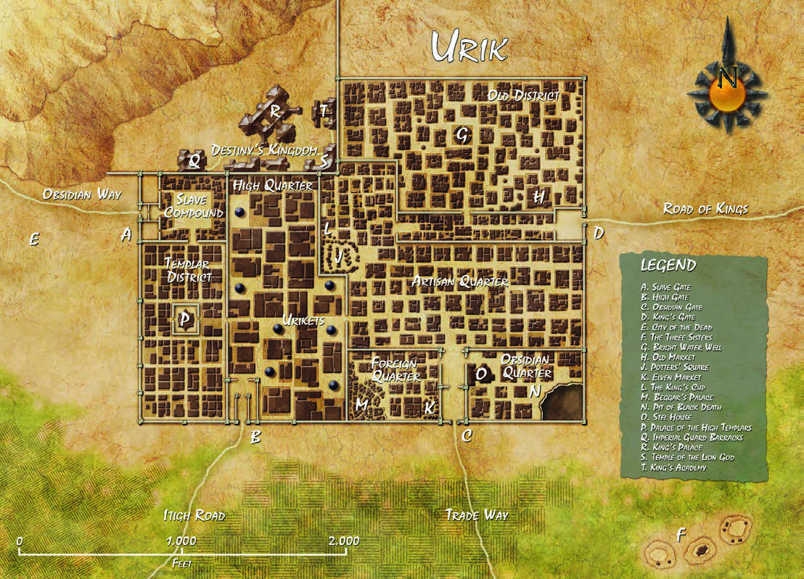
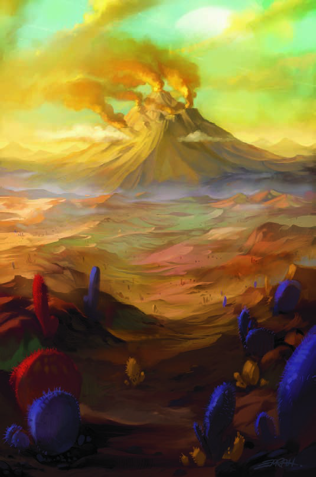
*Square military grid, walled quarters, the Destrier's Kilns and obsidian works, gates on sealed roads — the fortress identity is already drawn. The volcano art is the backdrop: put the Black Crown smoking behind the walls.*

**District & lore notes (for the map):** ~20,000 under **Hamanu's Code** — the law that dictates everything from construction standards to weddings; templars test every child and assign vocations. Districts: **Potters' Square** and the **Obsidian Quarter** (deliberately uniform inns — Urik prides itself on uniformity), and the **Old District** (the only quarter with character). **Pottery is the highest art** on the ring and Urik's glory; its other fames are **astronomers** and the obsidian mines that kill more slaves than the arena. Yellow cloaks mark the templars (forbidden to all others); **sirdars** (nobles) alone own land. Defense: the thousand half-giant **Imperial Guard**, ten thousand soldiers, and two hundred **halfling scouts from Ogo** — Chief Urga-Zoltapl's standing gift, paid in obsidian. Herd-lands outside produce leather, chitin, and kank nectar.

### Regional maps (for the drill-in maps between cities)

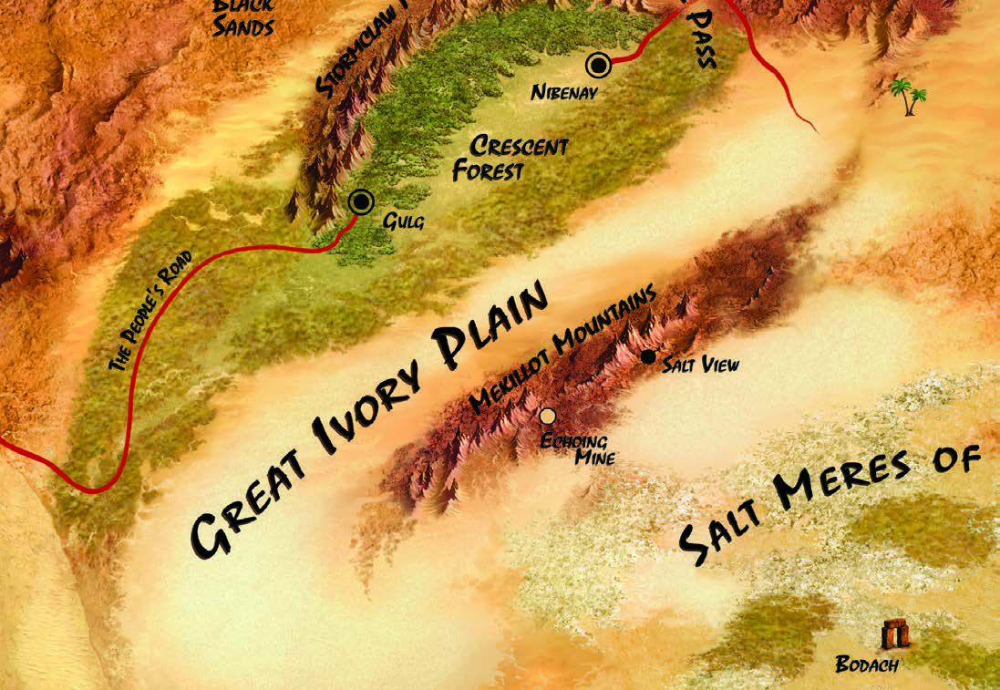
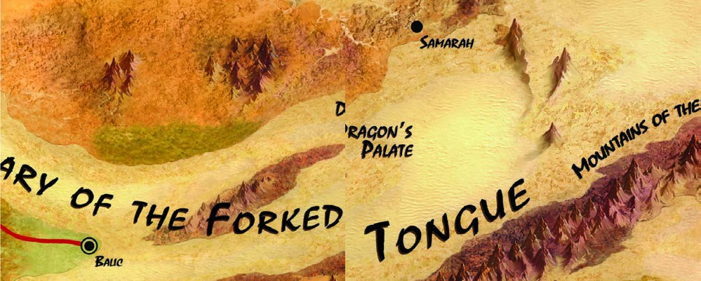
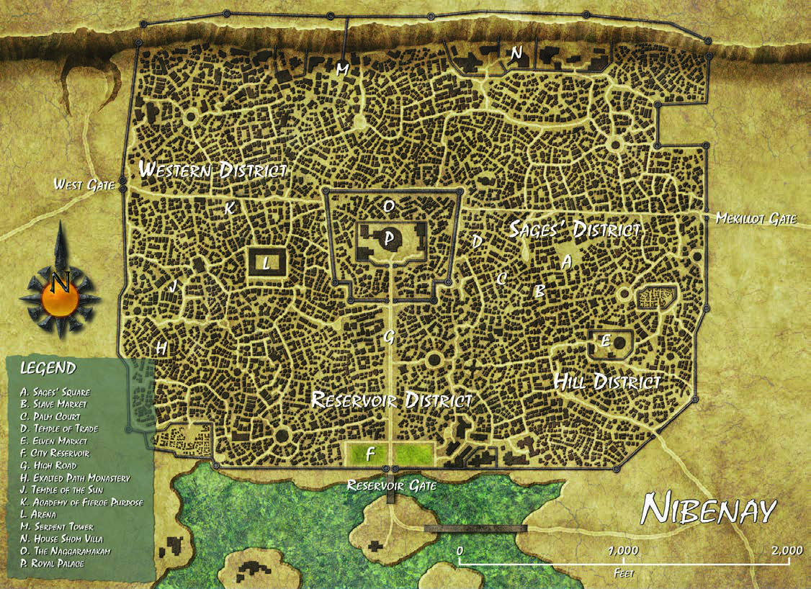

*These three cover the East (Crescent Forest), South (estuary), and Southwest (Urik–Raam road) [drill-in maps](Aerun-Map-Prompts.md); the silt wanderer sets the interior's mood.*

## Source records

- [Glossary — geography for the map](../World/Dark-Sun/Glossary.md)
- [The Merchant Houses](../World/Factions/The-Merchant-Houses.md)
- [Aerun Map Prompts](Aerun-Map-Prompts.md) — the continent prompt and drill-in template
- `assets/DD4_DarksunCampaign.pdf` (atlas chapter, pp. 130–195) · `assets/DDDS_DarkSun_VI.pdf` (Tyr posters)
