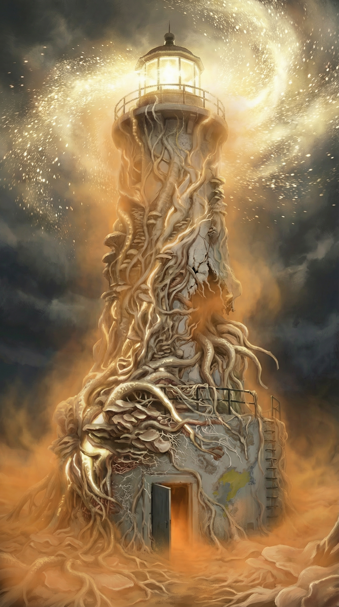
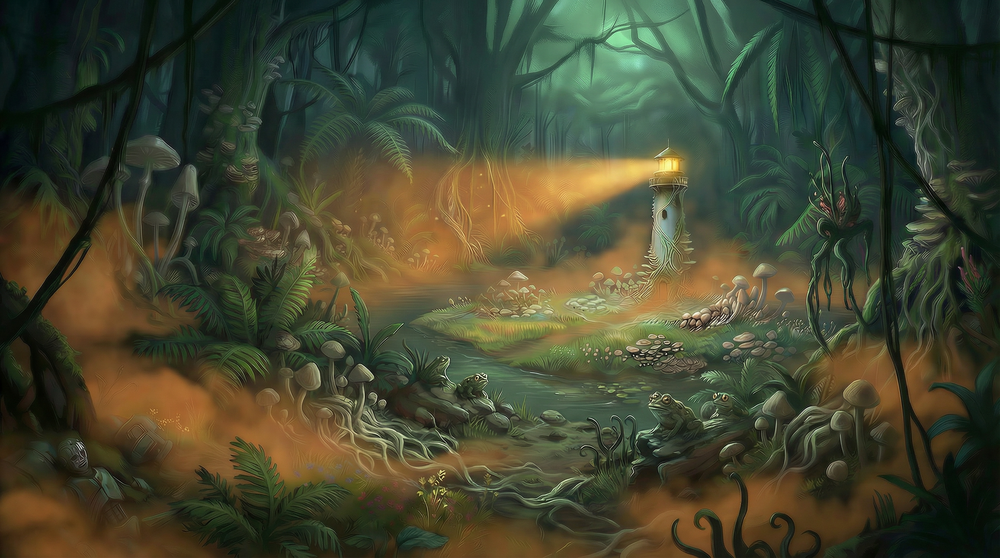

[Home](../Home.md) / [The Lost Ship](../The-Lost-Ship.md) / The Lighthouse <!-- wikidown:breadcrumb -->

# The Lighthouse

The source. A white tower at the center of the garden island, consumed by russet mold mycelium, broadcasting spores through the ship and out into the Barrier Peaks. The campaign's central dilemma stands here.

*DM only: the tower is the **anchor** of the Black Salient — an interdimensional protrusion from the Far Realm bleeding negative energy into our reality. The mold is that bleed made physical. See [The Ship's Purpose](../Campaign/Plot-Threads/The-Ships-Purpose.md).*

> *The original white concrete is barely visible beneath a skin of interlocked mushroom caps and ropy cords of pale mycelium, infiltrating every seam and crack of the structure with a faint, steady bioluminescent glow… High above, a blinding halo of churning golden-white spores swirls in slow, deliberate orbit around the lantern room.*

## Features

- **The beam:** sweeps the dark water; the spore halo is *attracted to whatever the beam illuminates*. George: "Do not let the beam touch you." Flying characters get pulled down.
- **The breach:** a ragged hole halfway up, spilling enormous mycelium cords — the root structure of something massive and buried. *(DM: that is the protrusion itself — as much of the Salient as sits on this side.)*
- **Interior:** walls choked with mycelium and amber fungal caps; a spiral stair winding up; a heavy circular **floor hatch** (mycelium-fouled: DC 15 Strength + green key card) leading down.
- **Broadcast:** every hour it operates, the infection clock in the peaks advances. Destroying it ends the outbreak — and, per Erleena, destroys the knowledge needed for a cure. *DM: "broadcast" is the players' word. The tower isn't transmitting spores so much as bleeding them — negative energy from the Salient manifesting as mold — and the more it bleeds, the more the infected stop acting like animals and start acting like one thing with one goal.* **Lately, it's doing something else too:** Erleena's cure research beneath it is working, George's anti-fungals are working on the decks above, and both are working against it — the Salient has redirected the tower's reach inward, driving the spore-controlled horde to attack the ship itself rather than simply bleeding outward.

## Found here

**[Erleena Riser](../NPCs/Erleena-Riser.md)** — alive, suit intact, found straining at the hatch wheel. *"Well. I'll be damned. You're a long way from home."*

## Below the Lighthouse: Erleena's Lab, then the Observatory

Fifty feet beneath the lake surface: a 30-ft circular chamber, 10-ft ceiling, cold stale air, blue-green emergency light. Concave porthole windows look into the murk (AC 13, 10 HP each; a broken window floods the chamber at 1 ft/round) — the lake's small infected fauna batter the glass around the clock, and it holds; a froghemoth is another matter. If the froghemoth lives, three glowing eyes watch from the dark.

- **Erleena's lab sits in the sealed levels directly beneath the Lighthouse** — intact seals, the lake as a natural spore shield: the perfect control environment, directly beneath the heaviest spore concentration. She is synthesizing a cure here: for George, and for everyone infected. (George's own lab is separate — up on the observation deck; see [his page](../NPCs/George-Decay.md).)
- **Her physics problem:** the stairwell continues down; the access door at the bottom is supposed to be sealed but **has been cycling open and closed for two days** — something is overriding the lock. She asked the party to make it stay shut. *(It didn't entirely work — the door still cycles, unexplained, and it leads further down toward the stasis chamber; see [The Ship's Purpose](../Campaign/Plot-Threads/The-Ships-Purpose.md).)*

## Stakes cheat sheet

See [The Lighthouse Dilemma](../Campaign/Plot-Threads/The-Lighthouse-Dilemma.md) for the three paths and who wants what. Remember: any purge or demolition decision now has Erleena's lab — and possibly a working cure — in the blast radius.
