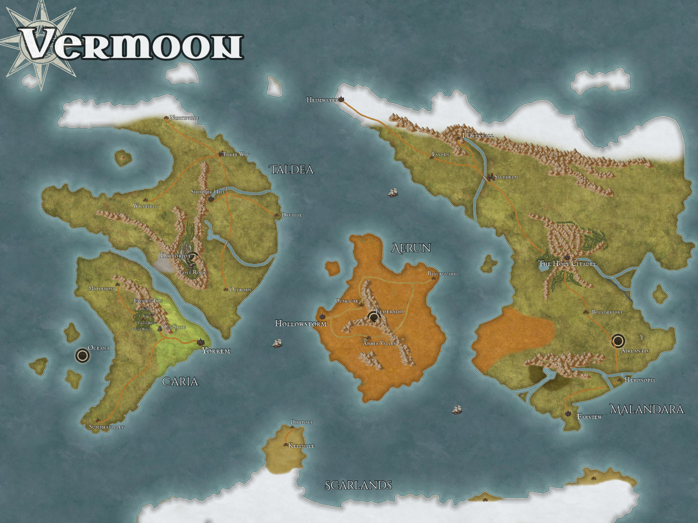

# World

**Vermoon** — the campaign world. A world of Nordic fjords and equatorial deserts, ruled (for the first time in living memory) by a single visible Administrator, and quietly threaded together by an ancient technological network most of its people mistake for divinity.

## Pages

- [The Scarlands](World/The-Scarlands.md) — the cold southern landmass: Grønnfjord, Frostwatch, the Barrier Peaks.
- [Aerun](World/Aerun.md) — the central desert continent; the world's warning.
- [Dark Sun](World/Dark-Sun.md) — the source setting Aerun borrows from: the 2e library, conversion rules, and the glossary of houses and city-states.
- [Caria](World/Caria.md) — the green southwest: Yorrem, Oldspire, the Void, Summervalley, and the coast over Oceana.
- [Taldea](World/Taldea.md) — the north: Drytide, Shimmerhill, buried Dirtroit, and Lost Rock.
- [The Antari](World/The-Antari.md) — "the ancients": the starship humans who enslaved the Titans, and the sleepers they left in orbit.
- [The Dragons](World/The-Dragons.md) — the sleeping guardians of the Red Dragon prophecy.
- [The Titans](World/The-Titans.md) — the elemental colossi: gods, engines, or captors.
- [The Elemental Cities](World/The-Elemental-Cities.md) — Dirtroit, Eldorado, Airlantis, Oceana, Eros Station, and the portal network.
- [The Aura Network](World/The-Aura-Network.md) — Jak's world-spanning implant network.
- [Factions](World/Factions.md) — the Spásistren, the merchant houses, the Sandwalkers, the Order of the Sere — and the older guilds and the Titan Fighters.
- [Timeline](World/Timeline.md) — history from the Green Age to the current day.

## The shape of the world

- **The Scarlands** (south, cold): fjord ports, mountain holds, and the Barrier Peaks range where the ship crashed. Seat of Jak's earthbound power at Grønnfjord.
- **Aerun** (central, equatorial): the desert crossroads-continent — seven merchant-house city-states on the coastal ring, the Rim Wall, and the Sea of Silt quarantine at the center — see [Dark Sun](World/Dark-Sun.md).
- **[Taldea](World/Taldea.md)** (northwest): dragon-tower country and Shhhmeowmeow's homeland — home of **Drytide**, where the party first met Rico (and, unknowingly, the Blue Dragon), the mining city **Shimmerhill**, the buried earth city **Dirtroit**, and the acid swamp of **Lost Rock**. *(Earlier notes rendered this "Lafdea" — the map settles it as Taldea.)*
- **[Caria](World/Caria.md)** (southwest): green and temperate — **Yorrem**, capital of the Gleaners Guild, where the previous campaign began; **Oldspire** and the dig called **the Void**, where Aura woke; the underwater city **Oceana** off its far coast; and **Titans Rest**, the Titan Fighters' tree fort, in its highlands.
- **Malandara** (east): the largest landmass — **The Holy Citadel**, Boulderfort, Heronopia, the ports of Direport and Fairstone — and **Airlantis's** parking ground, making it Eustace's homeland. Musty-Jo's tribe is here too.
- **The orbital layer:** **Eros Station**, the [Antari](World/The-Antari.md) space station of the previous campaign, where the First Administrator ruled and died — and where the Blue Dragon departed. Nothing up there can strike the ground; the world's only strategic air power is **Airlantis**, and the party holds it.

## Ancient technology as theology

Vermoon's civilization lives atop the infrastructure of "the ancients" — **[the Antari](World/The-Antari.md)**, starship refugees who enslaved the Titans some 720 years ago — networks, flying cities, teleporters, dis-trans creatures, implants — buried in the Red Dragon's apocalypse and partially revived. Most people experience this as religion (the Temple of Nord, "Jak's blessing"); a few understand it as machinery; almost no one understands it completely. The campaign's central irony: the one place the all-seeing network cannot reach is the one place the answers are.
