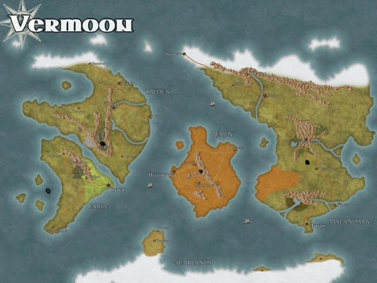

# World

**Vermoon** — the campaign world. A world of Nordic fjords and equatorial deserts, ruled (for the first time in living memory) by a single visible Administrator, and quietly threaded together by an ancient technological network most of its people mistake for divinity.

## Pages

- [The Scarlands](World/The-Scarlands.md) — the cold southern landmass: Grønnfjord, Frostwatch, the Barrier Peaks.
- [Aerun](World/Aerun.md) — the central desert continent; the world's warning.
- [The Dragons](World/The-Dragons.md) — the sleeping guardians of the Red Dragon prophecy.
- [The Titans](World/The-Titans.md) — the elemental colossi: gods, engines, or captors.
- [The Elemental Cities](World/The-Elemental-Cities.md) — Airlantis, Ocean, and the teleport network.
- [The Aura Network](World/The-Aura-Network.md) — Jak's world-spanning implant network.
- [Factions](World/Factions.md) — the Spásistren, the merchant houses, the Sandwalkers, the Order of the Sere.
- [Timeline](World/Timeline.md) — history from the Green Age to the current day.

## The shape of the world

- **The Scarlands** (south, cold): fjord ports, mountain holds, and the Barrier Peaks range where the ship crashed. Seat of Jak's earthbound power at Grønnfjord.
- **Aerun** (central, equatorial): the desert crossroads-continent — seven merchant-house city-states on the coastal ring, the Rim Wall, and the Deep Desert quarantine at the center.
- **Lafdea** (north): the northern continent — dragon-tower country and Shhhmeowmeow/Shenandoah's homeland; largely undetailed.
- **The orbital layer:** the space station of the previous campaign, where the First Administrator ruled and died — and where the Blue Dragon departed; orbital platforms capable of incendiary strikes still answer to the Administrator's authority.

## Ancient technology as theology

Vermoon's civilization lives atop the infrastructure of "the ancients" — networks, orbital platforms, dis-trans creatures, implants — buried in the Red Dragon's apocalypse and partially revived. Most people experience this as religion (the Temple of Nord, "Jak's blessing"); a few understand it as machinery; almost no one understands it completely. The campaign's central irony: the one place the all-seeing network cannot reach is the one place the answers are.
