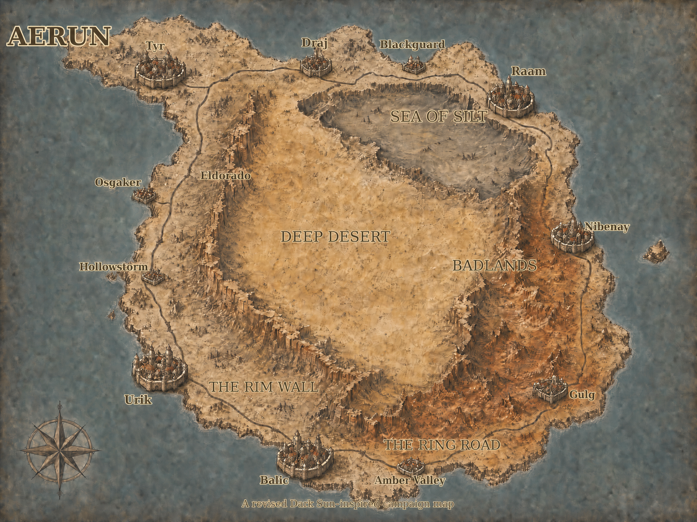

[World](../World.md) / Aerun <!-- wikidown:breadcrumb -->

# Aerun

The central equatorial continent of Vermoon — a world of concentric rings where civilization clings to the coast, a wall marks the edge of the known, and the deep desert keeps the world's most dangerous secret. Vermoon's Dark Sun / Dune analogue.

*"Beyond the Rim Wall, the world ends."* — coastal proverb. (Map: `assets/aerun_map.png` — the revised campaign map; the earlier draft is `aerun_map_v3.png`.)

Canonical sources: the revised map above, `assets/Aerun_TheDesertContinent.md`, and `assets/Aerun_TheMerchantHouses.md`. **The city-name reconciliation is settled by the revised map:** the Dark Sun seven are the great coastal city-states, and the legacy names from Andy's world map survive as smaller settlements — **Blackguard** (north coast, between Draj and Raam), **Osgaker** and **Hollowstorm** (west coast, between Tyr and Urik), **Amber Valley** (south coast, between Balic and Gulg), and **Eldorado** (inland, on the northwestern rim behind Tyr — the town at the edge of the wall).

## The concentric rings

### 1. The Coastal Ring — the seven city-states

The habitable coastal strip: seven great city-states controlling Vermoon's global commerce — the shipping hubs between the northern continents (**Taldea** and **Malandara**), the Scarlands, and the other landmasses — linked by the **Ring Road**, the continent-circling highway that carries the bulk goods teleporters cannot (labeled on the revised map along the southern coast). Jak keeps small temples in each city; true power lies with [the merchant houses](Factions/The-Merchant-Houses.md).

Going clockwise from the north (per the revised map): **Draj** → **Blackguard** → **Raam** → **Nibenay** → **Gulg** → **Amber Valley** → **Balic** → **Urik** → **Hollowstorm** → **Osgaker** → **Tyr**.

| City-State | Ruling House | Character |
| :--- | :--- | :--- |
| **Balic** (south; the great harbor) | Wavir | Merchant-lord democracy; silt harbor fleet; salt and silver |
| **Draj** (north) | Tsalaxa | Theocratic warrior culture; god-king figurehead; hemp and grain |
| **Gulg** (southeast) | Inika | Forest city; sorcerer-queen styled a goddess; druidic templars |
| **Nibenay** (east) | Shom | The Shadow King rules in mystery; half-giant legions; rare wood |
| **Raam** (northeast; the sprawl) | M'ke | Teetering on civil war after its sorcerer-queen's death; gateway to the Sea of Silt |
| **Tyr** (northwest) | Vordon | The Free City; first to abolish slavery; council-governed; iron mines |
| **Urik** (southwest; the fortress-ring) | Stel | Militarized warrior-state; sorcerer-king still in power; sealed borders |

**The lesser towns** (no house seats — client settlements, each a story hook): **Blackguard** (grim north-coast waypoint), **Osgaker** and **Hollowstorm** (west-coast fishing and salvage towns in the seven's shadow), **Amber Valley** (south-coast caravanserai on the Ring Road), **Eldorado** (the rim town — last provision stop before the interior, all rumors and gold-fever; the classic jumping-off point for a Deep Desert expedition).

### 2. The Rim Wall

A massive geological barrier — labeled **The Rim Wall** on the revised map, walling the interior plateau on the south and west — the final boundary of civilization. **Beyond the Rim Wall the Aura network fails completely**: Jak is blind to the entire interior. Coastal citizens consider everything beyond it uninhabitable wasteland. **Eldorado** sits at the wall's northwestern edge — the traditional crossing point into the interior.

### 3. The Tablelands and the Deep Desert

Between the wall and the true desert lie the transitional lands (per the revised map): the **Badlands** massif in the east behind Nibenay and Gulg — rust-red broken country — and the **Sea of Silt** in the northeast below Raam, a sunken basin of powder-fine dust that flows like water, navigable only by psionic silt skimmers, with horrors beneath the surface.

The center is the **Deep Desert**: a vast raised plateau ringed by cliffs, capricious violent sandstorms, absolute water scarcity, entirely off the grid — home of the [Sandwalkers](Factions/The-Sandwalkers.md).

## Magic: preservers and defilers

Arcane magic on Aerun draws on the life force of the land. **Preservers** take only what the flora can recover from, and organize in secret cells — the **Veiled Alliance** — working quietly toward restoring Aerun's green. **Defilers** rip life out wholesale, turning soil to sterile ash; the **sorcerer-kings are defilers of the highest order**, and their centuries of defiling helped scour the Tablelands. Arcane magic is feared and often illegal in the city-states — punishable by death or enslavement. See [The Order of the Sere](Factions/The-Order-of-the-Sere.md) for how this connects to the Green Age containment and the Scarlands crisis.

## Society

| Tier | Group |
| :-: | :--- |
| 1 | **Sorcerer-Kings** — god-like immortal defiler-psions (still enthroned in Urik, Gulg, Nibenay; fallen in Tyr, Raam, Balic, Draj — those cities now in violent flux) |
| 2 | **Templars** — bureaucrat-enforcers; manage water; minor magic granted by their king |
| 3 | **Nobility / merchant houses** — farms, water, Spice, the Ring Road |
| 4 | **Free citizens** — tenuous freedom |
| 5 | **Slaves** — the economic foundation; the arena is the only ladder up |

**Peoples of Aerun:** ruthless-adaptable humans · nomadic elf desert-runners (earned reputation for larceny) · hairless single-purpose dwarves ("focus") · **muls** (sterile human-dwarf arena-breeds) · **thri-kreen** mantis pack-hunters of the deep wastes · **half-giant** shock troops. Ambient Spice exposure gives nearly everyone on Aerun a minor psionic wild talent.

## The secret at the center

The Deep Desert is the **scar of a cure**. During the Green Age the **[First Source](../Campaign/Plot-Threads/The-First-Source.md)** — the original outbreak of the Barrier Peaks infection — was discovered here; **defiler magic** stopped it by killing every plant on the continent. *The desert did not happen to Aerun; it was made, at terrible cost, to keep something buried.* The First Source endures — contained by the desert's engineered ecology (massed spores, blooms, the great worms, and the **Spice** they produce), a mechanism the tribes guard absolutely.

## Why it matters now

Three months ago Aerun's primal spirits began going **silent** — the Defiling Silence. [Harah Tabr](../NPCs/Harah-Tabr.md) followed it south to the Scarlands and recognized the Barrier Peaks infection at once: a **second source**, in a land with no worms and no desert. The party is unknowingly fighting the war Aerun has fought for millennia.

## Using Aerun at the table

- Rules: the **[Dark Sun 5e Rules](../Game-Mechanics/Dark-Sun-5e-Rules.md)** page summarizes the player-facing Players Guide (races, Psion, Arcane Defilement, wild talents); DM chassis: **`assets/DarkSun_5e_Campaign_Guide_v1.9.pdf`** and **`assets/DarkSun_5e_Terrors_of_the_Desert_v1.0.pdf`** (monster manual) — plus the 4e books and Dune 2d20 line ([Sourcebooks & Inspiration](../Reference/Sourcebooks-and-Inspiration.md)).
- The party has been here before — by flight and teleporter, never by sea. The [teleport network](The-Elemental-Cities.md) nominally reaches the coastal ring. (The interview's elemental **fire city** should be mapped onto one of the seven — [ANDY LORE].)
- Tone: **ecological grief** on the sand, **political vertigo** on the coast, **arena blood** in between.

## Design notebook

