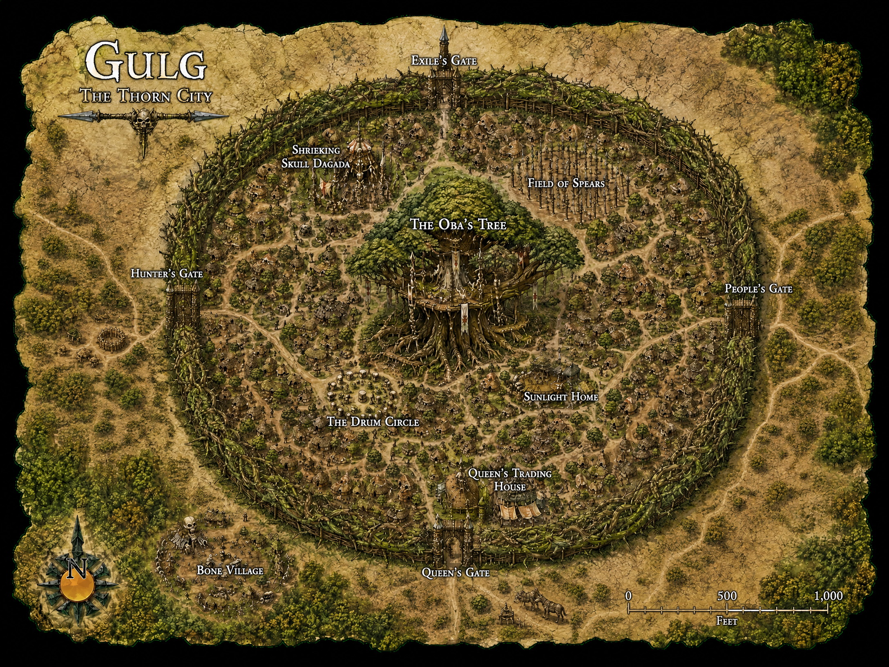

[World](../../../World.md) / [Aerun](../../Aerun.md) / [Gazetteer](../Gazetteer.md) / Gulg <!-- wikidown:breadcrumb -->

# Gulg — the Thorn City

Deep in the Crescent Forest, behind a wall that is alive. Gulg is the smallest of the seven cities, the strangest to outsiders, and the only one whose people seem genuinely to love their ruler.

## At a glance

- **Population** ~8,000 — the smallest city, and it likes that.
- **Ruling family** Inika, who trade small, fast, and expensive: gems, furs, feathers, kola, spices.
- **The wall** No masonry. A **hedge of interwoven thorn-trees**, grown so tight a halfling's fist won't pass. Two main gates.
- **Food** Gathered, not farmed — fruit, nuts, and game out of the forest, collected by city slaves and redistributed by the templars. There is no open market. A merchant deals with one assigned official who barters for the whole city, and drives a famously brutal bargain.

## What a visitor sees

Not streets but **dagadas** — dozens of round hut-compounds along twisting dirt lanes, animal pens and groves between. Above everything, the **Oba's tree**: an agafari grown to impossible size, a small palace in its highest limbs, and the huts of her witch-doctor templars on the branches below. It is visible from every corner of the city and from some way outside it.

## Traveler's notes

- Outsiders cannot navigate Gulg. Hire a local child for a coin; this is normal and expected.
- The **nganga** — the queen's templars — are rarely seen. You will know they have been by what is missing in the morning.
- Storytellers are honored here beyond gladiators. If you can tell a tale, you can eat for a week at the **Drum Circle**.
- The Ring Road does not enter the forest; Gulg hangs off it by a guarded spur track. Arrive by daylight.
