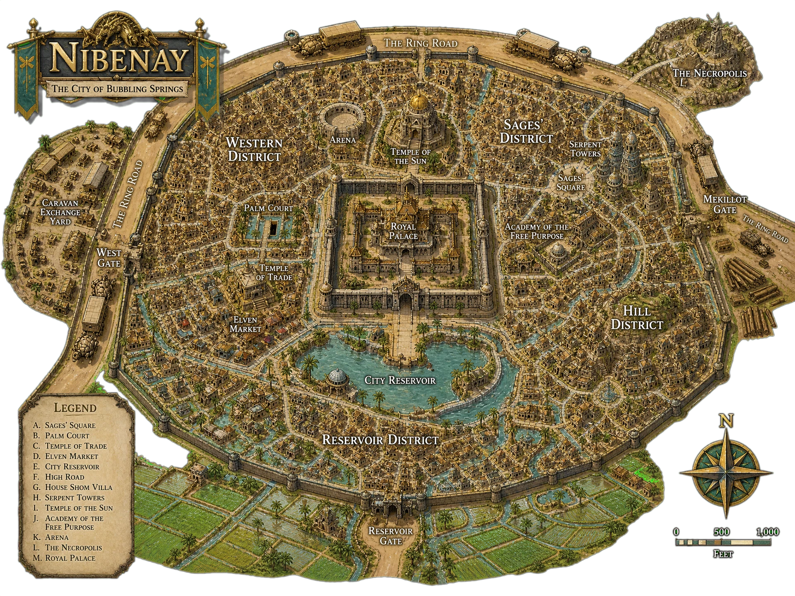

[World](../../../World.md) / [Aerun](../../Aerun.md) / [Gazetteer](../Gazetteer.md) / Nibenay <!-- wikidown:breadcrumb -->

# Nibenay — the City of Springs

East coast, between the red mesas and the forest's northern tip, built over hot springs that bubble up through the streets. The oldest, richest, and most self-satisfied city on the ring.

## At a glance

- **Population** ~24,000 in the city, as many again in tenant villages.
- **Ruling family** Shom — ancient, immense, and (whisper it) slipping.
- **Water** Hundreds of hot springs, every one **privately owned**. If you want water in Nibenay you buy it from a noble house, and you will be charged what the season allows.
- **Trade** Rice from spring-fed paddies, **agafari hardwood** out of the forest, spices, nuts, and dry beans. Anything at all is for sale here, legitimately or otherwise.

## What a visitor sees

Every surface carved — ancestors, triumphs, and a good deal of shocking hedonism, all in flawless relief. The **Serpent Towers**, the **Temple of the Sun**, the great **City Reservoir**, and at the heart a **walled inner precinct** nobody outside the templar order may enter, ever, on any pretext. The templars are all women, and they run the city's entire bureaucracy.

## Traveler's notes

- Nibenese manners are a maze: decorum in everything, coolness downward, deference upward, and no display of feeling in any direction. Being loud is the one unforgivable act.
- Watch the **dancers** — three schools, whirling, comic, and martial — and pay them; it is the city's great art.
- The forest logging is a live quarrel with [Gulg](Gulg.md), and has been for generations. Do not take a side over dinner.
- Lodging: the Sages' District for scholars, Cliffside for nobles, the Hill District if you would rather nobody wrote down your name.
