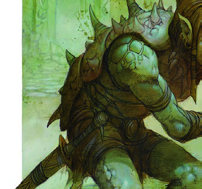

[World](../../../World.md) / [Aerun](../../Aerun.md) / [Gazetteer](../Gazetteer.md) / The Sea of Silt <!-- wikidown:breadcrumb -->

# The Sea of Silt

The gray country that fills the whole interior of Aerun, lying on top of the highland like water on a table. Not sand: **dust finer than flour**, hundreds of miles of it, pale as ash and dead flat.

## At a glance

- **Where** Above you. The interior is higher than the coast — the silt's surface sits well over a thousand feet above the sea, held up by [the Rim Wall](The-Rim-Wall.md). From the lowlands you look *up* at it.
- **What it does** It flows like water and it drowns like water. A person sinks. An animal sinks. There is no swimming in it and no bottom worth reaching.
- **Crossing it** Only three ways: the Guild's marked lane ([the Long Reach](The-Long-Reach.md)) aboard a silt skimmer; the shoals — ridges of firmer ground that shift with the seasons and are known to the desert tribes; or not at all.
- **Weather** Silt-storms: dust hurricanes that bury landmarks, rearrange the shoals, and can strip the paint off a hull. There is a season for them and it is longer than anyone would like.

## Traveler's notes

- Things live out there. Something large moves beneath the surface where the silt is deep, and skimmer crews watch for the wake the way sailors watch for reefs.
- The **northwestern reach** carries no lane, no markers, and no charts. Pilots call it *the blank* and turn the conversation elsewhere. Whatever the reason, the Guild's rule is absolute: nothing goes northwest.
- Breathing the dust over days does permanent damage. Buy a good veil in Eldorado or Raam; the cheap ones are decoration.
