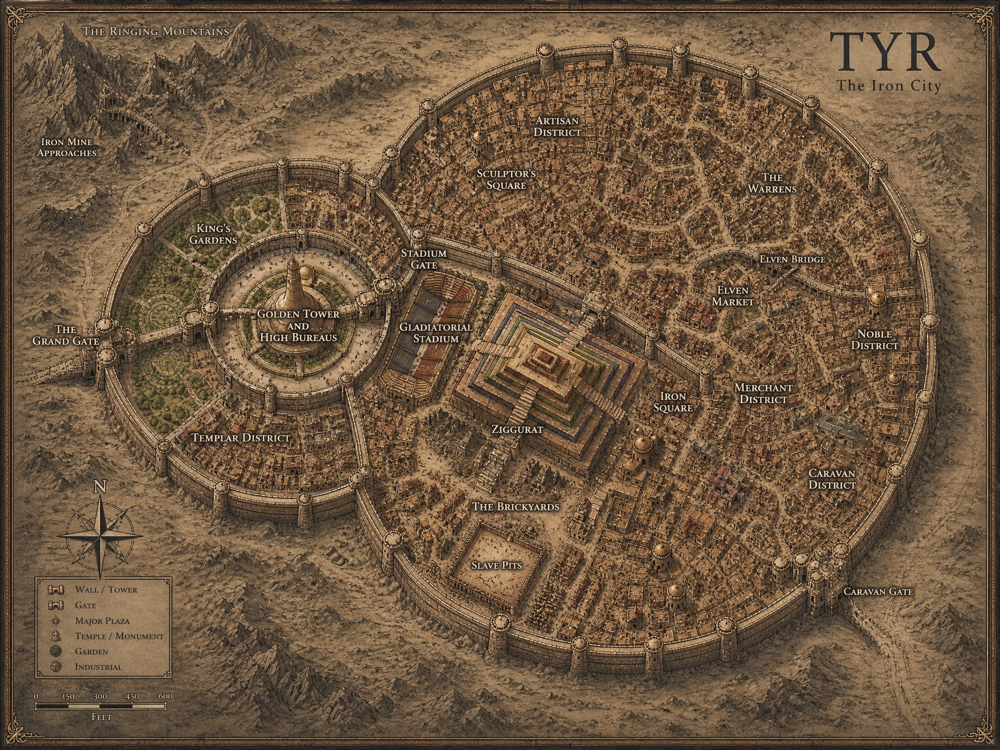

[World](../../../World.md) / [Aerun](../../Aerun.md) / [Gazetteer](../Gazetteer.md) / Tyr <!-- wikidown:breadcrumb -->

# Tyr — the Iron City

Northwest, high in the green foothills of the Ringing Mountains, where the rain still falls. Tyr is the coolest, wettest, and most argumentative of the seven cities — and the only one where you may say so out loud in the street.

## At a glance

- **Population** ~15,000 within the walls, as many again in the estates and villages of the Tyr Valley.
- **Ruling family** Vordon, whose iron built the place. The city calls itself free and has done since its old ruler died; what "free" means is settled daily, loudly, in the squares.
- **Trade** The **only iron mines on Aerun** — a day up a guarded mountain road. Every other city needs Tyr's metal, a fact Tyr never stops mentioning.
- **Water** Seventeen public wells over a deep mountain-fed aquifer, each under guard. One hand-carried container per citizen per day, and exile for cheating.

## What a visitor sees

The **Golden Tower** above the inner precinct; the **Ziggurat**, enormous and sealed, which nobody will explain to you; the **Stadium** and its ragtag bazaar; the **Elven Market** buried in the Warrens, where the prices are excellent and your purse is not. Newcomers are steered toward the Caravan and Merchant Districts, which have thirty inns apiece and the honest ones are marked.

## Traveler's notes

- The **Tyrian Guard** is five thousand strong and made of ex-royal soldiers, house troops, revolutionaries, and freed gladiators, all of whom recently fought each other. Their marshal is a mul named **Zalcor**. Address them politely.
- Freed slaves are numerous, proud, and newly employed; old nobles are numerous, quiet, and newly nervous. Both will tell you what really happened. The stories do not match.
- Good place to hire: miners, smiths, brawlers, agitators. Bad place to discuss: who should rule.
