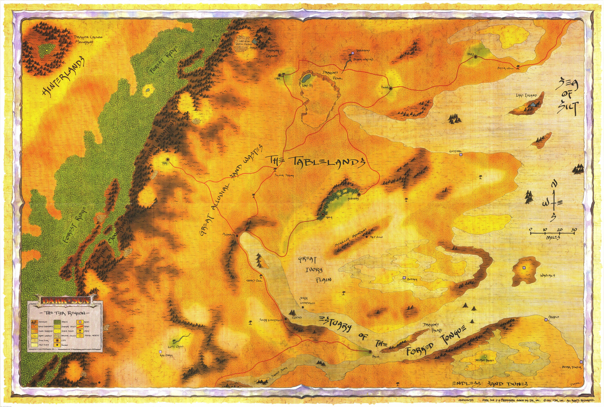
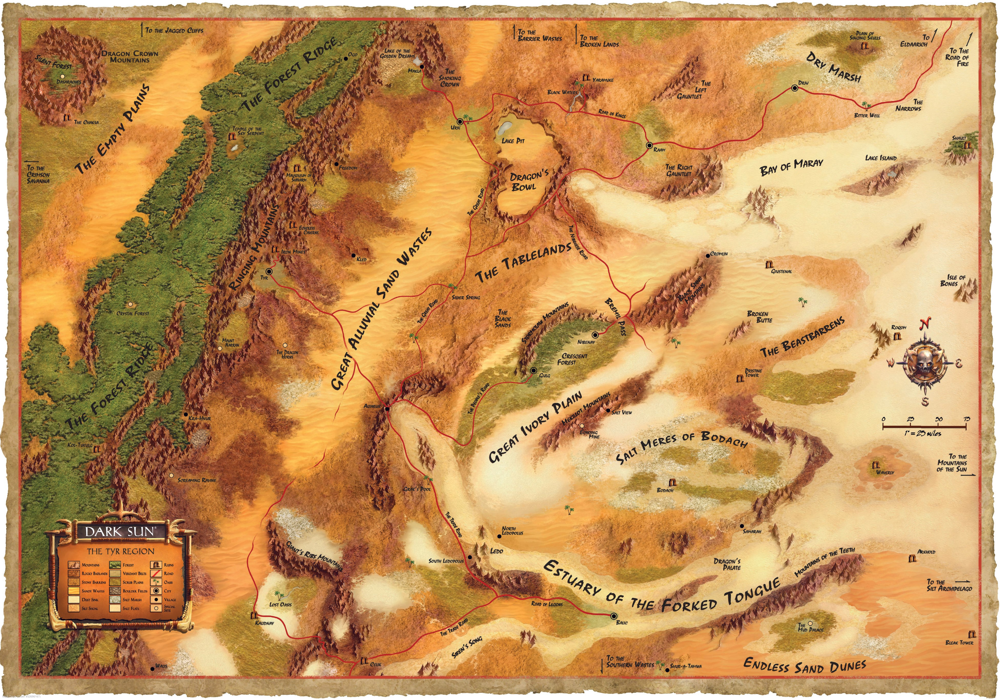
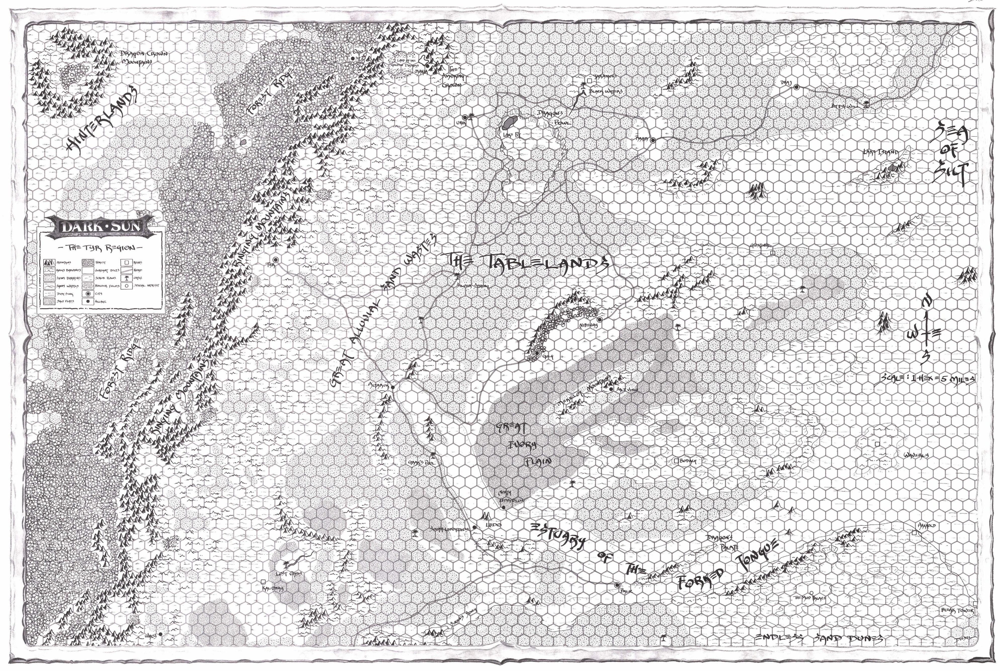
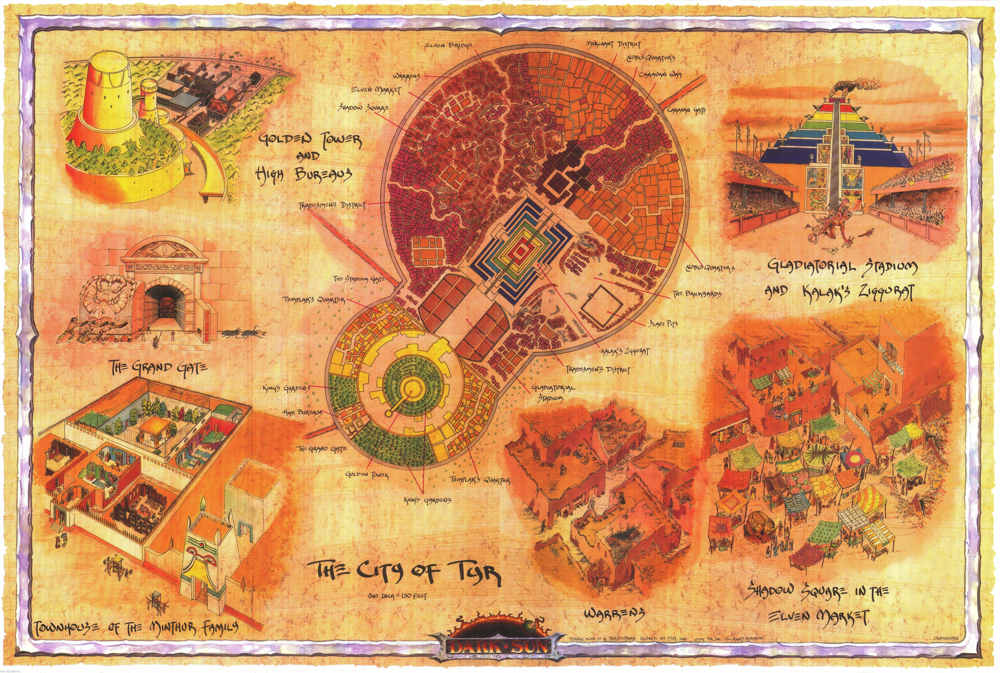
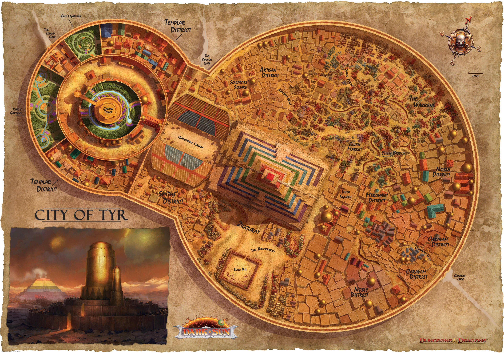

[Home](../../Home.md) / [World](../../World.md) / [Dark Sun](../Dark-Sun.md) / Glossary <!-- wikidown:breadcrumb -->

# Dark Sun Glossary (Aerun edition)

The names, powers, and relationships that make the continent run — campaign-canon where it conflicts with the books. Deep sources: *The Wanderer's Journal* (`DDDS_DarkSun_V.pdf`), *Defilers and Preservers*, *The Will and the Way*, *The Complete Gladiator's Handbook*.

## The shape of power: the triad

Aerun runs on the Dune model, and the players only need to remember three things:

| Power | Who | What they hold |
| :--- | :--- | :--- |
| **The Emperor** | **[Jak](../../NPCs/Jak-Bjornsson.md)** — the world's one king, in the south: **the Administrator** | The [Aura network](../The-Aura-Network.md), the temples in every city, the Spásistren — and a deliberately light hand on Aerun |
| **The Houses** | The **seven merchant families** — they *rule* the seven cities outright | The cities, the wells, the arenas, the Spice trade — and their **Champions** |
| **The Guild** | **The Caravan Guild** — no house, no city, no master | **All bulk transport**: the colossal mekillot argosies of the Ring Road — and the silt lanes besides, worked by the skimmers and long haulers of the Long Reach. They carry everyone or no one |

The balance: Jak's network moves *words* instantly but cannot move *goods*; the families own everything worth moving; the Guild is the only way to move it. Any two of the three can strangle the third — so nobody squeezes first. **There are no kings on Aerun. There is a king in the south — the Administrator — and everyone on the Ring Road knows it.** Aerun is his wildest, least-governed continent, and he leaves it that way on purpose: it is **the trading hub of the world**, and strangling the hub would cost him every other continent's peace. His temples watch; they do not rule.

## The Champions (the former god-kings)

The beings the old world worshiped as god-kings **kept their names and lost their thrones** — because on Aerun the role was never really *king*. It was **Champion**: each family's sovereign weapon, the single being who fights in the family's name. The title is a thousand years old and heavier than any crown: the first **Champions of Rajaat** were the Green Age heroes who led the great defiling that stopped the [First Source](../../Campaign/Plot-Threads/The-First-Source.md) — they saved the world by unmaking the continent's heart, and their successors have carried the name, the power, and the stain ever since.

### The War of Champions

Armies do not march on Aerun. The Guild charges **triple rates for war freight**, a city under siege still has to eat at Guild prices, and every soldier in the field is a customer not buying — **open war bankrupts the victor**. So the houses settled on something older and cheaper, born of the arenas that stand at the heart of every city: **matters between houses are settled by champions.** Where Dune has the War of Assassins, Aerun has the **War of Champions** — a formal, refereed institution:

1. **The challenge** — a house declares grievance and stakes: a contract, a tariff, a bride, a border well. Stakes are lodged with the Guild, which notarizes and enforces (the Guild carries the winnings; nobody argues with the freight-master).
2. **The proxy tier** — most disputes end here: named gladiators fight in a neutral arena before both houses and a roaring city. This is why **every city has an arena** and why the gladiator ladder matters: the arena is the continent's *court system*, and its best fighters are the bar.
3. **The champion tier** — grave matters call out the houses' **named Champions** themselves. Rare, ruinous to lose, unforgettable to watch. A house without a champion at this tier must hire, forfeit, or kneel.
4. **The ascended tier — never.** This is the deterrent that holds the peace (below).

*Fighting outside the rites is the continent's deepest crime.* Kalak was not defeated — he was **assassinated**, outside the forms, and all seven houses still pretend not to know who paid. That is why Vordon rebuilds in shadow: shame, and the fear that the answer will surface.

### Ascension — Dragon, Avangion, Avatar

A champion who advances far enough in the defiler-psionic (or preserver-psionic, or purely psionic) arts can **ascend** — transform into something beyond the mortal tiers:

| State | Road | Nature |
| :--- | :--- | :--- |
| **Dragon** | Defiler-psion metamorphosis | An engine of appetite and war — power ripped from land and minds |
| **Avangion** | Preserver-psion metamorphosis | The luminous guardian — power grown, never taken |
| **Avatar** | The [Way of the Unseen Mind](../../Campaign/Plot-Threads/Spicy-Jak.md) | The self as transparent instrument — power that takes nothing at all |

**An ascended champion is not a duelist. It is a deterrent.** Ascended beings never take the sand against each other — the one time it happened, **Hamanu erased the city of Yaramuke**, poisoned its oasis black, and gave the continent its permanent lesson: the ruins sit on the Road of Kings out of Urik as the accord's memorial. Since Yaramuke, the ascended exist to make total war unthinkable, the way their originals once made Rajaat's return unthinkable. A house with an ascended champion cannot be conquered. A house without one negotiates accordingly.

### The roster

| Champion | Serves | State & status |
| :--- | :--- | :--- |
| **Hamanu, the Lion** | House Stel (Urik) | **Ascended — Dragon.** The great living deterrent; disciplined, patient, terrifying; Urik's sealed borders are his preference. Leads Stel's legions in name; has not needed to fight in centuries |
| **The Shadow King** | House Shom (Nibenay) | **Ascended — Dragon**, half-withdrawn into mystery; the one force holding rotting Shom together |
| **The Oba** | House Inika (Gulg) | **Ascended — state debated.** Her forest templars worship her as an **Avangion**; her rivals mutter Dragon. Her exhibit A is **Sunlight Home**: an agafari tree grown to titanic size by her own magic — and defilers cannot *grow*. Nobody has tested the question |
| **Kalak** | House Vordon (Tyr) | **Slain — outside the rites.** The continent's unsolved crime; Vordon rebuilds in shadow and shame |
| **Abalach-Re** | House M'ke (Raam) | **Dead** — and Raam burns without its deterrent |
| **Tectuktitlay** | House Tsalaxa (Draj) | **Broken** — shattered in a champions' duel generations ago; paraded at festivals as a figurehead. Tsalaxa's spies do the work its champion cannot |
| **Andropinis** | House Wavir (Balic) | **Banished** — Wavir renounced the institution itself, banished its champion, and bet everything on commerce. The richest house fights every War of Champions with hired blades — and wins more than it should |

**The strategic math:** three houses hold ascended champions (Stel, Shom, Inika); four do not (Wavir, Tsalaxa, Vordon, M'ke) — and the champion-less four are, not coincidentally, the houses that lean hardest on gold, spies, shadow armies, and hired arena talent. Ascended deterrence is why no house war goes total; the Guild's rates are why none goes long.

**The arena ladder** (deep source: *Complete Gladiator's Handbook*): slave → gladiator → freed name → house blade → **named Champion** — and at the far end of a long life of power, perhaps ascension. It is the only ladder on Aerun that reaches from the bottom of the pyramid to the top, which is why every city roars for the games: everyone in the stands is watching the one road out.

## The seven cities and their families

City = family seat; the family rules it outright. Full dossiers, banners, and feuds: [The Merchant Houses](../Factions/The-Merchant-Houses.md).

| City | Ruling Family | Champion | Character |
| :--- | :--- | :--- | :--- |
| **Tyr** (NW) | Vordon | *(Kalak, slain)* | Iron mines the whole ring needs; free-city veneer over Vordon's rebuilding |
| **Urik** (SW) | Stel | Hamanu (Dragon) | The war-city: fortress walls, mercenary legions, sealed borders |
| **Raam** (NE) | M'ke | *(Abalach-Re, dead)* | Teeming sprawl at the silt's edge, half in civil war; M'ke fortified and waiting |
| **Draj** (N) | Tsalaxa | Tectuktitlay *(broken)* | Warrior-theocracy theater run by spymasters; hemp, grain, blood festivals |
| **Nibenay** (E) | Shom | The Shadow King (Dragon) | Ancient, decadent, dragonfly-bannered; wealth without hunger |
| **Gulg** (SE) | Inika | The Oba (ascended) | Forest city inside a living hedge; small, agile, fanatically loyal |
| **Balic** (S) | Wavir | *(Andropinis, banished)* | The great harbor and silt-fleet; merchant democracy, abolitionist, beloved |

**The lesser towns** (client settlements, no family seats): Blackguard, Osgaker, Hollowstorm, Amber Valley, and **Eldorado** — the rim town, last provisions before the interior silt.

### Geography for the map (from the Wanderer's Journal)

**Continental scale (canon):** Aerun spans **~500 miles east–west by ~400 north–south** — roughly **160,000 sq mi: the size of California or Spain**, *not* Australia. The reference chain: Lake Pit is ~6 miles wide → the Dragon's Bowl (35–50 miles) holds it in one lobe → the Bowl spans about a tenth of the continent. Travel math that follows: **Ring Road circumference ~1,400 miles** (a caravan circles in ~2 months — six tendays and change — at 20–25 mi/day); **neighboring cities sit 100–150 miles apart** (4–7 caravan days — close enough to feud, too far to march cheaply); **Raam→Balic by silt lane ~350 miles** (5–6 days by Guild skimmer vs. a tenday and a half at caravan pace — two and a half tendays for a loaded argosy — down the ~310-mile eastern sweep by road: the lanes' whole economic reason to exist).

Terrain, siting, populations, and forces per city — the map-builder's reference, translated to Aerun's ring (interior = the Sea of Silt). Populations are the standard Dark Sun supplement figures; adjust freely. Source: *The Wanderer's Journal* atlas chapter (`DDDS_DarkSun_V.pdf`, pp. 65–75).

| City | Siting & terrain | Surrounds | Pop. (approx) | Forces |
| :--- | :--- | :--- | :--- | :--- |
| **Tyr** | In the foothills of the **Ringing Mountains** (the range behind the NW coast) | Verdant belt of gardens and farms; the continent's **only iron mines** in the mountains above; a great ziggurat and stadium dominate the skyline | ~15,000 | Guard of 2,000 mercenaries + 500 half-giants |
| **Urik** | Between the Ringing Mountains and the silt — a walled fortress-city on the stony barrens | **Obsidian quarries at the Mountain of the Black Crown** (volcanic); depends on Tyr's iron for quarry tools; sealed roads | ~20,000 | 10,000 slave-soldiers + 1,000 lance-carrying half-giants + 200 contracted halfling infiltrators |
| **Raam** | Below the plateau's northeastern spill-shelf — the **gateway between ocean and silt** | Noble toll-lands carving up every road; palace on a grassy knoll ringed by breastworks; the most chaotic city on the ring | ~40,000 (largest) | Poorly led but vast — the armory can arm *every citizen* |
| **Draj** | On a **huge mudflat apron at the plateau wall's foot**, on the north coast — reachable only by a **low stone causeway running inland-to-city across the mud** from the Ring Road's firm ground to the city gate; the causeway stays at coastal level and never touches the silt | Fertile mud makes it the ring's breadbasket: **hemp and grain**; a 200-ft stone pyramid rises over the arena | ~15,000 | Harpoon-and-rope captive-takers, constantly raiding |
| **Nibenay** | Just outside the **northern edge of the Crescent Forest**, atop several hundred acres of **bubbling springs** | Spring-irrigated **rice paddies**; **agafari hardwood** logging in the forest (the cause of the Gulg war); every building carved with stone reliefs | ~24,000 | Core of 1,000 half-giants with agafari lances |
| **Gulg** | At the **southern tip of the Crescent Forest** — not a built city but a vast compound walled by a living **hedge of interwoven thorn-trees** | Mud-hut rings under the canopy; the Oba's palace in the limbs of a giant agafari tree; food *gathered*, not farmed | ~8,000 (smallest) | Hunter-nobility: an elite forest-warrior class |
| **Balic** | Built into the **great rock dam** at the foot of the southern silt-ramp, where the gray stops ~700 ft above the sea: a city between two seas, approachable by land only from the west | Olive orchards and grain farms; scrub plains 20 miles west for herd-grazing; the agora ringed by the Elven Market; **silt giants wade down the ramp to raid the fields** | ~24,000 | Universal militia — every citizen serves one month in ten |

**The source maps** (extracted from the PDFs — every landmark below is findable on these):

*The original Wanderer's Journal region map: Ringing Mountains west, Sea of Silt east, the Forked Tongue Estuary, Great Alluvial Sand Wastes, and all seven cities.*

*The 4e redraw of the same region — cleaner labels for the Tablelands, estuary, and silt coast.*

*The hex-gridded DM version — distances and terrain types at a glance; the best skeleton for drafting the new Aerun interior.*

**Where things sit in relation to each other** (cartographer's crib — distances in miles, for a ~500-mile continent):

| From | To | Distance | Relationship |
| :--- | :--- | :-: | :--- |
| **Urik** | Mountain of the Black Crown | **5–10** | On the city's doorstep: the volcano looms over the walls, quarry terraces and the slave road climbing its flank |
| **Urik** | Lake Pit / the Dragon's Bowl | **~30** | Canon: "less than thirty miles from Urik" — one hard day's ride north, then the thousand-foot descent |
| **Urik** | Ruins of Yaramuke | **~110** | The Road of Kings, northeast out of Urik — the inland freight road, which runs on past the ruins to the silt's southern rim near the Balic Saddle |
| **Yaramuke** | **Black Oasis** | **0 — it is inside the ruins** | The oasis Hamanu poisoned when he erased the city; the two are **one site**, never separate features. Its water still kills |
| **Urik** | Balic | **~150** | Southeast along the Ring Road — six or seven caravan days |
| **Urik** | Raam | **~460** | By the shortest road: southeast through Balic (~150), then up the eastern sweep (~310). The Road of Kings is *not* a through-route to Raam — it runs Urik → Yaramuke (~110) → onward to the silt's southern rim near the Balic Saddle, where it meets the Long Reach traffic |
| **Balic** | Amber Valley | **~50** | The next stop east on the southern Ring Road |
| **Balic** | Altaruk | **~35** | The caravan fort between them |
| **Raam** | **Balic** *by the Long Reach* | **~350** | Across the silt: **5–6 days** by Guild skimmer convoy — the continent's fastest crossing |
| **Raam** | **Balic** *by road* | **~310** | The eastern sweep: Nibenay (90), Gulg (170), Amber Valley, Balic — **a tenday and a half** at caravan pace (12–15 days at 20–25 mi/day), **two and a half tendays** for loaded argosies (21–26 days at 12–15 mi/day). The Long Reach still beats it by a factor of two-plus — this gap is why the portages print money |
| **Urik** | Hollowstorm | **~120** | North along the west coast |
| **Bitter Well** | Hollowstorm | **~25** | The oasis on the scrub plains inland of the coast road |
| **Tyr** | Eldorado | **~40** | Inland, up to the rim pass |
| **Tyr** | its iron mines | **~15** | A day up the mountain road, three guard outposts |
| **Nibenay** | Gulg | **~80** | Opposite ends of the Crescent Forest, along the wall's sweep — close enough to war over the trees |
| **Raam** | Nibenay | **~90** | South along the sweep, where the wall turns down the coast |
| **Gulg** | Amber Valley | **~90** | The forest road out to the southern coast |
| Across the highland | (no road) | — | The plateau blocks any inland shortcut: the Ring Road simply bends with the wall's sweep, an unbroken loop touching every city |
| **Draj** | Raam | **~130** | The north coast run; the two war constantly |

**Rules of thumb:** neighboring cities are **100–150 miles** apart (4–7 caravan days at 20–25 mi/day); a landmark "near" a city means **under 30 miles**; the whole Ring Road is **~1,400 miles**.

**Between-city landmarks worth placing** (all from the Journal):

- **The Ringing Mountains** — the great range behind Tyr and Urik (the NW–SW coast's spine); iron at Tyr's end, obsidian at Urik's.
- **The Southern Sweep** — not a peninsula: the rim wall's **long graceful arc** from Raam southeast and then south, running parallel to the eastern coast before bending west to Balic. It keeps the living band narrow the whole way down that shore, and it **loses height as it goes** — sheer and unclimbable in the north, stepped benches and scree ramps midway, and the **Balic Saddle — only two or three hundred feet above the coastal plain**, where the silt finally spills over and a city can work cargo across. From anywhere in the eastern forest the gray edge stands above the treetops, but it stands *lower* with every mile south.
- **The Crescent Forest** — **crescent-shaped because it fills the sweep**: a long bowed corridor of woodland pressed between the curving wall and the sea, **Nibenay** near its northern end, **Gulg** in the belly of the curve. The rust-red **Badlands** step down from the wall's flank to the shore.
- **Altaruk** — fortified caravan fort on the southern Ring Road between Balic and Amber Valley; 15-ft walls, 500 mercenaries; jointly held by Wavir and two client houses; quietly a **Veiled Alliance haven** (defilers barred at the gate).
- **The Mekillot Mountains** — an isolated range near the southern coast; **Salt View**, a boisterous ex-slave tribe village famous for its theater troupes, hides on its eastern face.
- **The Dragon's Bowl** — not a crater and not a circle: an **irregular, elongated sunken basin ~30 miles north of Urik** (canon: Lake Pit is "less than thirty miles" from the city), 35–50 miles long on its axis (a thousand-plus square miles of floor — a small hidden country, not a landmark), with a ragged thousand-foot rim of treacherous slopes and sheer cliffs. The myth is canon: the Bowl was formed **when the first great dragon was born, tearing its body out of the living rock** — in Aerun's terms, the site of the **first Champion's ascension** at the end of the Green Age war. The psychic residue is real: travelers entering the basin are struck by involuntary awe (the Wanderer fell trembling to his knees), and despite sitting between three busy caravan routes the Bowl stays hushed and empty. Ascension-road pilgrims — [a certain blue-eyed student included](../../Campaign/Plot-Threads/Spicy-Jak.md) — have reason to stand at the bottom of it. One stretch of the southern rim reads as *breached* rather than eroded; nobody says why out loud.
- **Lake Pit** — **in the Bowl's northern lobe, not its center**: **28 square miles** (~6 miles across) of cerulean, the largest true water on the continent, pristine and teeming while thirty miles from Urik's legions. Beneath it, in submerged caves, the rumored **Sunken City** — in our canon a drowned **Green Age city**, preserved under the one thing the silt cannot touch; its records would be the oldest untouched account of the world before the defiling. The whole region is under the protection of **Enola**, a mul druid whom even Hamanu leaves alone — why, is a question the Lion does not answer.
- **The ruins of Yaramuke and the Black Oasis** — *one site, not two*: the oasis lies **within the ruins**, at their heart. Hamanu erased the city the one time an ascended champion made war — the atrocity that taught the houses to build the [War of Champions](#the-war-of-champions) instead; the dispute was nothing grander than **obsidian quarrying rights on the Black Crown**, and the answer was annihilation. The magic that killed the city **poisoned its water forever**: the Black Oasis is black, spectre-haunted, and lethal to drink — the death of Yaramuke still killing travelers a thousand years on. Queen **Sielba's** treasure is said to lie beneath her palace rubble; good luck telling which pile that was. **~110 miles northeast of Urik on the Road of Kings — the accord's memorial.**
- **Walis** — a hidden village atop a 500-ft rock spire in the Ringing Mountain foothills, sitting on the continent's **only gold mine**.
- **Ogo** — the halfling chief's step-pyramid village beneath the forest canopy; visitors survive only under Urik's escort.
- **The Witchgrove** — a stretch of the deep Crescent Forest that is *malignantly aware*: watching undergrowth, hateful fey, travelers spirited away. The Lands Within the Wind press close here.
- **The Crescent Circle** — a dozen hermit druids (escaped slaves among them) guarding the Crescent Forest against logging, overhunting, and defiling — squeezed between Nibenay's axes and Gulg's hunters, trusting neither.
- **Bitter Well** — a sweet-water oasis on the western scrub plains (~25 miles inland of Hollowstorm) that caravans drain faster than it refills.

**Ruins & wonders of the wastes** (deeper cuts from the 4e atlas — optional placements):

- **Giustenal** — the *eighth* city, once as grand as Tyr: its champion **Dregoth** grew so strong the other champions **united to kill him** — the only time the Champions ever fought as one, and the other pillar of the accord (Yaramuke taught what one ascended does to a city; Giustenal taught what the champions do to one of their own). The duel entombed the city — and Dregoth persists beneath it, undead, with his created race of **dray**.
- **Kalidnay** — a great city that simply *emptied* overnight on the eve of a festival; a cracked-open tomb-pyramid, streets that now half-exist in the shadow-world, nightly mists that take whoever they catch. No rival did this. Nobody knows what did.
- **Slither, the Crawling Citadel** — a roving fortress built from seven fused mekillot skeletons, animated by the lich **Yarnath**; his raiders ambush caravans and hide their walking castle a quarter-day away. "The fortress moved" is a valid report on the southern routes.
- **The Vault of House Madar** — an extinguished eighth merchant dynasty (Tsalaxa's work, a century ago); its hidden treasury labyrinth is still out in the wastes — unless the whole legend is a decoy for the true vault.
- **Grak's Pool** — a fortified oasis on the southern routes; outside it camps **Mafoun**, a scarred prophet of the Children of the Dragon, who believe an ascended one will redeem the world *if it is fed enough lives*.

**City maps** (for whichever city the campaign visits first — swap "Tyr" for its Aerun self):

*Templar district, elven market, warrens, stadium, and the ziggurat — a ready-made street map for any of the seven with the labels filed off.*

## The Caravan Guild

The Spacing Guild of Aerun. Nobody else can build, crew, or feed the **mekillot argosies** — rolling fortress land-trains the size of small villages — or the **silt skimmers and long haulers** that survive the interior crossings (with **silt-crawlers** for the shallows and harvest-siding work). The Guild's law is older than any family charter:

- **Carry everyone or no one.** The Guild serves all seven families, Jak's temples, and any coin that meets the rate. Refusing one customer means the customer-refusing precedent — so it never does, and never has to.
- **No armies aboard without every rate paid triple.** War freight is legal and ruinous — the Guild's quiet veto on conquest, and the economic bedrock of the **War of Champions**: it is always cheaper to send one fighter than a legion.
- **Stakes-holder of the rites.** Challenge stakes in a War of Champions are lodged with the Guild, which notarizes, holds, and delivers. Nobody argues with the freight-master.
- **An embargo is a death sentence.** The one city the Guild ever cut off is a ruin with a cautionary name. (Which town? Open lore — Blackguard's grimness wants an origin story.)
- **What the Guild wants** is an open design question with teeth: mere profit, or — like its Dune model — a private dependency of its own. The Guild's argosies consume more Spice than anyone on Aerun signs for. Nobody audits the Guild.

A great argosy carries **four tiers of crew**, top of the hull to the depths: **the crew** — cargo handlers and manual hands, ordinary Guild employment; **the drovers**, who physically steer and drive the beast-train — a skilled low-level Guild trade learned on the road; the Academy's **Navigators**, blue-within-blue, who ride openly aboard, hold command over the train, and keep the mekillot teams calm; and, below the manifest, a rank the Academy does not confirm. **The Guild crews free — there are no slaves aboard a Guild argosy**; slaves belong to the cities and work the ports, which is why cargo changes hands at the portage and why the ports, not the road, are where the slowdown bites. The Guild's Navigators are trained at its own school in Raam, the **[Navigation Academy](../Factions/The-Great-Schools.md)** — the only Great School owned by no city, and the one that never releases its graduates. The Academy also keeps **the Relay** — a handful of Ancient far-speakers linking the waystations and terminals along the Guild's lanes; only Navigators are taught their working ([The Great Schools](../Factions/The-Great-Schools.md)). And the hidden fourth tier: the **Steersmen**, Spice-changed Navigators sealed in the argosies' hearts and carried on the Guild's books as cargo — warding the freight at scale, hiding it from any eye that boards, spreading the Navigators' calm across the whole train, and at need hiding the argosy itself, which is why an argosy is never late and has never been successfully robbed ([The Great Schools](../Factions/The-Great-Schools.md)).

## Powers and orders (the supporting cast)

- **House templars** — each family's civil service, secret police, and (where a champion lives) champion-cult officer corps. Where the champion died, the templars became something desperate.
- **The [Order of the Sere](../Factions/The-Order-of-the-Sere.md)** — the sworn defiler order: undertakers keeping the Green Age failsafe. The first Champions were theirs in spirit — the Sere keep the *oath* form of the art whose *war* form the ascended embody. Deep source: *Defilers and Preservers*.
- **The Veiled Alliance** — preserver cells in every city, working toward restoration, hunted by templars. Natural allies of any cure — and the quiet keepers of the **Avangion** road.
- **Elemental priesthoods** — clerics of Air, Earth, Fire, Water ([5e domains](../../Game-Mechanics/Dark-Sun-5e-Rules.md)); quietly despairing keepers of a dying ecology's shrines.
- **The [Sandwalkers](../Factions/The-Sandwalkers.md)** — the wardens: silt-shoal nomads keeping the thousand-year watch over the [First Source](../../Campaign/Plot-Threads/The-First-Source.md) beneath the Sea of Silt. [Harah Tabr](../../NPCs/Harah-Tabr.md) is theirs. Outside the triad entirely — which is their power.
- **The psionic academies (the Way)** — every city trains the Will through the five **[Great Schools](../Factions/The-Great-Schools.md)**: **Stillwater** (Nibenay), the **School of Reckoning** (Draj), **Kenaz** (Tyr), the **Menders' Hall** (Balic), and the **Navigation Academy** (Raam — the Guild's). The desert's masterless orders (the **Way of the Unseen Mind**) teach what the cities won't: the [Avatar road](../../Campaign/Plot-Threads/Spicy-Jak.md) — the one ascension no house has ever owned.

## The land and its words

- **The Sea of Silt** — the continent's heart, sitting **center-north** (the general rule: silt north, ocean south — the inverse corners being Raam's northeast harbor and Draj's north coast): an ocean of powder-fine gray dust, the residue of the Green Age defiling — and it lies **on the roof of the continent**: the bed of the old highland heart-sea, silt surface at roughly **+1,800 ft above sea level** (the Salar de Uyuni model — dry *because* it is high; nothing flows up to it), breathing tens of feet with the wind seasons. The arms are **spill-lobes** stepping down through rim gaps: the **Raam arm** pooled near +1,000 ft, the **southern ramp** hanging at ~+700 ft behind Balic's dam, **Draj's seep-fed flats** at the wall's coastal foot. Wind pushes **silt-falls** over the rim's low points in slow gray cascades. Flows like water, drowns like water; crossed only on **the Long Reach** — the Guild's marked Raam–Balic shipping lane, ~350 miles staked in bone-and-obsidian markers with the waystations **First Mark**, **Midreach**, and **Saltbone** along the eastern and southern reaches — by silt skimmer and long hauler, or on the Sandwalkers' secret shoals. Never northwest, where the Deeps lie. **Silt horrors** hunt beneath the surface; the **great worms** swim its deeps and eat the Spice-cycle's dead spores.
- **The Veil** — the wardens' great working over the sea's **northwestern reach** (the Deeps — where no Guild lane bends and no chart continues): the **deeper places of the Sea of Silt are psionically hidden** from every approaching mind. Fly directly over the First Source and you perceive only empty gray; expeditions cross the deeps and remember crossing nothing. Sight contests sight — massed disciplined minds blur what any single mind can see ([The First Source](../../Campaign/Plot-Threads/The-First-Source.md)).
- **The Rim Wall** — the cliffs where the living coast ends and the silt begins; beyond it the [Aura network fails](../The-Aura-Network.md). **Realistic profile:** from the coastal ring the outer face climbs **~2,000 ft** to the crest (~+2,200 ft typical; sheer upper cliffs over long scree slopes, higher in the south and west) — and on the inner side the silt nearly fills its bowl: the crest stands only **~300–500 ft above the gray**. From everywhere on the living ring you look **up** at the wall; the dead sea is on the roof. Every road, hoist, and portage that touches the silt is an engineering answer to that climb.
- **The Tablelands / Badlands** — the broken transitional country behind Nibenay and Gulg; stony barrens behind Tyr and Urik.
- **Why the silt stays dry (the hydrology)** — three layers. *Rain shadow:* **the prevailing winds always blow from the west**, off the open ocean and straight into the **Ringing Mountains that run the whole west coast** — 4,000–6,000 ft of forced lift that wrings them dry on the seaward slopes. That is why the western ring is green and everything downwind is not: the mountains harvest the continent's rain for the coast, and what crosses the crest arrives hot and empty. *The haze dome:* the silt makes its own weather — a vast hot dust plain throws up a permanent particulate haze that suppresses rainfall outright (droplets cannot form in that much dust); storms that crest the wall rain a brief crust of mud at the plateau's edge and die. *The containment:* the deep layer — **water is the spore vector** (the Green Age walls fell to spores in the groundwater), and elevation makes the quarantine self-keeping: nothing flows up, rain drains *out* through the rock (**the coastal ring's springs are the dead sea bleeding out** — Nibenay's springs, Tyr's aquifer, Draj's seeps), and a **larval stage of the great worms sequesters** what lingers in the deeps. The dryness is not climate; it is the quarantine's outermost wall ([The First Source](../../Campaign/Plot-Threads/The-First-Source.md)). Corollary the wardens never explain: **wetting the interior at scale is a containment breach**, and rare rain-years are **bloom years** — which the coast experiences only as bumper Spice harvests.
- **The Spice** — the worms' gift and the silt-cycle's product; ambient exposure grants **wild talents** (psionics); heavy use stains the eyes blue-within-blue and opens deeper doors ([conversion rules](../Dark-Sun.md)). The true engine of the [First Source's](../../Campaign/Plot-Threads/The-First-Source.md) containment — a secret the wardens keep absolutely. **An Aerun-only phenomenon** — the southern empire has never tasted it. The Guild's Navigators are steeped in it; the families sell it; nobody but the wardens knows what it *is*.

## Peoples

**Muls** (sterile human-dwarf arena-breeds, tireless) · **thri-kreen** (mantis pack-hunters; never sleep) · **half-giants** (loyal, suggestible shock troops) · **elven runners** (nomadic market-tribes; never ride, never trust, always deal) · **dwarves** (hairless, bound to a single *focus*) · **Athasian halflings** (feral jungle cannibals of the far ranges) · humans, ruthless and adaptable. Player options for all: [Dark Sun 5e Rules](../../Game-Mechanics/Dark-Sun-5e-Rules.md).

## The social pyramid

1. **Jak** — the Emperor, far away and never far enough
2. **The seven families** — the cities, the wells, the law; **their Champions** — the court and the deterrent
3. **The Caravan Guild** — beside the pyramid, not in it; everything moves at their rate
4. **Free citizens** — tenuous liberty, one bad season from the block
5. **Slaves** — the economic foundation; the **arena ladder** is the only road up (deep source: *Complete Gladiator's Handbook*) — and it runs, in principle, all the way to Champion. Except in Wavir's Balic, which pays wages and is hated for it

## Relationships that drive stories

- **Family ↔ family:** the permanent shadow war — spies, tariffs, arranged marriages, poisoned caravans — **settled, when it must be settled, by the War of Champions.** Wavir–Tsalaxa is the cold war everyone else navigates.
- **Family ↔ Champion:** who really holds the leash? Stel commands Hamanu the way one commands weather. Inika *worships* the Oba. Wavir banished its champion and hires its wars out — and sleeps badly.
- **Families ↔ the Guild:** everyone resents the rates; nobody moves without them; the Guild holds every challenge-stake; every generation one house tries to build its own argosies and is quietly economically destroyed.
- **The triad ↔ Jak:** the families coalesce into a Landsraad-style [merchant alliance](../../Campaign/Plot-Threads/The-Merchant-Alliance.md) against the southern Emperor's reach — united outward, knives inward. His restraint is policy, not weakness; their alliance is insurance against the day the policy changes.
- **Everyone ↔ the silt:** the interior is the sea no one owns; the Sandwalkers tolerate crossings and forbid one place only — and the campaign knows what lies there.
- **The campaign's braid:** a working cure in the Scarlands ([Return to the Ship](../../Adventures/Return-to-the-Ship.md)) would end the wardenship, transform the Spice economy, and hand whoever delivers it more leverage than any Champion — every entity in this glossary has an opinion about that.
