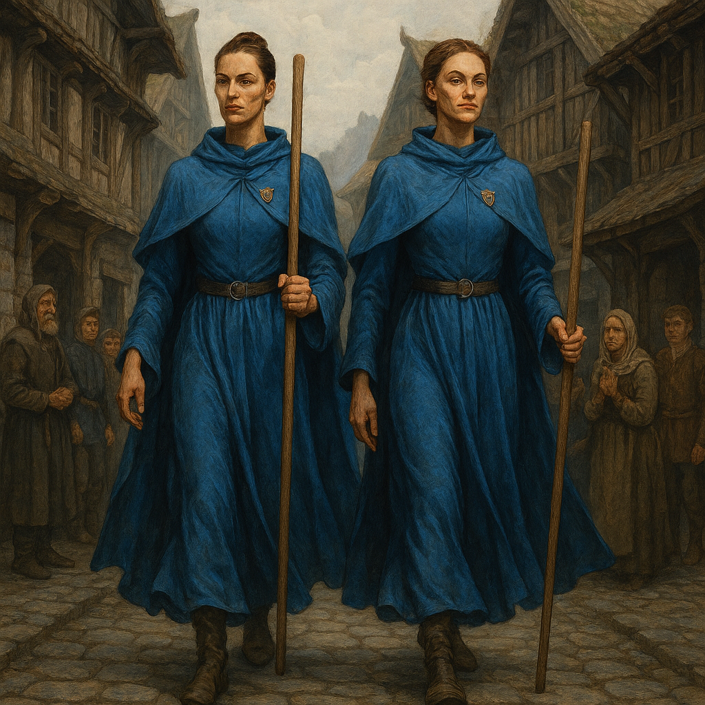

[World](../../World.md) / [Factions](../Factions.md) / The Spasistren <!-- wikidown:breadcrumb -->

# The Spásistren

Jak's elite all-female guard: warrior monks bound to the Administrator through Aura implants, modeled on absolute, almost religious devotion. The Fish Speakers — and the Sardaukar — of Vermoon.

*"Citizens, maintain the peace. Jak protects. Jak provides."*

## Who they are

- An all-female force that views Jak not just as a ruler but as **the central node of a new reality**. They do not fight for pay; they fight because they believe.
- Recruited (in part) through temple ceremonies; initiates return "different." Families both revere and fear the calling.
- They carry simple quarterstaffs and need nothing else — witnesses describe one dropping three brawling sailors by touching pressure points.
- They move with eerie, synchronized grace, guided by the constant data stream of the [Aura network](../The-Aura-Network.md). They do not show fear, anger, or frustration — the terrifying calm of zealots who know their god is watching through the blue light behind their ears.

## Hierarchy

| Rank | Role | Note |
| :--- | :--- | :--- |
| Initiates | Guards, labor | The bulk of any deployment |
| Sisters | Tactical command | Eight led the Frostwatch occupation |
| High Sisters | Strategic command, independent judgment | See [High Sister Valerius](../../NPCs/High-Sister-Valerius.md) — the capacity for independent judgment is deliberately embedded at this rank, and severing the connection is its ultimate (heretical) expression |

## Stat block (typical patrol pair — 8th-level monk chassis)

**AC** 16 (Unarmored Defense) · **HP** 68 · **Speed** 45 ft · STR 14, DEX 18, CON 14, INT 12, WIS 16, CHA 10 · **Immunities:** charmed, frightened (implant)

- **Multiattack:** two unarmed strikes (+9, 1d6+4) or quarterstaff (1d8+4 two-handed).
- **Ki 8:** Stunning Strike (DC 14), Flurry of Blows, Patient Defense, Step of the Wind, Slow Fall 40 ft.
- **Aura Network:** telepathy with Spásistren within 1 mile; direct line to Jak.
- **Coordinated Strike:** bonus action — grant a nearby sister advantage on her next attack.

## Playing them

Efficient, polite, utterly immovable. Questions about orders get a serene *"Those matters will be addressed at the council."* They are not lying; they are simply not answering. They never start fights; they end them. The only thing that has ever cracked one is doubt in Jak himself.
