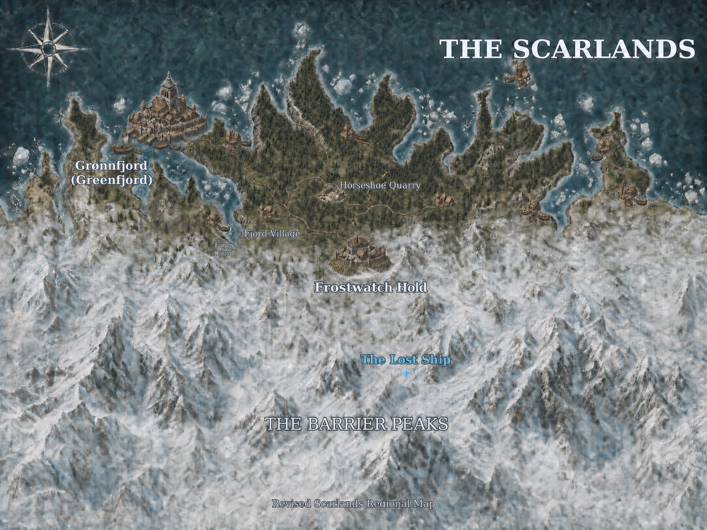

[World](../World.md) / The Scarlands <!-- wikidown:breadcrumb -->

# The Scarlands

The cold southern landmass of Vermoon — fjord coasts, timber holds, and the Barrier Peaks. Home of the campaign so far. (Map: `assets/scarlands_completed_map.png` — note **The Lost Ship** marked in the peaks south of Frostwatch.)

## Character

Nordic in culture and climate: longships, sled dogs, clan memory, and winters that kill the unprepared. Until two years ago the region was a patchwork of feuding local lords and raiding hill clans; **Jak's Peace** ended that almost overnight when the Temple of Nord awakened and Grønnfjord became the seat of world government.

## Key places (all on the map)

- **[Grønnfjord](../Locations/Gronnfjord.md)** — the port city and seat of the Administrator, on the northwest coast.
- **[Frostwatch Hold](../Locations/Frostwatch-Hold.md)** — fortified hold at the treeline where forest gives way to the peaks; staging point for expeditions south; now Spásistren-occupied.
- **[The Barrier Peaks](../Locations/The-Barrier-Peaks.md)** — the southern range; forbidden zone; **The Lost Ship** is marked in the high peaks below Frostwatch ([the ship](../The-Lost-Ship.md)).
- **Foggy Fjord** and **Fjord Village** — southwest coast; the shipwreck-camp interlude and the children's village ([Foggy Fjord](../Adventures/Foggy-Fjord.md), [Think of the Children](../Adventures/Think-of-the-Children.md)).
- **Horseshoe Quarry** — the old iron quarry inland of the coast road ([Foggy Fjord](../Adventures/Foggy-Fjord.md), day 2).
- **[Nordkrist's Hold](../Campaign/Plot-Threads/Nordkrists-Hold.md)** — Jak's mysterious project in the peaks (deliberately not on the map).

## Travel

- Sea travel hugs the fjord coasts; captains now refuse the southern waters near the Barrier Peaks ("things in the water that ain't fish… metal gleaming beneath the waves").
- Overland travel in the south means the **Frostwind Crossing**: blizzards, crevasses, frostbite saves (see [Cold & Survival](../Game-Mechanics/Cold-and-Survival.md)), and dogsled logistics — which is why sledmasters like [Korrin](../NPCs/Korrin.md) matter. The map shows the road network: coast road linking the fjord settlements, with the single inland spur through Horseshoe Quarry to Frostwatch.
- Distances: the ship-to-Frostwatch descent is ~4 hours by hoversled, two days mounted.

## Current condition

The infection is loose in the range: fungal veins thread the treelines below the crash site, wildlife stands and *watches*, and three foothill villages are quarantined (two silent). The Scarlands are the front line of the campaign's ecological clock — and the map makes the stakes visible: everything green on it sits between the ship's mark and the sea.
